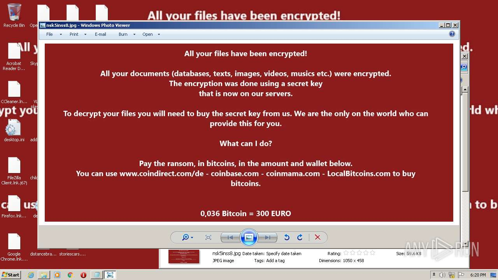

# HEUR-Trojan-Ransom.Win32.Generic-7ff02d597c1d6d81252edc66749f979c3f61b5e2ebd76ecbbec75859c21baf83

- https://any.run/report/7ff02d597c1d6d81252edc66749f979c3f61b5e2ebd76ecbbec75859c21baf83/34ba28b2-6544-4004-a184-6c28917186e7

```
- _id: "7ff02d597c1d6d81252edc66749f979c3f61b5e2ebd76ecbbec75859c21baf83"
  creation_date: 1650646395  # 2022-04-22 18:53:15 +0200 CEST
  crowdsourced_yara_results: 
  - author: "ditekShen"
    description: "Detects files referencing identities associated with Chaos ransomware"
    rule_name: "INDICATOR_KB_ID_Ransomware_Chaos"
    ruleset_id: "00cec9e642"
    ruleset_name: "indicator_knownbad_id"
    source: "https://github.com/ditekshen/detection"
  - author: "ditekSHen"
    description: "detects command variations typically used by ransomware"
    rule_name: "INDICATOR_SUSPICIOUS_GENRansomware"
    ruleset_id: "00c3b8eb5d"
    ruleset_name: "indicator_suspicious"
    source: "https://github.com/ditekshen/detection"
  - author: "ditekSHen"
    description: "Detects executables containing many references to VEEAM. Observed in ransomware"
    rule_name: "INDICATOR_SUSPICOUS_EXE_References_VEEAM"
    ruleset_id: "00c3b8eb5d"
    ruleset_name: "indicator_suspicious"
    source: "https://github.com/ditekshen/detection"
  - author: "ditekSHen"
    description: "Detects Chaos ransomware"
    rule_name: "MALWARE_Win_Chaos"
    ruleset_id: "00cc803bdc"
    ruleset_name: "malware"
    source: "https://github.com/ditekshen/detection"
  first_submission_date: 1650651930  # 2022-04-22 20:25:30 +0200 CEST
  last_analysis_date: 1664114484  # 2022-09-25 16:01:24 +0200 CEST
  last_analysis_results: 
    Kaspersky: 
      result: "HEUR:Trojan-Ransom.Win32.Generic"
  magic: "PE32 executable for MS Windows (GUI) Intel 80386 32-bit Mono/.Net assembly"
  packers: 
    PEiD: ".NET executable"
  size: 192000
  trid: 
  - file_type: "Generic CIL Executable (.NET, Mono, etc.)"
    probability: 72.5
  - file_type: "Win64 Executable (generic)"
    probability: 10.4
  - file_type: "Win32 Dynamic Link Library (generic)"
    probability: 6.5
  - file_type: "Win32 Executable (generic)"
    probability: 4.4
  - file_type: "OS/2 Executable (generic)"
    probability: 2.0
```





