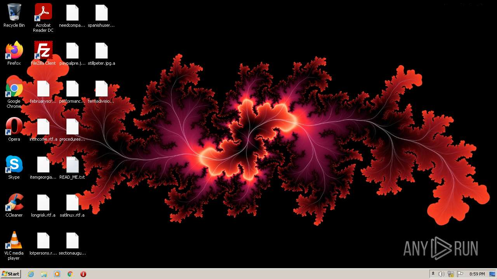
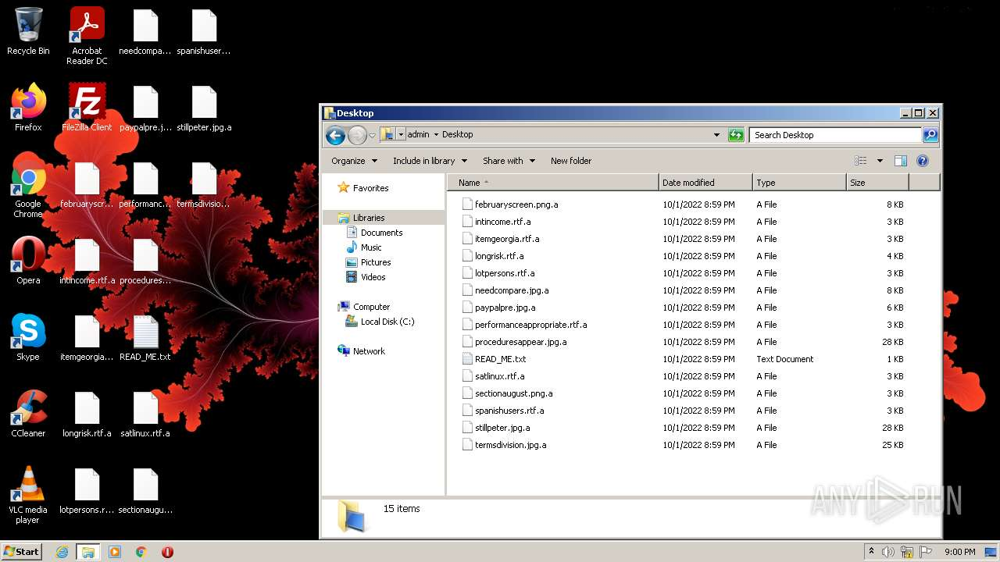
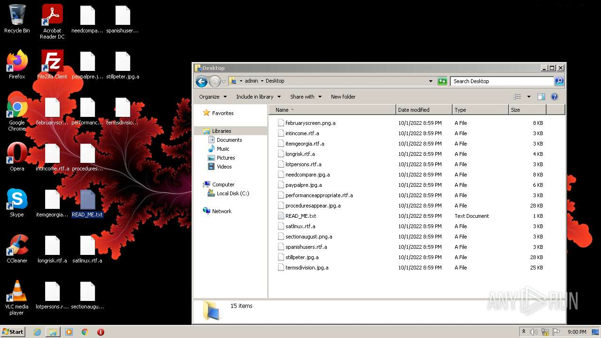
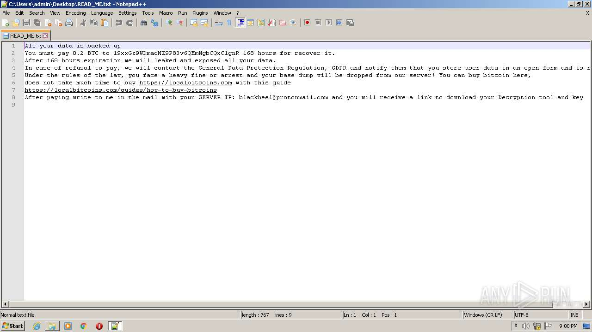

# HEUR-Trojan-Ransom.Win32.Generic-888f64a7abc8080cef8bd58ce1c502975de5c6e2a178c5646f27ef9f8525c642

```
- _id: "888f64a7abc8080cef8bd58ce1c502975de5c6e2a178c5646f27ef9f8525c642"
  creation_date: 1610685729  # 2021-01-15 05:42:09 +0100 CET
  crowdsourced_yara_results: 
  - author: "Florian Roth"
    description: "Detects ransomware distributed in COVID-19 theme"
    rule_name: "MAL_RANSOM_COVID19_Apr20_1"
    ruleset_id: "000f8b51a1"
    ruleset_name: "crime_covid_ransom"
    source: "https://github.com/Neo23x0/signature-base"
  first_submission_date: 1610696102  # 2021-01-15 08:35:02 +0100 CET
  last_analysis_date: 1610824062  # 2021-01-16 20:07:42 +0100 CET
  last_analysis_results: 
    Kaspersky: 
      result: "HEUR:Trojan-Ransom.Win32.Generic"
  magic: "PE32 executable for MS Windows (GUI) Intel 80386 Mono/.Net assembly"
  size: 219648
  trid: 
  - file_type: "Generic CIL Executable (.NET, Mono, etc.)"
    probability: 72.5
  - file_type: "Win64 Executable (generic)"
    probability: 10.4
  - file_type: "Win32 Dynamic Link Library (generic)"
    probability: 6.5
  - file_type: "Win32 Executable (generic)"
    probability: 4.4
  - file_type: "OS/2 Executable (generic)"
    probability: 2.0
```






