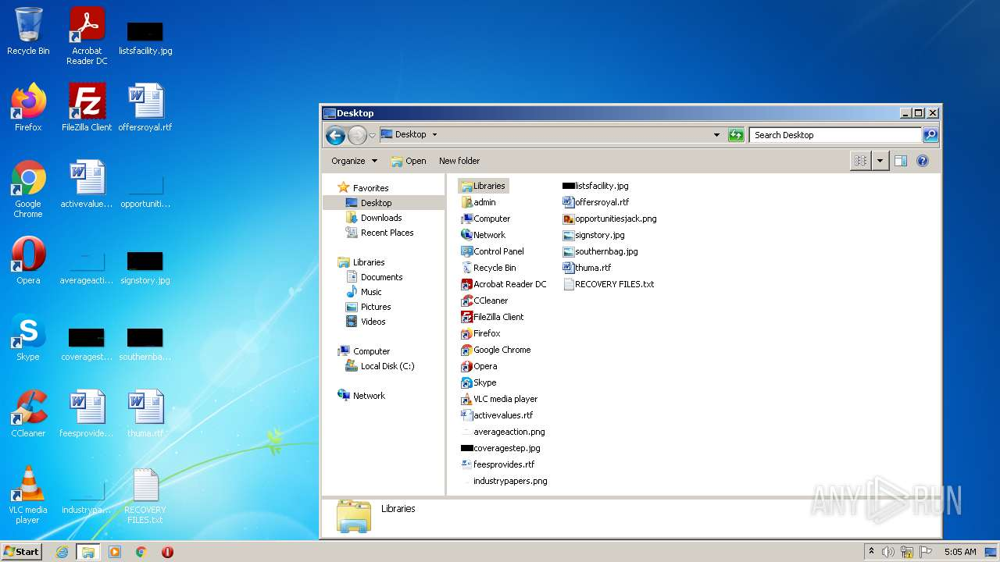
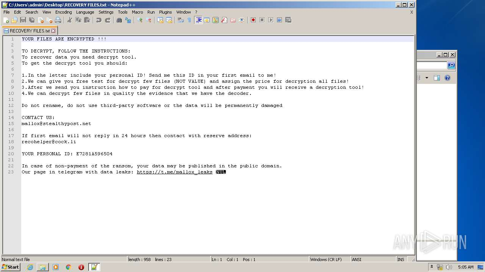
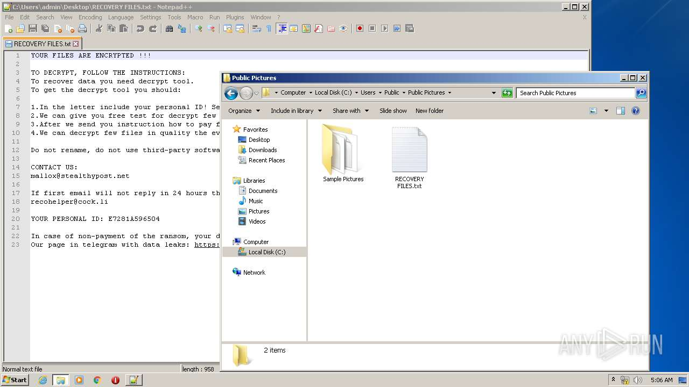
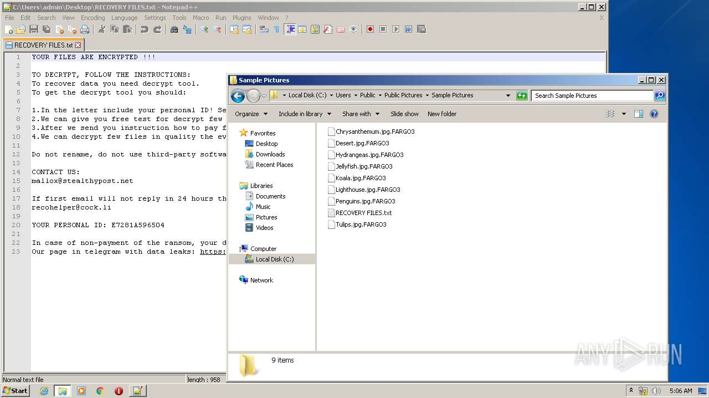
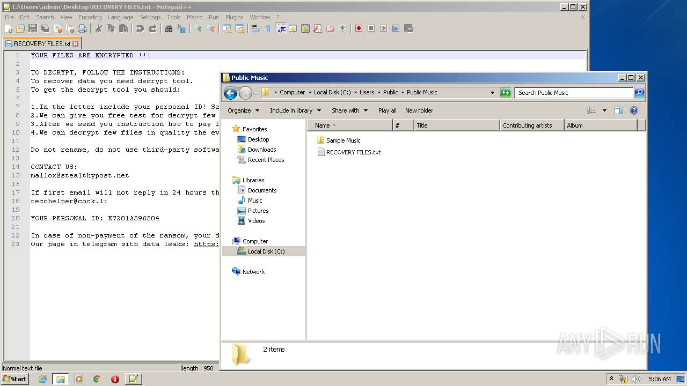
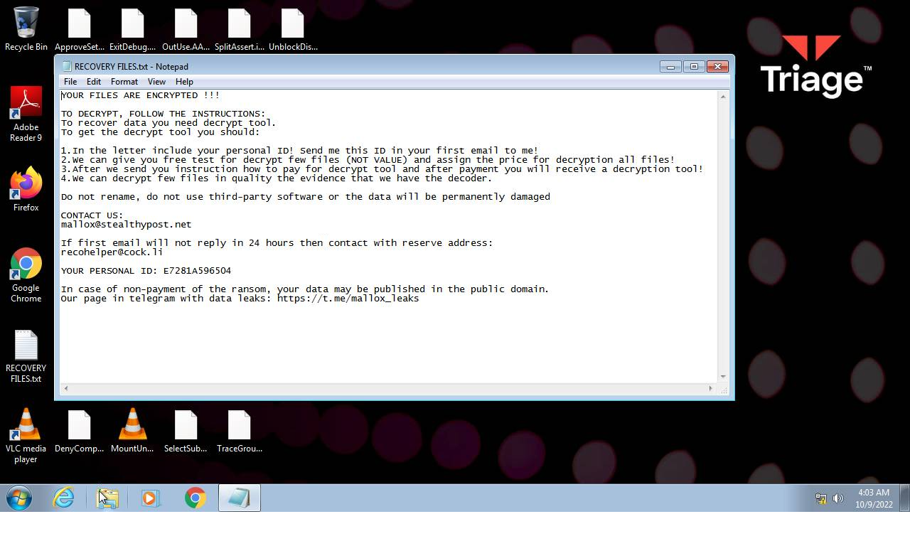
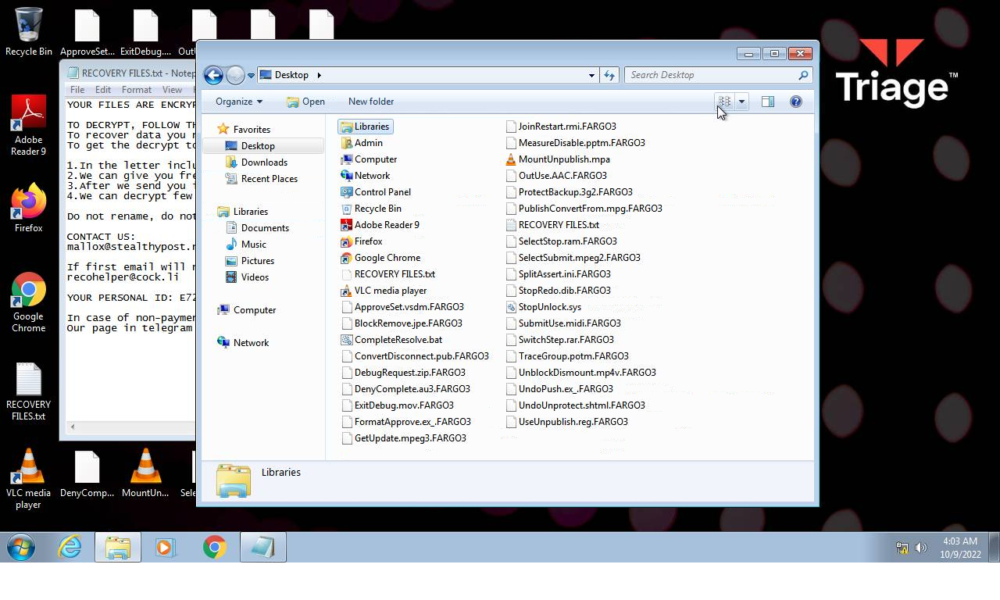
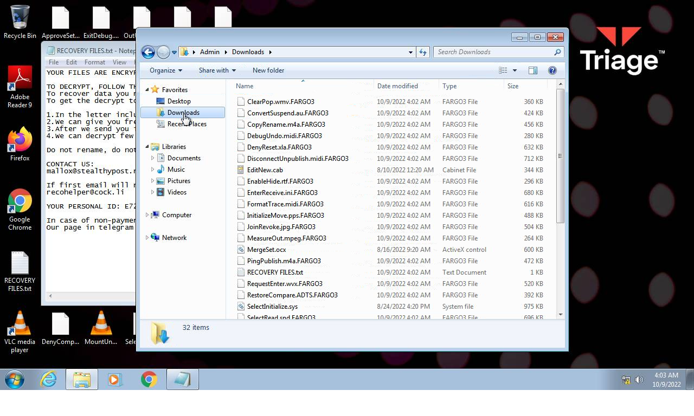

# HEUR-Trojan-Ransom.Win32.Generic-8e974a3be94b7748f7971f278160a74d738d5cab2c3088b1492cfbbd05e83e22

- https://any.run/report/8e974a3be94b7748f7971f278160a74d738d5cab2c3088b1492cfbbd05e83e22/b34e6a88-9f91-4481-b59e-0dff4df64726

```
- _id: "8e974a3be94b7748f7971f278160a74d738d5cab2c3088b1492cfbbd05e83e22"
  creation_date: 1663023441  # 2022-09-13 00:57:21 +0200 CEST
  crowdsourced_yara_results: 
  - author: "ditekSHen"
    description: "detects command variations typically used by ransomware"
    rule_name: "INDICATOR_SUSPICIOUS_GENRansomware"
    ruleset_id: "00c3b8eb5d"
    ruleset_name: "indicator_suspicious"
    source: "https://github.com/ditekshen/detection"
  first_submission_date: 1665275524  # 2022-10-09 02:32:04 +0200 CEST
  last_analysis_date: 1665279486  # 2022-10-09 03:38:06 +0200 CEST
  last_analysis_results: 
    Kaspersky: 
      result: "HEUR:Trojan-Ransom.Win32.Generic"
  magic: "PE32 executable for MS Windows (GUI) Intel 80386 32-bit"
  size: 162816
  trid: 
  - file_type: "Win64 Executable (generic)"
    probability: 32.2
  - file_type: "Win32 Dynamic Link Library (generic)"
    probability: 20.1
  - file_type: "Win16 NE executable (generic)"
    probability: 15.4
  - file_type: "Win32 Executable (generic)"
    probability: 13.7
  - file_type: "OS/2 Executable (generic)"
    probability: 6.2
```










