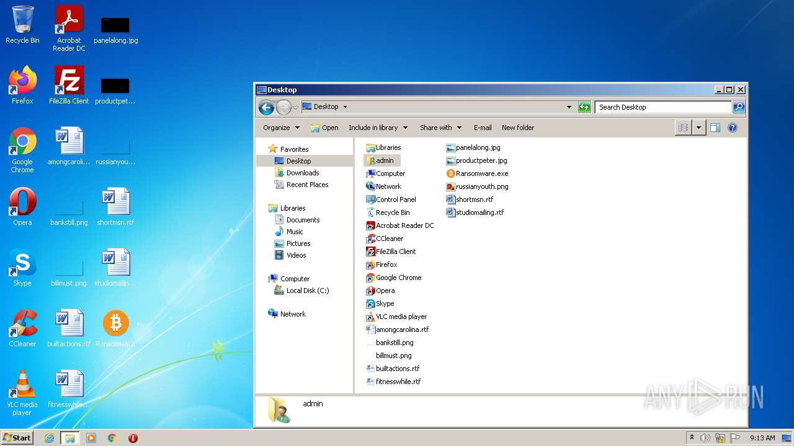
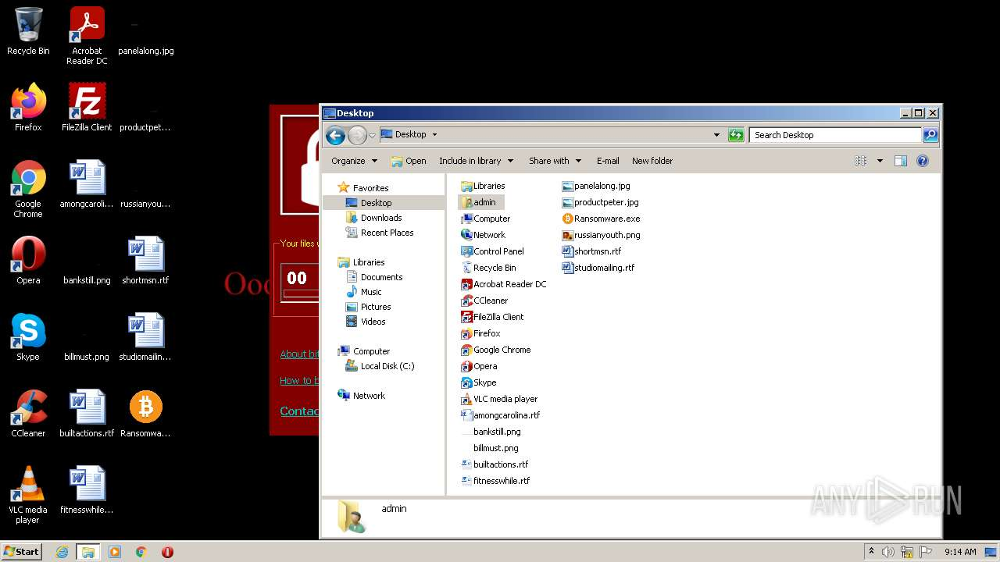
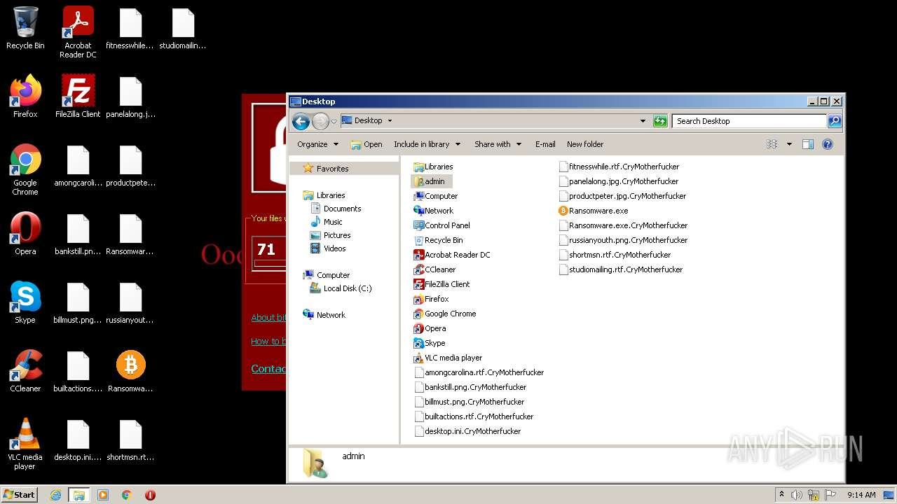
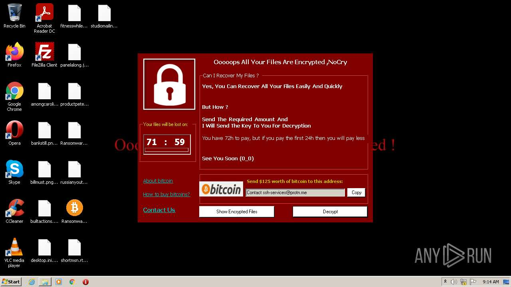
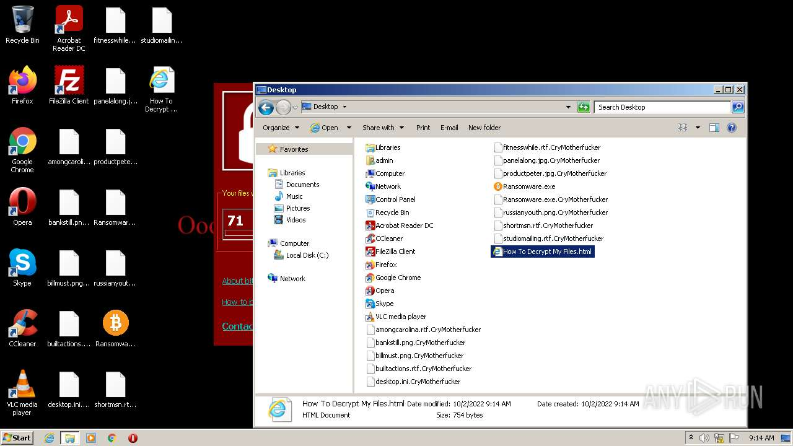
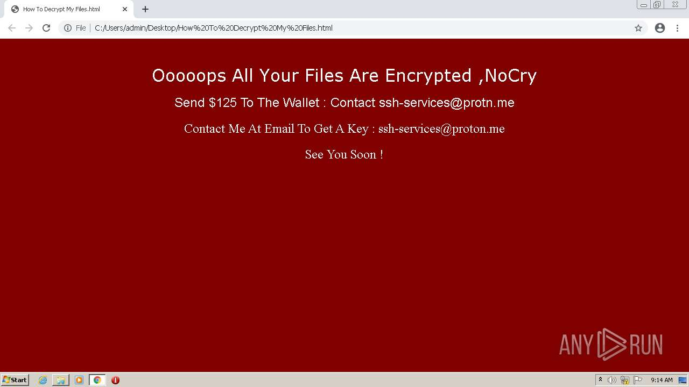
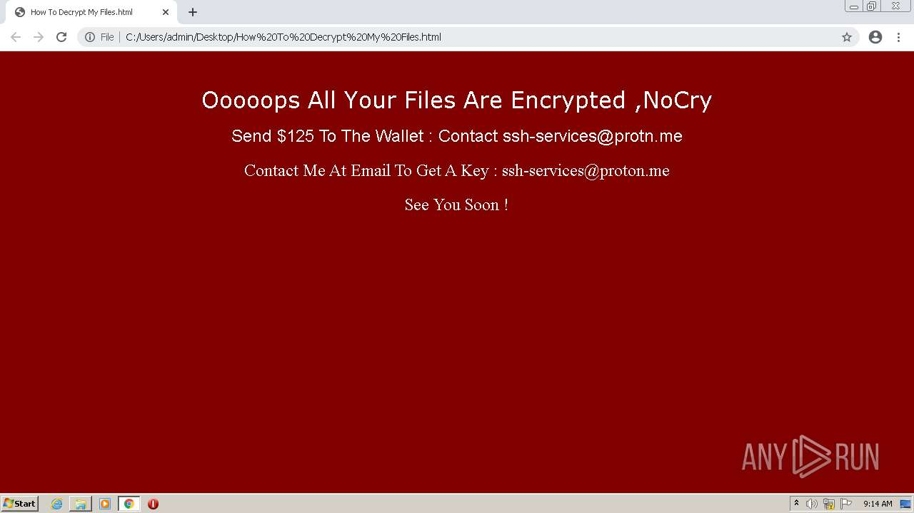
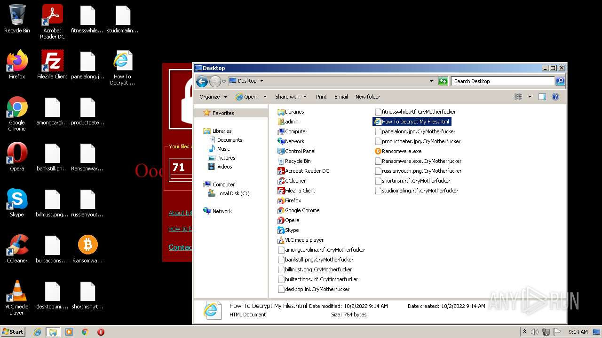
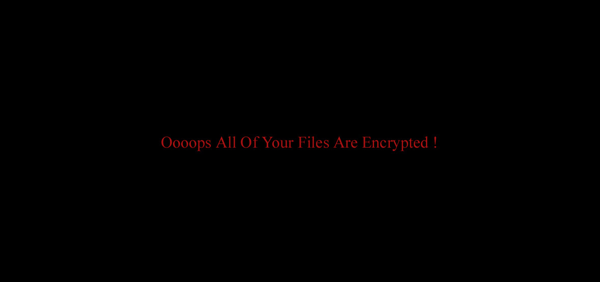

# HEUR-Trojan-Ransom.Win32.Generic-ab8d097bd5fb7fe03f5e40abd77652210e635b0a253c578db76d2cf844e9147b

- https://any.run/report/ab8d097bd5fb7fe03f5e40abd77652210e635b0a253c578db76d2cf844e9147b/360a8254-3143-4e49-96cd-a5a36fecbf0b

```
- _id: "ab8d097bd5fb7fe03f5e40abd77652210e635b0a253c578db76d2cf844e9147b"
  creation_date: 1657979020  # 2022-07-16 15:43:40 +0200 CEST
  crowdsourced_yara_results: 
  - author: "AlienVault Labs"
    description: "Sandbox detection tricks"
    rule_name: "sandboxdetect_misc"
    ruleset_id: "009cfa8ad5"
    ruleset_name: "sandboxdetect"
    source: "https://github.com/AlienVault-Labs/AlienVaultLabs"
  - author: "ditekSHen"
    description: "Detects executables Discord URL observed in first stage droppers"
    rule_name: "INDICATOR_SUSPICIOUS_EXE_DiscordURL"
    ruleset_id: "00c3b8eb5d"
    ruleset_name: "indicator_suspicious"
    source: "https://github.com/ditekshen/detection"
  first_submission_date: 1663239315  # 2022-09-15 12:55:15 +0200 CEST
  last_analysis_date: 1663596485  # 2022-09-19 16:08:05 +0200 CEST
  last_analysis_results: 
    Kaspersky: 
      result: "HEUR:Trojan-Ransom.Win32.Generic"
  magic: "PE32 executable for MS Windows (GUI) Intel 80386 32-bit Mono/.Net assembly"
  packers: 
    PEiD: ".NET executable"
  size: 287744
  trid: 
  - file_type: "Generic CIL Executable (.NET, Mono, etc.)"
    probability: 69.1
  - file_type: "Win64 Executable (generic)"
    probability: 9.9
  - file_type: "Win32 Dynamic Link Library (generic)"
    probability: 6.2
  - file_type: "Win16 NE executable (generic)"
    probability: 4.7
  - file_type: "Win32 Executable (generic)"
    probability: 4.2
```












