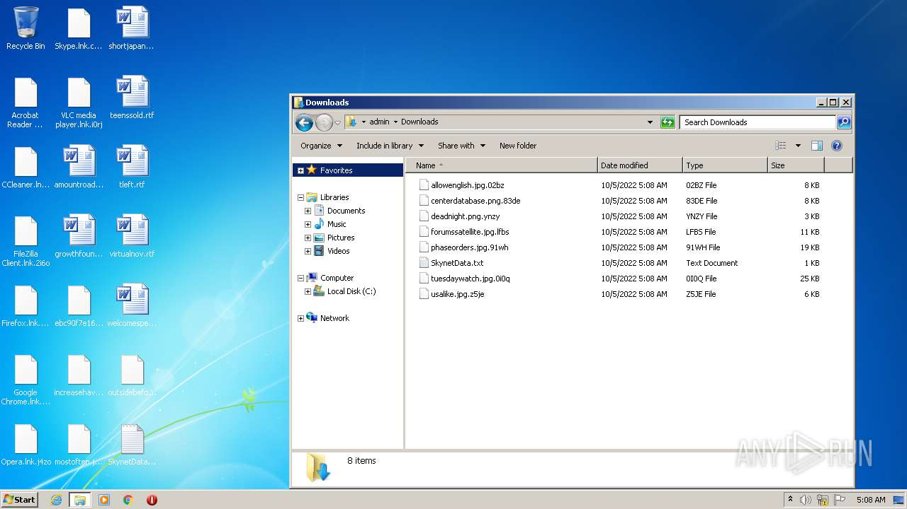
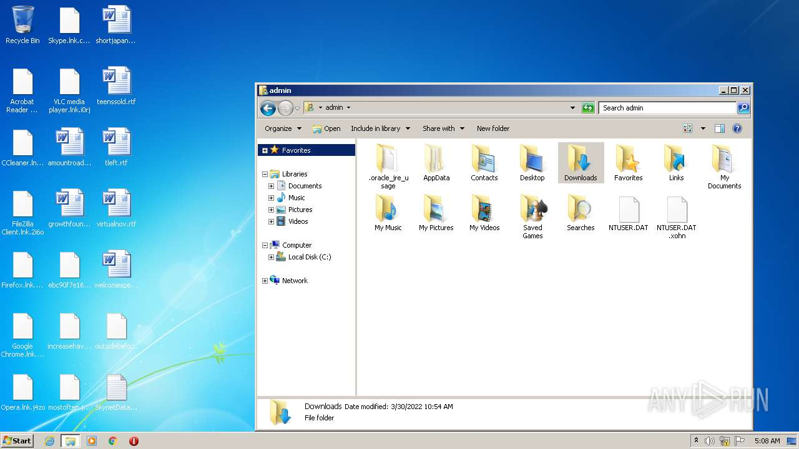
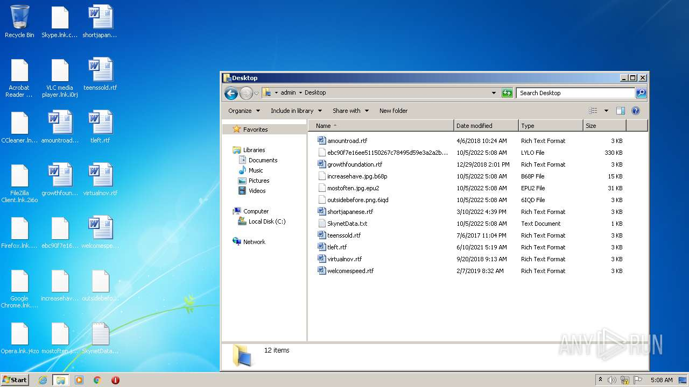
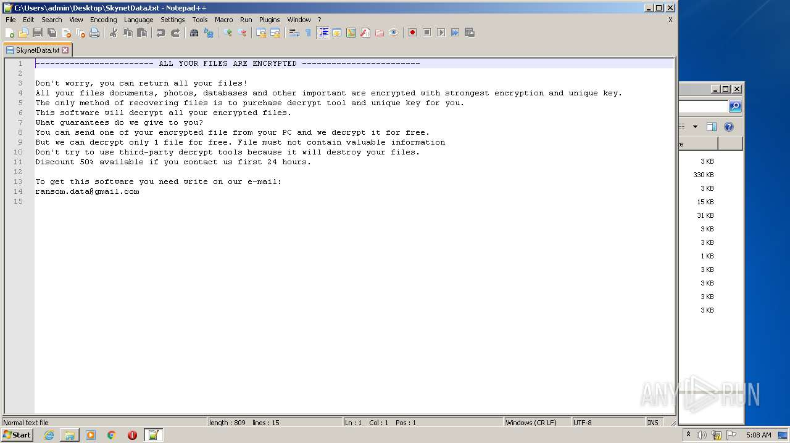
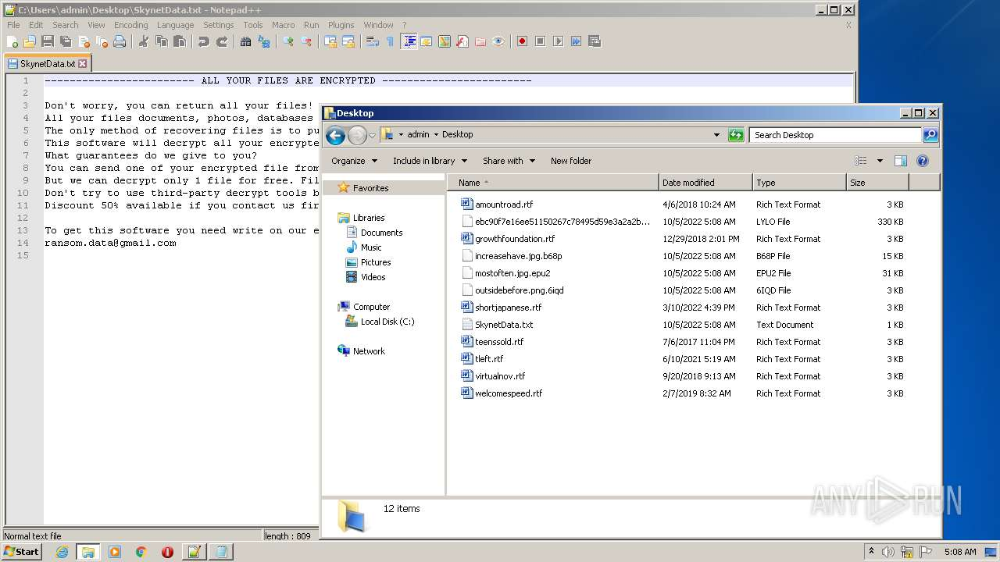
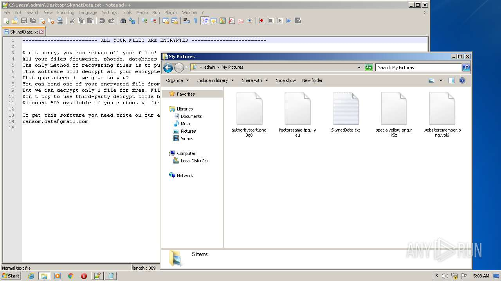

# HEUR-Trojan-Ransom.Win32.Generic-ebc90f7e16ee51150267c78495d59e3a2a2b3880c7541ca3df0ff287b528fc41

- https://any.run/report/ebc90f7e16ee51150267c78495d59e3a2a2b3880c7541ca3df0ff287b528fc41/056f89f7-e1ad-45f1-91f5-a3b36cbf2f02

```
- _id: "ebc90f7e16ee51150267c78495d59e3a2a2b3880c7541ca3df0ff287b528fc41"
  creation_date: 1664920213  # 2022-10-04 23:50:13 +0200 CEST
  crowdsourced_yara_results: 
  - author: "ditekSHen"
    description: "detects command variations typically used by ransomware"
    rule_name: "INDICATOR_SUSPICIOUS_GENRansomware"
    ruleset_id: "00c3b8eb5d"
    ruleset_name: "indicator_suspicious"
    source: "https://github.com/ditekshen/detection"
  - author: "ditekSHen"
    description: "Detects executables containing many references to VEEAM. Observed in ransomware"
    rule_name: "INDICATOR_SUSPICOUS_EXE_References_VEEAM"
    ruleset_id: "00c3b8eb5d"
    ruleset_name: "indicator_suspicious"
    source: "https://github.com/ditekshen/detection"
  - author: "ditekSHen"
    description: "Detects Chaos ransomware"
    rule_name: "MALWARE_Win_Chaos"
    ruleset_id: "00cc803bdc"
    ruleset_name: "malware"
    source: "https://github.com/ditekshen/detection"
  first_submission_date: 1664922515  # 2022-10-05 00:28:35 +0200 CEST
  last_analysis_date: 1664928247  # 2022-10-05 02:04:07 +0200 CEST
  last_analysis_results: 
    Kaspersky: 
      result: "HEUR:Trojan-Ransom.Win32.Generic"
  magic: "PE32 executable for MS Windows (GUI) Intel 80386 Mono/.Net assembly"
  size: 337408
  trid: 
  - file_type: "Generic CIL Executable (.NET, Mono, etc.)"
    probability: 72.5
  - file_type: "Win64 Executable (generic)"
    probability: 10.4
  - file_type: "Win32 Dynamic Link Library (generic)"
    probability: 6.5
  - file_type: "Win32 Executable (generic)"
    probability: 4.4
  - file_type: "OS/2 Executable (generic)"
    probability: 2.0
```








