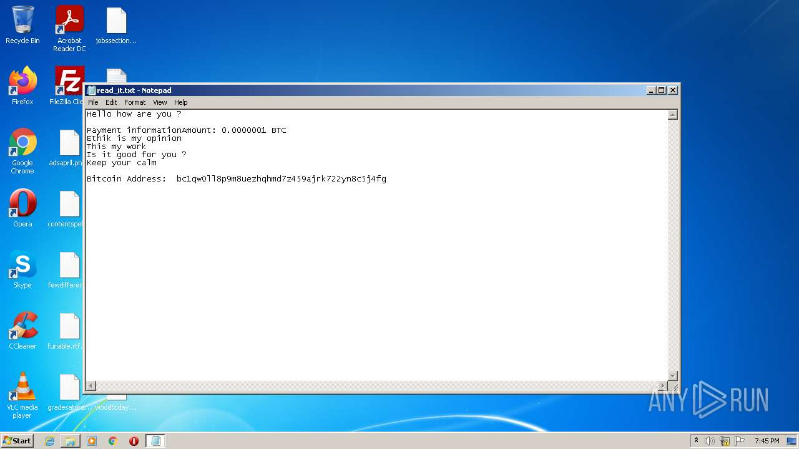
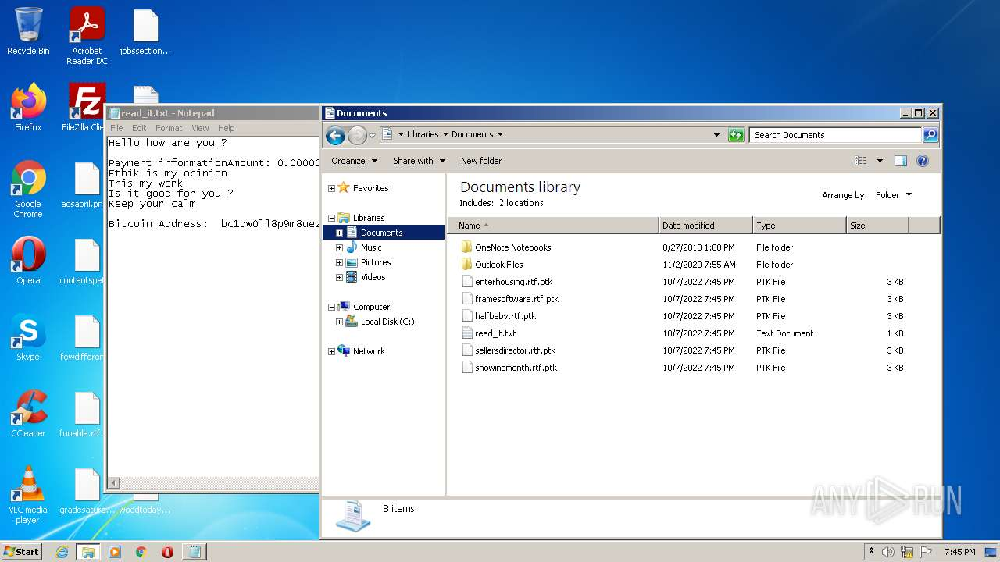
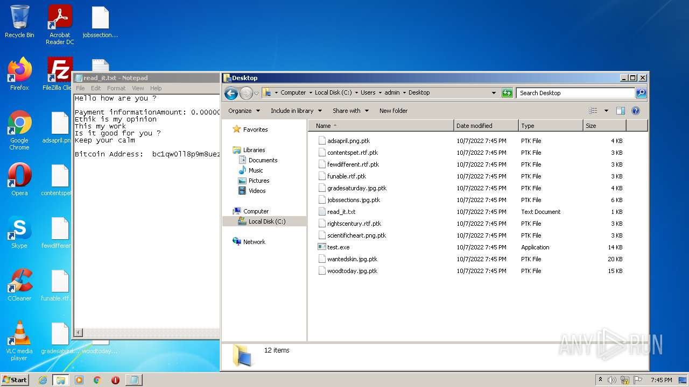
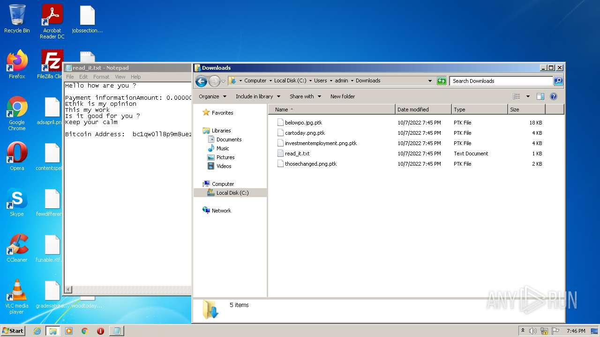
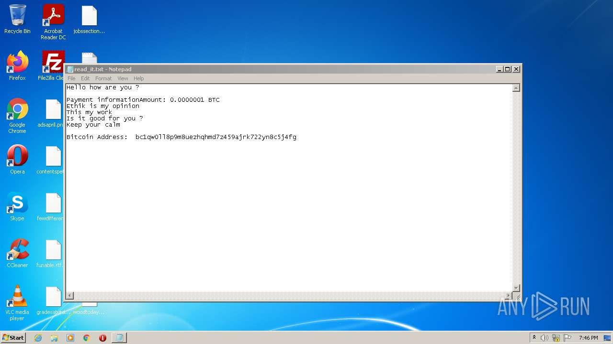

# HEUR-Trojan-Ransom.Win32.Generic-f47a386a562660d0f2d6d266e60f531dcfc48a9c6724601b743a1888f2ec4173

- https://any.run/report/f47a386a562660d0f2d6d266e60f531dcfc48a9c6724601b743a1888f2ec4173/241dbd13-002c-4a1c-9057-49e3b3e1b261

```
- _id: "f47a386a562660d0f2d6d266e60f531dcfc48a9c6724601b743a1888f2ec4173"
  creation_date: 1665168282  # 2022-10-07 20:44:42 +0200 CEST
  crowdsourced_yara_results: 
  - author: "ditekSHen"
    description: "Detects Chaos ransomware"
    rule_name: "MALWARE_Win_Chaos"
    ruleset_id: "00cc803bdc"
    ruleset_name: "malware"
    source: "https://github.com/ditekshen/detection"
  first_submission_date: 1665168417  # 2022-10-07 20:46:57 +0200 CEST
  last_analysis_date: 1665168417  # 2022-10-07 20:46:57 +0200 CEST
  last_analysis_results: 
    Kaspersky: 
      result: "HEUR:Trojan-Ransom.Win32.Generic"
  magic: "PE32 executable for MS Windows (GUI) Intel 80386 32-bit Mono/.Net assembly"
  packers: 
    PEiD: ".NET executable"
  size: 14336
  trid: 
  - file_type: "Generic CIL Executable (.NET, Mono, etc.)"
    probability: 72.5
  - file_type: "Win64 Executable (generic)"
    probability: 10.4
  - file_type: "Win32 Dynamic Link Library (generic)"
    probability: 6.5
  - file_type: "Win32 Executable (generic)"
    probability: 4.4
  - file_type: "OS/2 Executable (generic)"
    probability: 2.0
```







