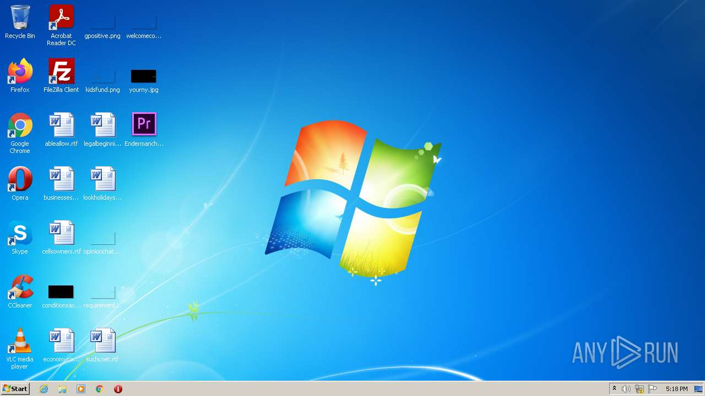
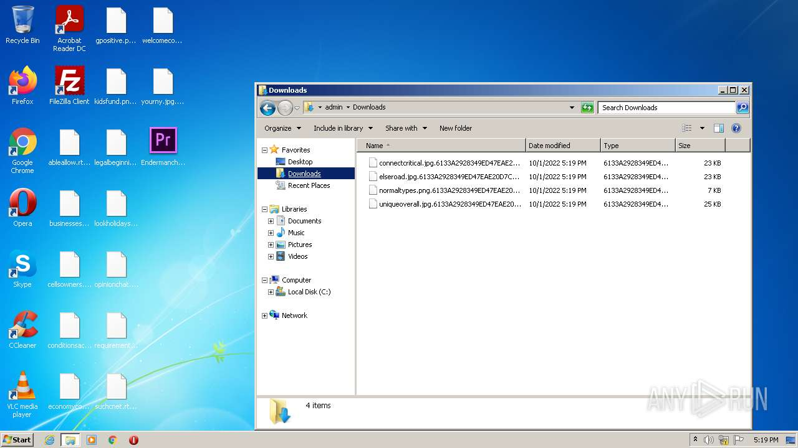
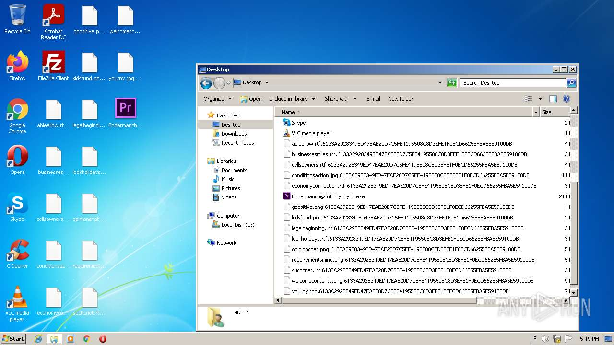

# HEUR-Trojan-Ransom.Win32.Generic-f5d002bfe80b48386a6c99c41528931b7f5df736cd34094463c3f85dde0180bf

```
- _id: "f5d002bfe80b48386a6c99c41528931b7f5df736cd34094463c3f85dde0180bf"
  creation_date: 1497454451  # 2017-06-14 17:34:11 +0200 CEST
  crowdsourced_yara_results: 
  - author: "ditekSHen"
    description: "Detects InfinityLock ransomware"
    rule_name: "MALWARE_Win_InfinityLock"
    ruleset_id: "00cc803bdc"
    ruleset_name: "malware"
    source: "https://github.com/ditekshen/detection"
  first_submission_date: 1567946370  # 2019-09-08 14:39:30 +0200 CEST
  last_analysis_date: 1658746550  # 2022-07-25 12:55:50 +0200 CEST
  last_analysis_results: 
    Kaspersky: 
      result: "HEUR:Trojan-Ransom.Win32.Generic"
  magic: "PE32 executable for MS Windows (GUI) Intel 80386 32-bit Mono/.Net assembly"
  packers: 
    PEiD: ".NET executable"
  size: 216064
  trid: 
  - file_type: "Generic CIL Executable (.NET, Mono, etc.)"
    probability: 63.0
  - file_type: "Windows screen saver"
    probability: 11.3
  - file_type: "Win64 Executable (generic)"
    probability: 9.0
  - file_type: "Win32 Dynamic Link Library (generic)"
    probability: 5.6
  - file_type: "Win32 Executable (generic)"
    probability: 3.8
```




