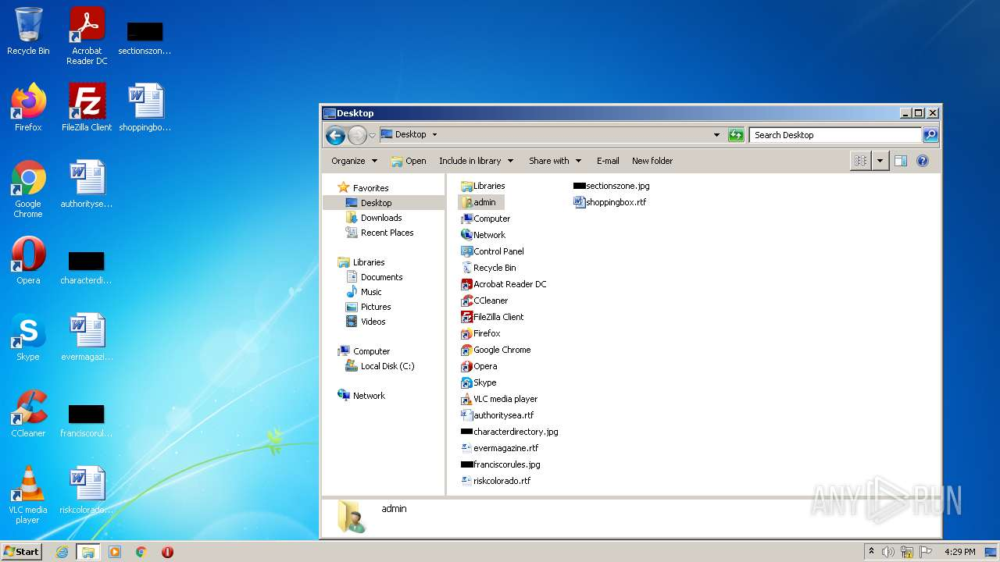
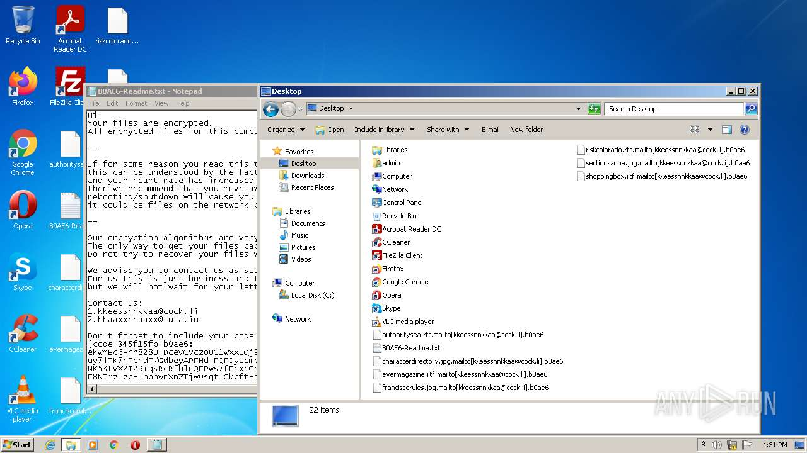
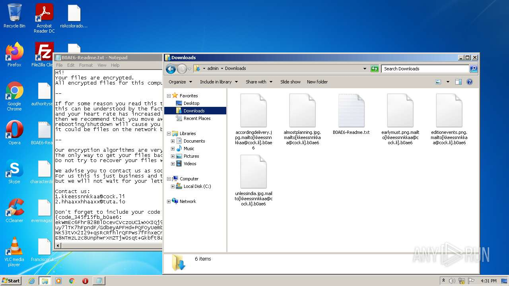
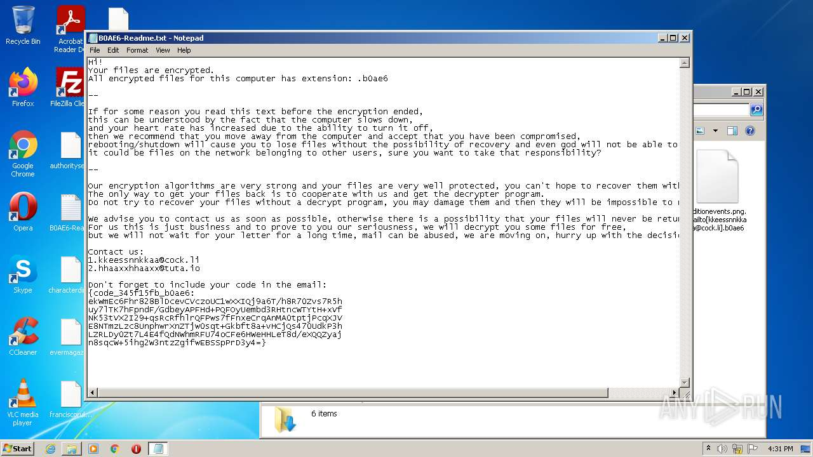

# HEUR-Trojan-Ransom.Win32.Mailto.vho-58e923ff158fb5aecd293b7a0e0d305296110b83c6e270786edcc4fea1c8404c

- https://any.run/report/58e923ff158fb5aecd293b7a0e0d305296110b83c6e270786edcc4fea1c8404c/13279756-2f4e-4032-9e5f-fbc5f70a42dd

```
- _id: "58e923ff158fb5aecd293b7a0e0d305296110b83c6e270786edcc4fea1c8404c"
  creation_date: 1575654386  # 2019-12-06 18:46:26 +0100 CET
  crowdsourced_yara_results: 
  - author: "McAfee ATR Team"
    description: "Rule to detect Netwalker ransomware"
    rule_name: "netwalker_ransomware"
    ruleset_id: "001a915e9e"
    ruleset_name: "RANSOM_netwalker"
    source: "https://github.com/advanced-threat-research/Yara-Rules"
  first_submission_date: 1580566313  # 2020-02-01 15:11:53 +0100 CET
  last_analysis_date: 1646885437  # 2022-03-10 05:10:37 +0100 CET
  last_analysis_results: 
    Kaspersky: 
      result: "HEUR:Trojan-Ransom.Win32.Mailto.vho"
  magic: "PE32 executable for MS Windows (GUI) Intel 80386 32-bit"
  size: 96256
  trid: 
  - file_type: "Win32 Dynamic Link Library (generic)"
    probability: 27.2
  - file_type: "Win16 NE executable (generic)"
    probability: 20.8
  - file_type: "Win32 Executable (generic)"
    probability: 18.6
  - file_type: "OS/2 Executable (generic)"
    probability: 8.3
  - file_type: "Clipper DOS Executable"
    probability: 8.3
```






