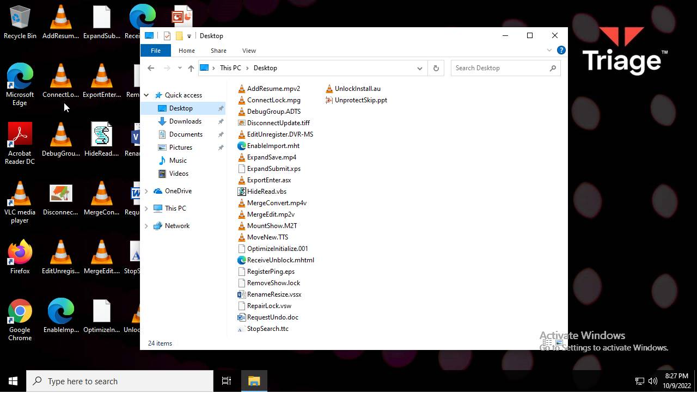
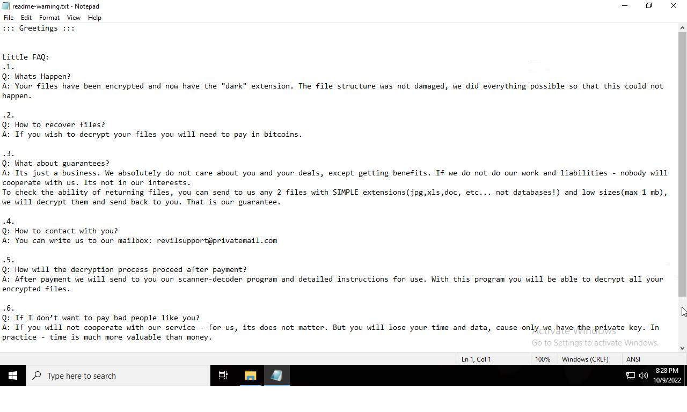
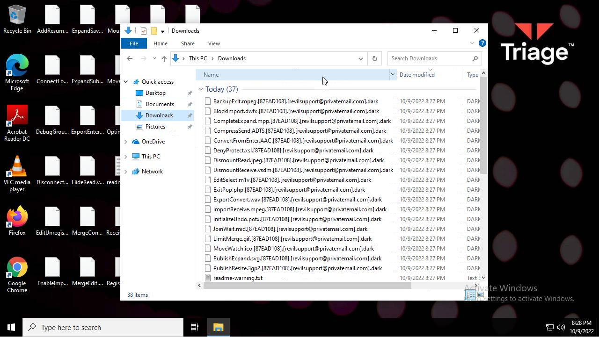
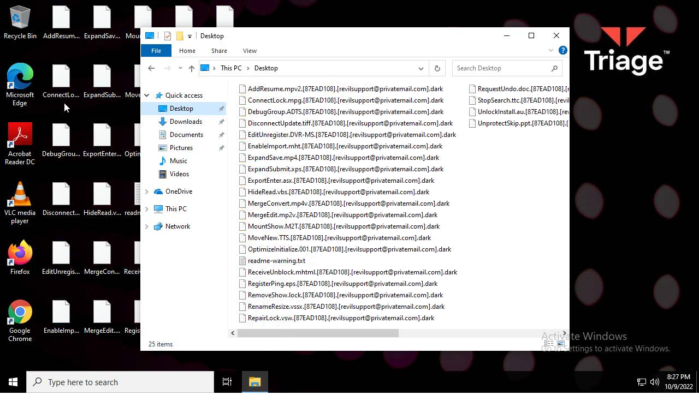
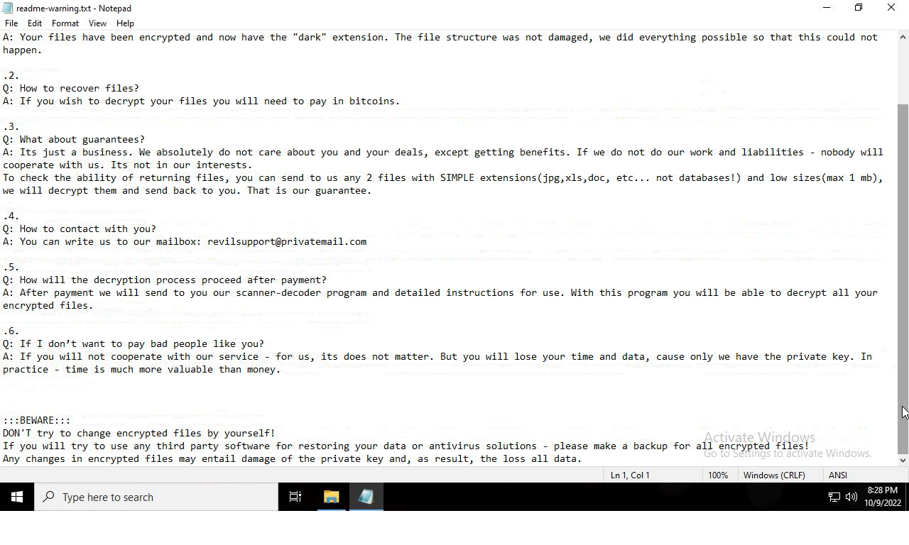

# HEUR-Trojan-Ransom.Win32.Makop.vho-bc0ed3e73b8d1fdc839f2e8ed3578ca3221dba4eb984e581cb00dfb4cdfb7d49

- https://tria.ge/221009-w3l1fahegn/behavioral2

```
- _id: "bc0ed3e73b8d1fdc839f2e8ed3578ca3221dba4eb984e581cb00dfb4cdfb7d49"
  creation_date: 1616765009  # 2021-03-26 14:23:29 +0100 CET
  crowdsourced_yara_results: 
  - author: "Marc Rivero | McAfee ATR Team"
    description: "Rule to detect the unpacked Makop ransomware samples"
    rule_name: "RANSOM_makop"
    ruleset_id: "00189e242f"
    ruleset_name: "RANSOM_makop"
    source: "https://github.com/advanced-threat-research/Yara-Rules"
  first_submission_date: 1617295048  # 2021-04-01 18:37:28 +0200 CEST
  last_analysis_date: 1632630401  # 2021-09-26 06:26:41 +0200 CEST
  last_analysis_results: 
    Kaspersky: 
      result: "HEUR:Trojan-Ransom.Win32.Makop.vho"
  magic: "PE32 executable for MS Windows (GUI) Intel 80386 32-bit"
  size: 35328
  trid: 
  - file_type: "Win32 Executable MS Visual C++ (generic)"
    probability: 58.4
  - file_type: "Win32 Dynamic Link Library (generic)"
    probability: 12.3
  - file_type: "Win16 NE executable (generic)"
    probability: 9.4
  - file_type: "Win32 Executable (generic)"
    probability: 8.4
  - file_type: "OS/2 Executable (generic)"
    probability: 3.8
```







