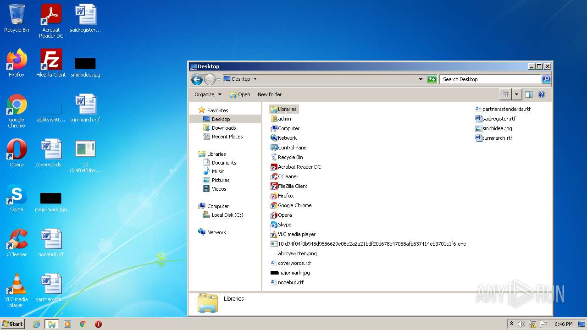
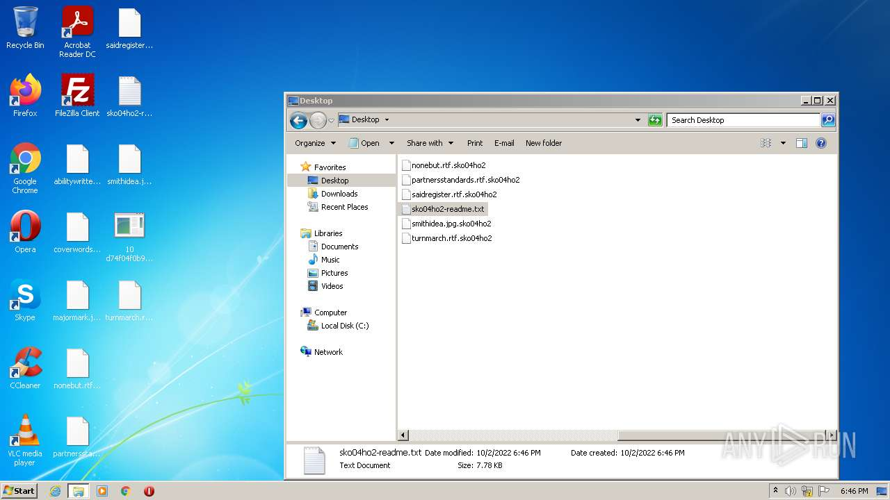
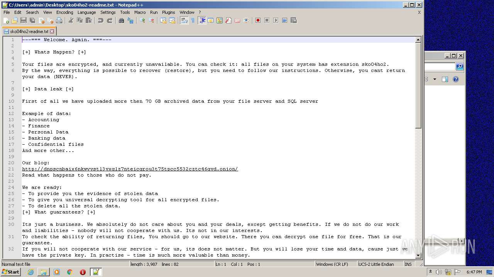
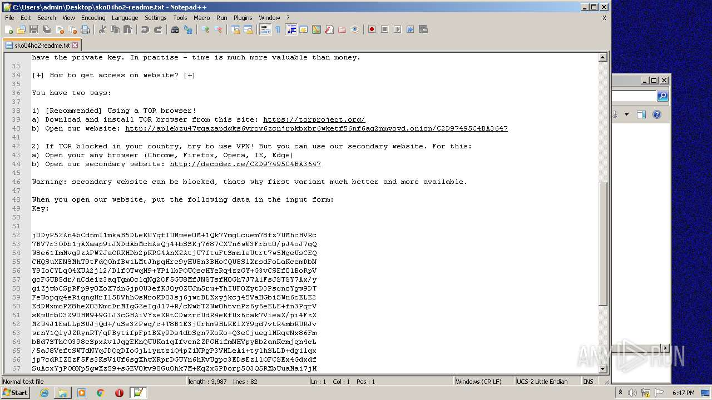
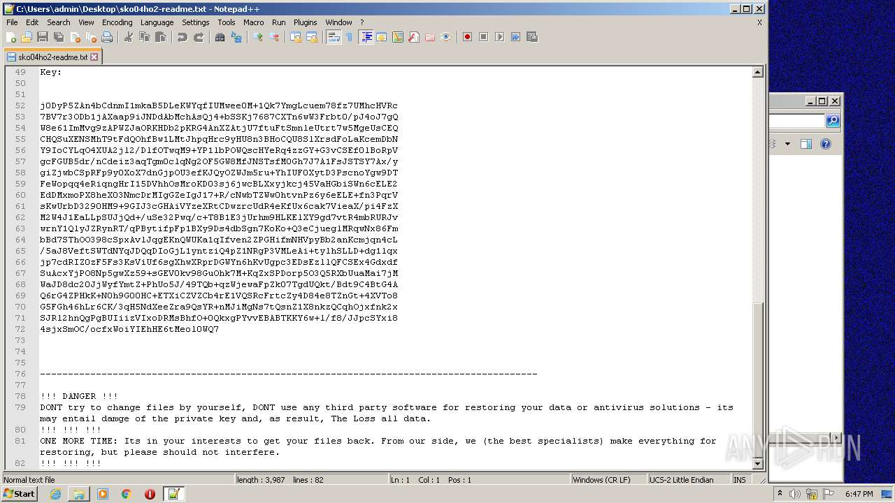
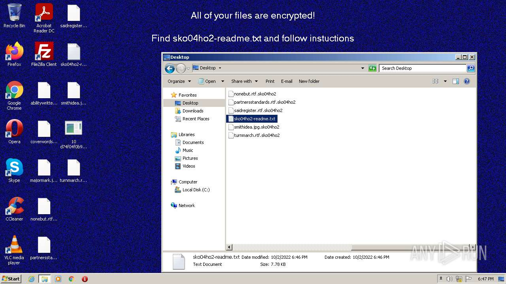
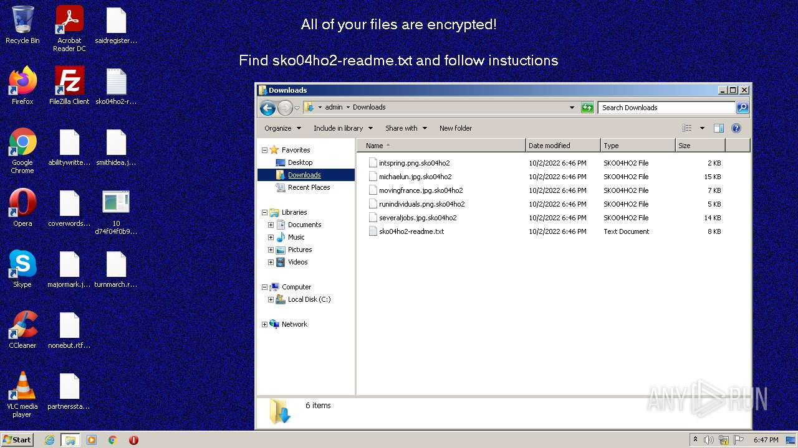
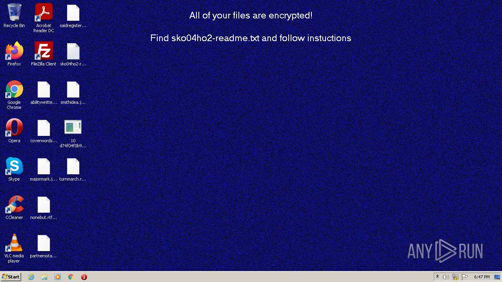

# HEUR-Trojan-Ransom.Win32.Sodin.vho-d74f04f0b948d9586629e06e2a2a21bdf20d678e47058afb637414eb3701c1f6

- https://any.run/report/d74f04f0b948d9586629e06e2a2a21bdf20d678e47058afb637414eb3701c1f6/35e33180-3987-44a4-89eb-30afb3cda01a

```
- _id: "d74f04f0b948d9586629e06e2a2a21bdf20d678e47058afb637414eb3701c1f6"
  creation_date: 1616363203  # 2021-03-21 22:46:43 +0100 CET
  crowdsourced_yara_results: 
  - author: "Florian Roth"
    description: "Detects REvil ransomware"
    rule_name: "MAL_RANSOM_REvil_Oct20_1"
    ruleset_id: "00014065d5"
    ruleset_name: "crime_ransom_revil"
    source: "https://github.com/Neo23x0/signature-base"
  - author: "Felix Bilstein - yara-signator at cocacoding dot com"
    description: "Detects win.revil."
    rule_name: "win_revil_auto"
    ruleset_id: "008278ba59"
    ruleset_name: "win.revil_auto"
    source: "https://malpedia.caad.fkie.fraunhofer.de/"
  first_submission_date: 1617042516  # 2021-03-29 20:28:36 +0200 CEST
  last_analysis_date: 1648513075  # 2022-03-29 02:17:55 +0200 CEST
  last_analysis_results: 
    Kaspersky: 
      result: "HEUR:Trojan-Ransom.Win32.Sodin.vho"
  magic: "PE32 executable for MS Windows (GUI) Intel 80386 32-bit"
  size: 123392
  trid: 
  - file_type: "Win32 Dynamic Link Library (generic)"
    probability: 29.6
  - file_type: "Win16 NE executable (generic)"
    probability: 22.7
  - file_type: "Win32 Executable (generic)"
    probability: 20.3
  - file_type: "OS/2 Executable (generic)"
    probability: 9.1
  - file_type: "Generic Win/DOS Executable"
    probability: 9.0
```











