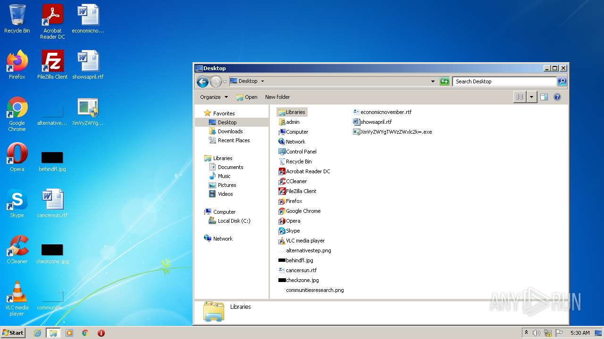
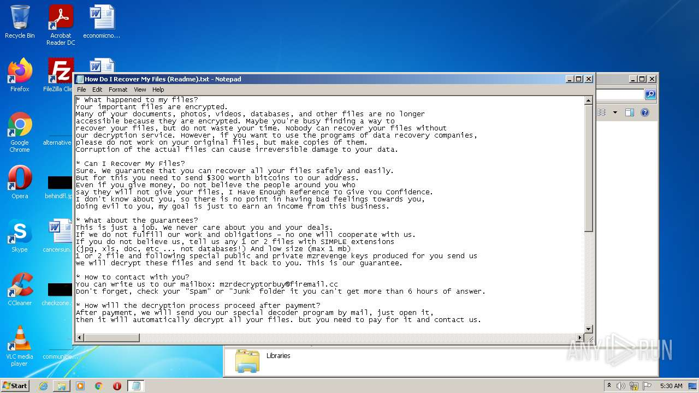
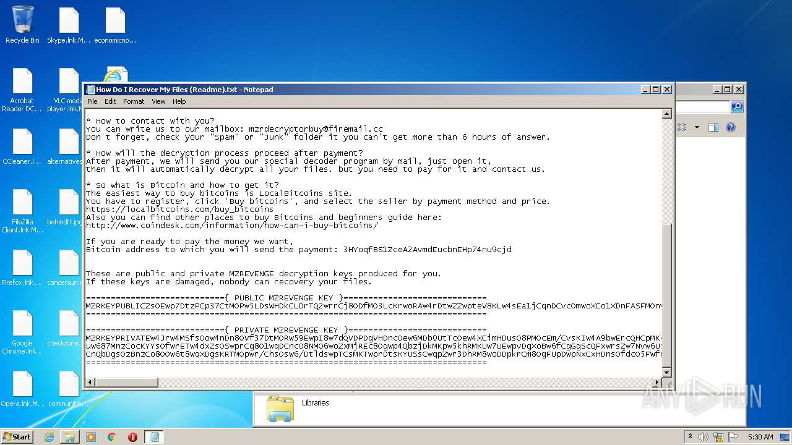
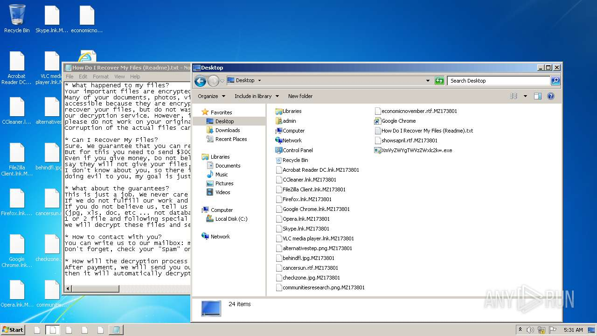
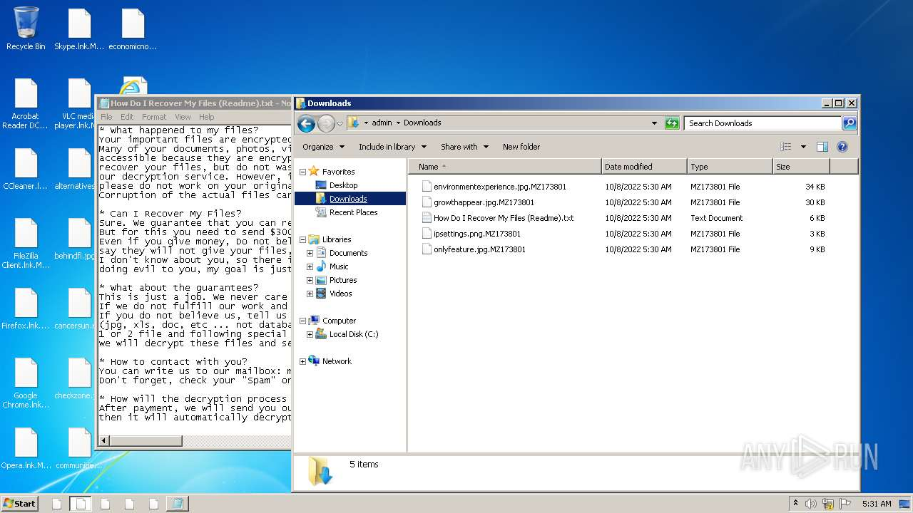
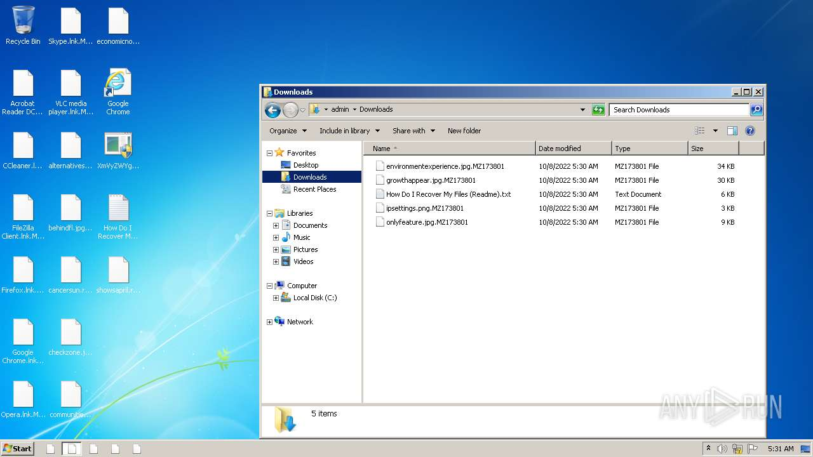

# HEUR-Trojan-Ransom.Win32.Wanna.gen-4b38f6d0ab76e86f03fcfa8060e4cba3d36edaa05f6708e1327c3ad8a983431c

- https://any.run/report/4b38f6d0ab76e86f03fcfa8060e4cba3d36edaa05f6708e1327c3ad8a983431c/10402435-2a1d-4be3-abea-588bdc744c37

```
- _id: "4b38f6d0ab76e86f03fcfa8060e4cba3d36edaa05f6708e1327c3ad8a983431c"
  creation_date: 2415175097  # 2046-07-14 11:58:17 +0200 CEST
  first_submission_date: 1585549763  # 2020-03-30 08:29:23 +0200 CEST
  last_analysis_date: 1587096812  # 2020-04-17 06:13:32 +0200 CEST
  last_analysis_results: 
    Kaspersky: 
      result: "HEUR:Trojan-Ransom.Win32.Wanna.gen"
  magic: "PE32 executable for MS Windows (console) Intel 80386 Mono/.Net assembly"
  packers: 
    PEiD: ".NET executable"
  size: 323072
  trid: 
  - file_type: "Generic CIL Executable (.NET, Mono, etc.)"
    probability: 81.0
  - file_type: "Win32 Dynamic Link Library (generic)"
    probability: 7.2
  - file_type: "Win32 Executable (generic)"
    probability: 4.9
  - file_type: "OS/2 Executable (generic)"
    probability: 2.2
  - file_type: "Generic Win/DOS Executable"
    probability: 2.2
```








