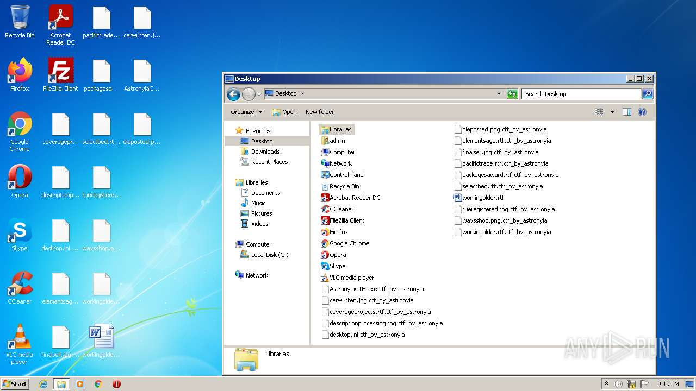
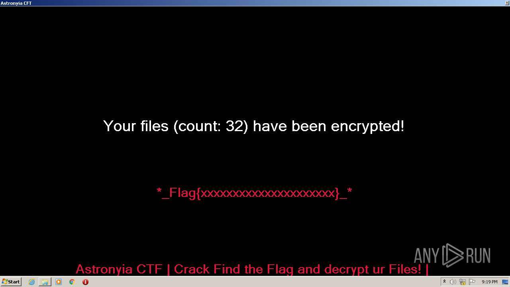

# HEUR-Trojan-Spy.MSIL.Quasar.gen-e03da9d728f41056d5668c805e9d05b38591f2c179c760553edb73a41133f1d1

```
- _id: "e03da9d728f41056d5668c805e9d05b38591f2c179c760553edb73a41133f1d1"
  creation_date: 1615565632  # 2021-03-12 17:13:52 +0100 CET
  first_submission_date: 1615572308  # 2021-03-12 19:05:08 +0100 CET
  last_analysis_date: 1615665186  # 2021-03-13 20:53:06 +0100 CET
  last_analysis_results: 
    Kaspersky: 
      result: "HEUR:Trojan-Spy.MSIL.Quasar.gen"
  magic: "PE32 executable for MS Windows (GUI) Intel 80386 32-bit Mono/.Net assembly"
  packers: 
    PEiD: ".NET executable"
  size: 16896
  trid: 
  - file_type: "Generic CIL Executable (.NET, Mono, etc.)"
    probability: 66.5
  - file_type: "Win64 Executable (generic)"
    probability: 9.5
  - file_type: "Win16 NE executable (generic)"
    probability: 6.4
  - file_type: "Win32 Dynamic Link Library (generic)"
    probability: 5.9
  - file_type: "Win32 Executable (generic)"
    probability: 4.1
```




