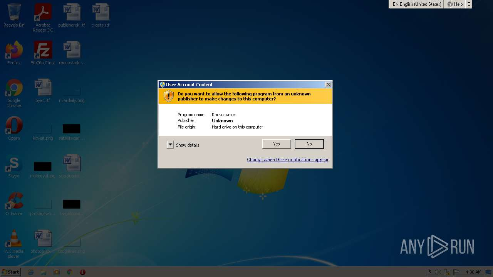
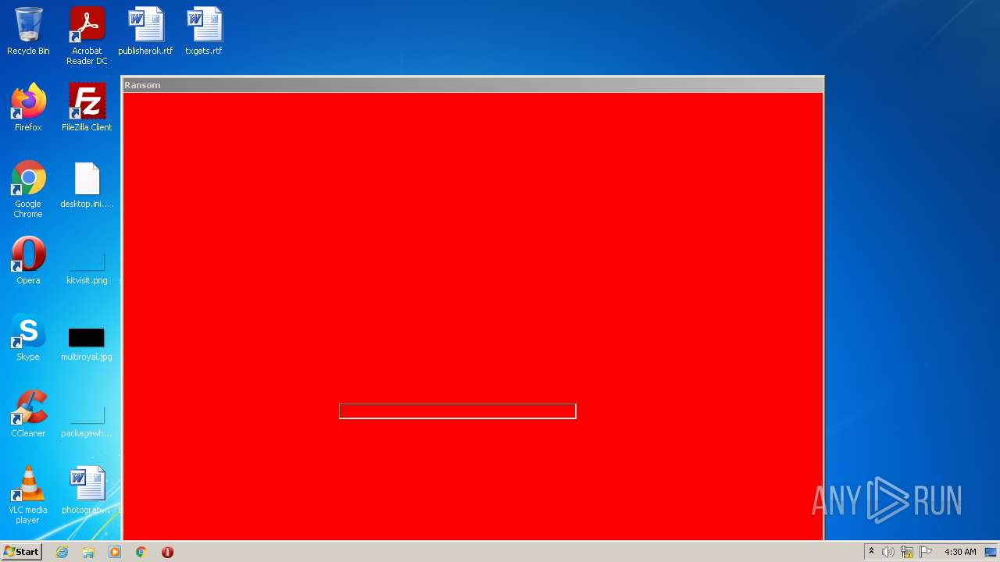
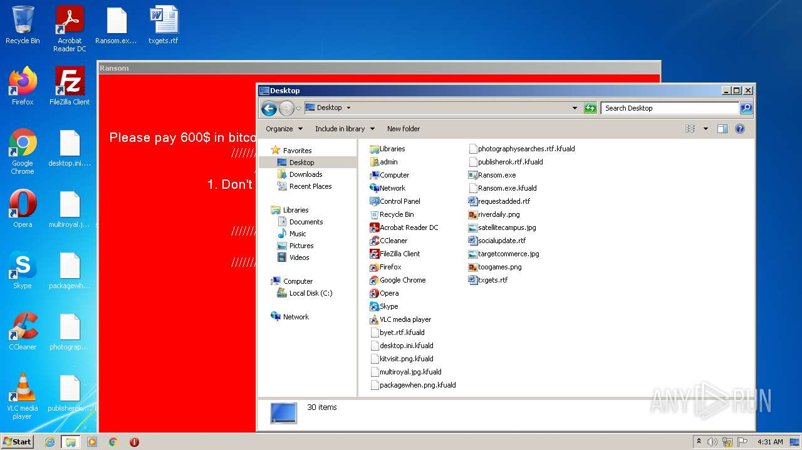
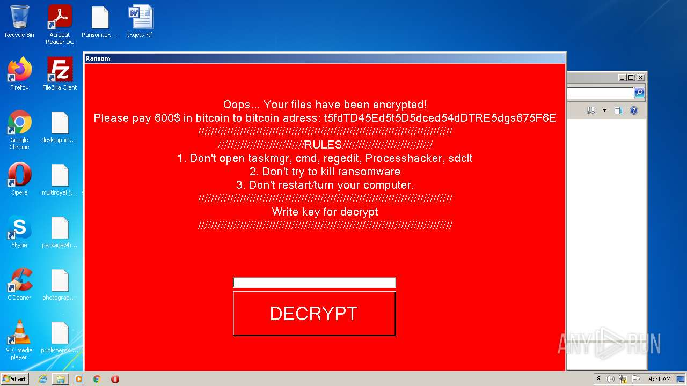
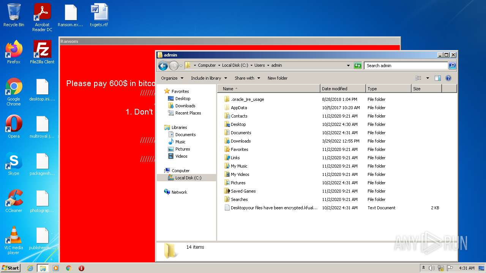
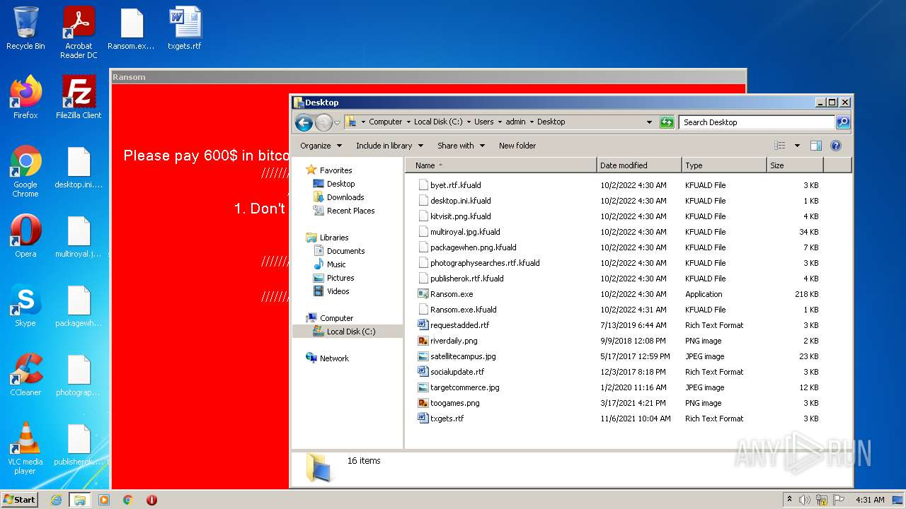
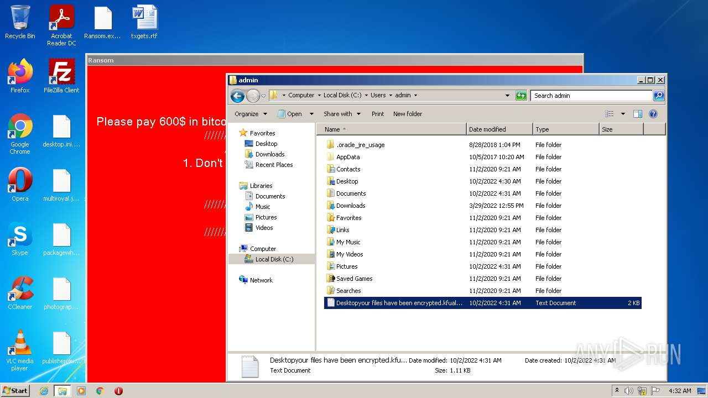
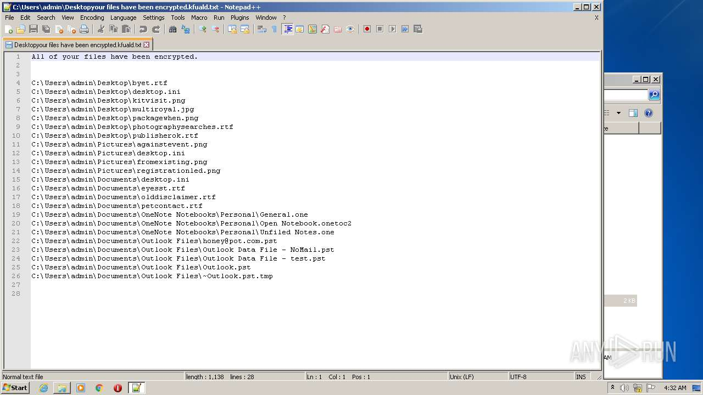
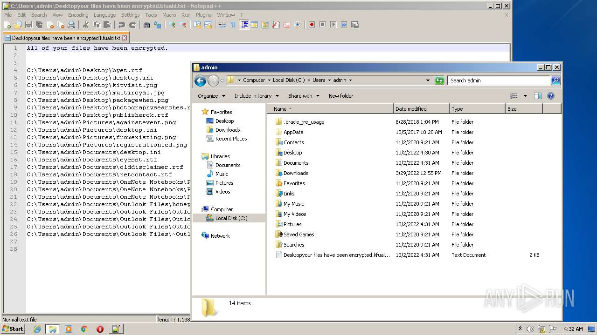

# HEUR-Trojan.MSIL.Diztakun.gen-47f5c7a0c27b925d9c1513ac73eecab3953327beda396fea0b2bbbe15467cb90

- https://any.run/report/47f5c7a0c27b925d9c1513ac73eecab3953327beda396fea0b2bbbe15467cb90/5fc80ab2-4e60-4c1a-89a0-ff716b333c72

```
- _id: "47f5c7a0c27b925d9c1513ac73eecab3953327beda396fea0b2bbbe15467cb90"
  creation_date: 3216026349  # 2071-11-29 13:39:09 +0100 CET
  crowdsourced_yara_results: 
  - author: "ditekSHen"
    description: "Detects executables embedding registry key / value combination indicative of disabling Windows Defedner features"
    rule_name: "INDICATOR_SUSPICIOUS_EXE_RegKeyComb_DisableWinDefender"
    ruleset_id: "00c3b8eb5d"
    ruleset_name: "indicator_suspicious"
    source: "https://github.com/ditekshen/detection"
  first_submission_date: 1619172280  # 2021-04-23 12:04:40 +0200 CEST
  last_analysis_date: 1664077799  # 2022-09-25 05:49:59 +0200 CEST
  last_analysis_results: 
    Kaspersky: 
      result: "HEUR:Trojan.MSIL.Diztakun.gen"
  magic: "PE32 executable for MS Windows (GUI) Intel 80386 Mono/.Net assembly"
  packers: 
    PEiD: ".NET executable"
  size: 223232
  trid: 
  - file_type: "Generic CIL Executable (.NET, Mono, etc.)"
    probability: 72.5
  - file_type: "Win64 Executable (generic)"
    probability: 10.4
  - file_type: "Win32 Dynamic Link Library (generic)"
    probability: 6.5
  - file_type: "Win32 Executable (generic)"
    probability: 4.4
  - file_type: "OS/2 Executable (generic)"
    probability: 2.0
```












