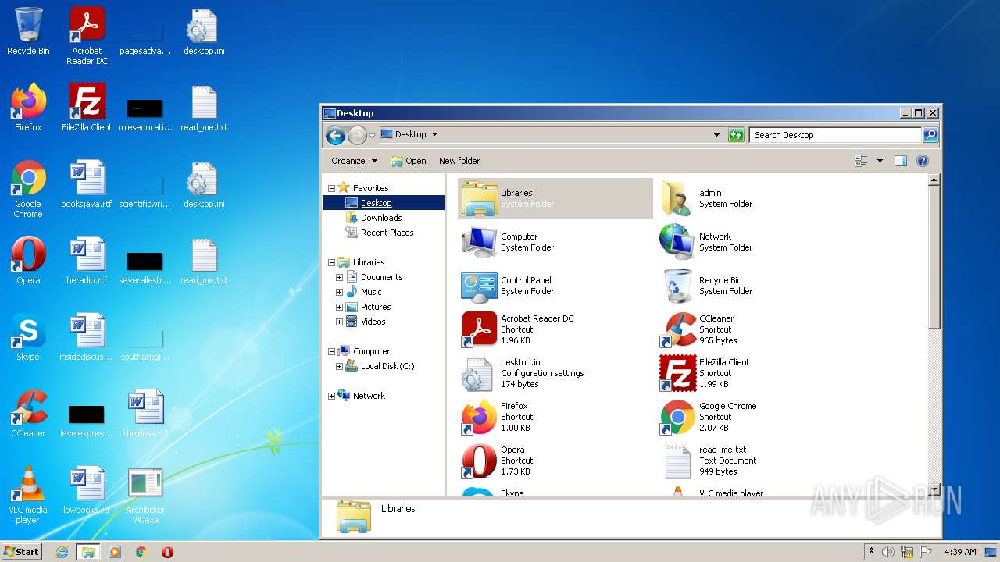
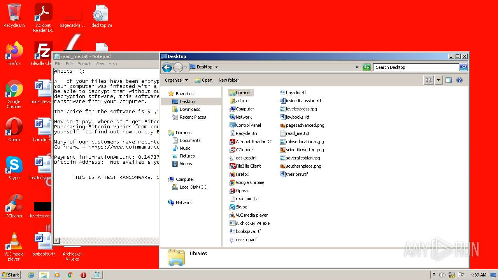
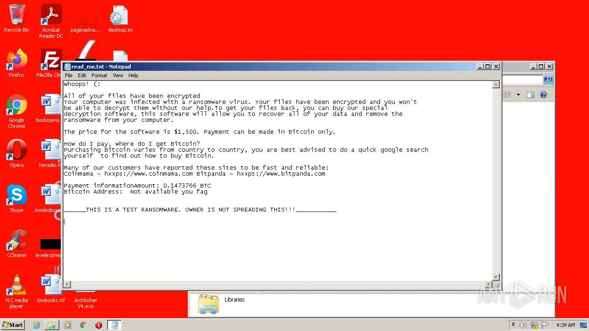
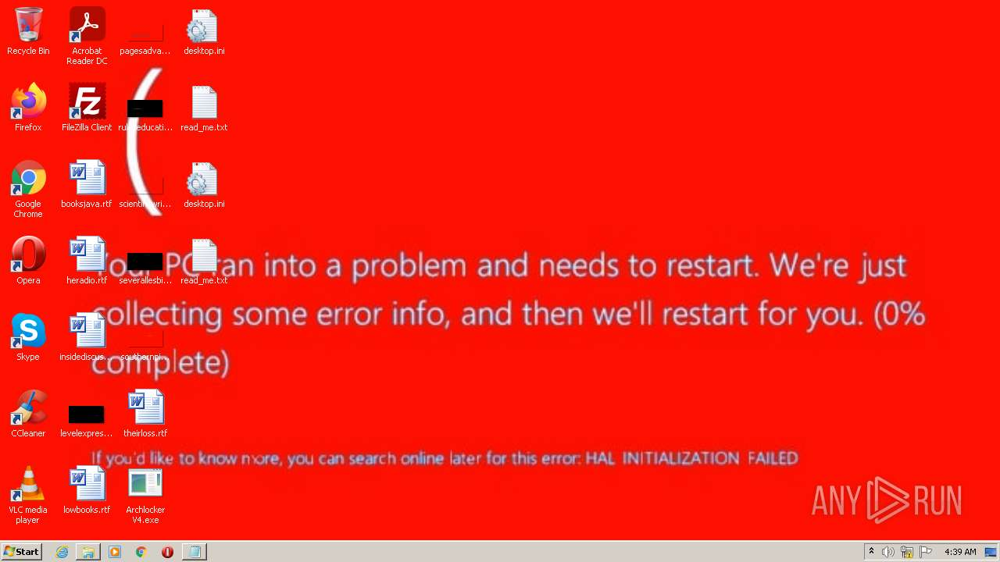
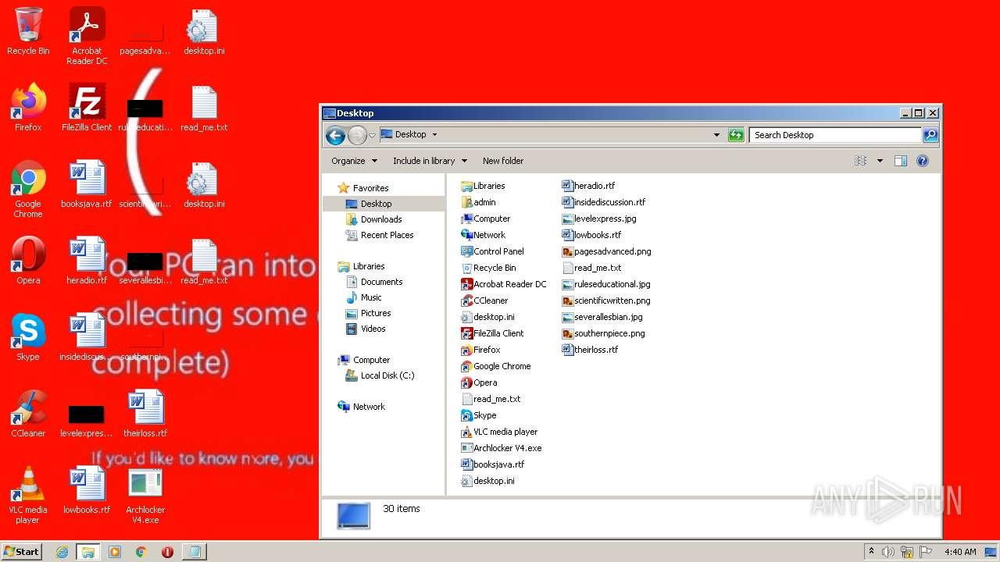
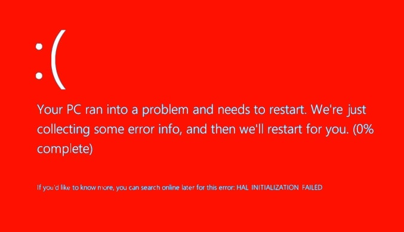

# HEUR-Trojan.MSIL.Fsysna.gen-45b93dc9cc01909bc2277c0c98022af81ea88aeb0957e8e7fa9bd194bcb172e4

- https://any.run/report/45b93dc9cc01909bc2277c0c98022af81ea88aeb0957e8e7fa9bd194bcb172e4/6c7cabe3-a469-4881-bf9e-4c551fd187ce

```
- _id: "45b93dc9cc01909bc2277c0c98022af81ea88aeb0957e8e7fa9bd194bcb172e4"
  creation_date: 1628193549  # 2021-08-05 21:59:09 +0200 CEST
  crowdsourced_yara_results: 
  - author: "Florian Roth"
    description: "Detects destructive malware"
    rule_name: "Destructive_Ransomware_Gen1"
    ruleset_id: "0002573660"
    ruleset_name: "apt_olympic_destroyer"
    source: "https://github.com/Neo23x0/signature-base"
  first_submission_date: 1628226579  # 2021-08-06 07:09:39 +0200 CEST
  last_analysis_date: 1628226579  # 2021-08-06 07:09:39 +0200 CEST
  last_analysis_results: 
    Kaspersky: 
      result: "HEUR:Trojan.MSIL.Fsysna.gen"
  magic: "PE32 executable for MS Windows (GUI) Intel 80386 32-bit Mono/.Net assembly"
  packers: 
    PEiD: ".NET executable"
  size: 80384
  trid: 
  - file_type: "Generic CIL Executable (.NET, Mono, etc.)"
    probability: 72.5
  - file_type: "Win64 Executable (generic)"
    probability: 10.4
  - file_type: "Win32 Dynamic Link Library (generic)"
    probability: 6.5
  - file_type: "Win32 Executable (generic)"
    probability: 4.4
  - file_type: "OS/2 Executable (generic)"
    probability: 2.0
```








