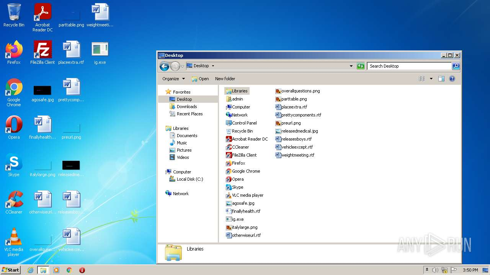
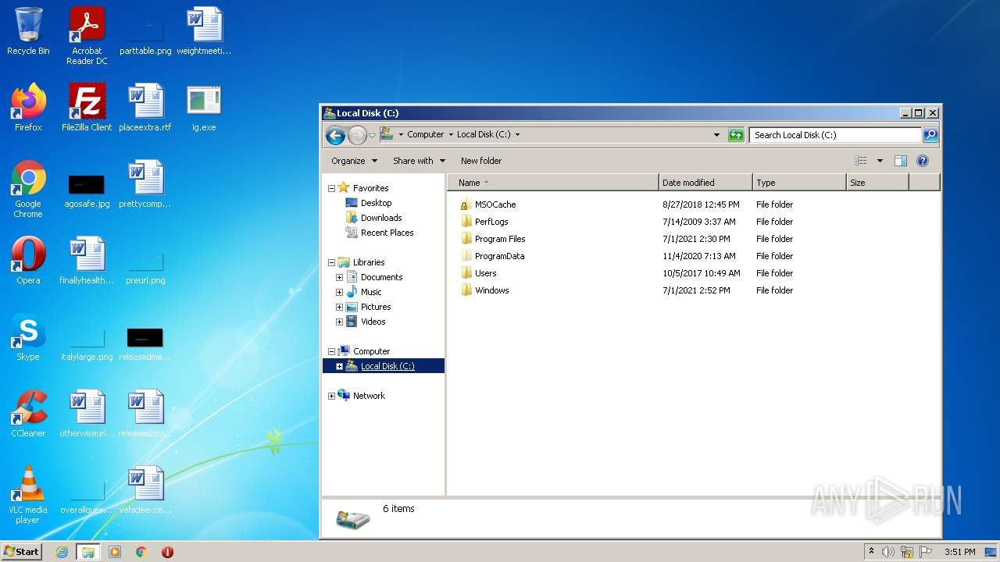
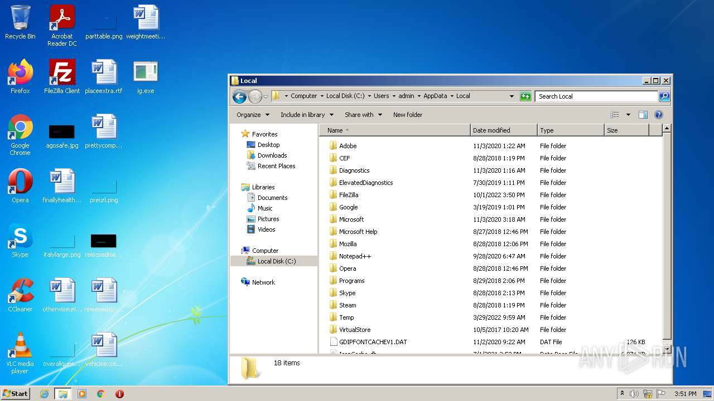
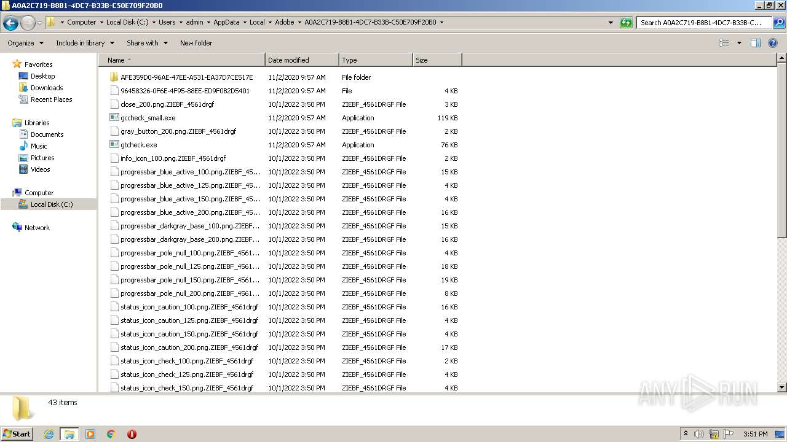
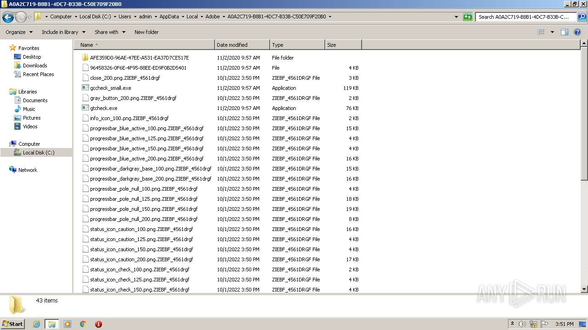
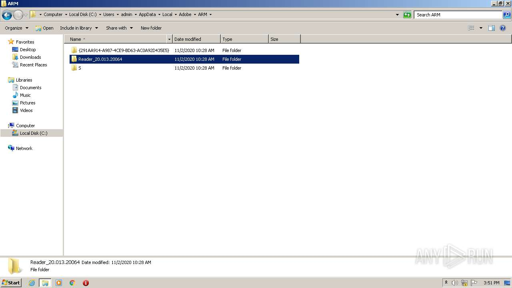
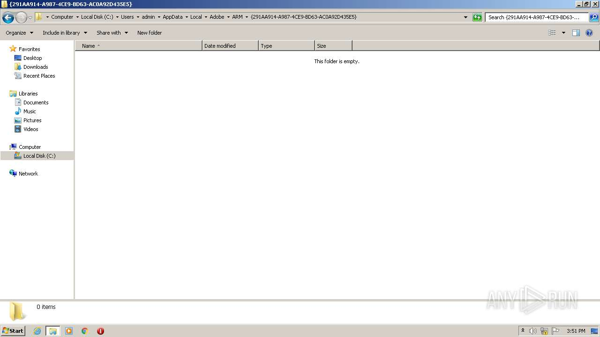
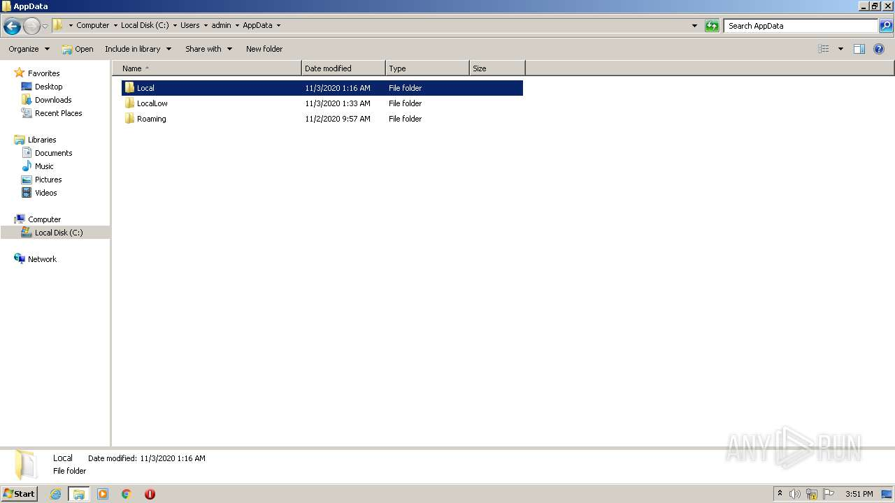
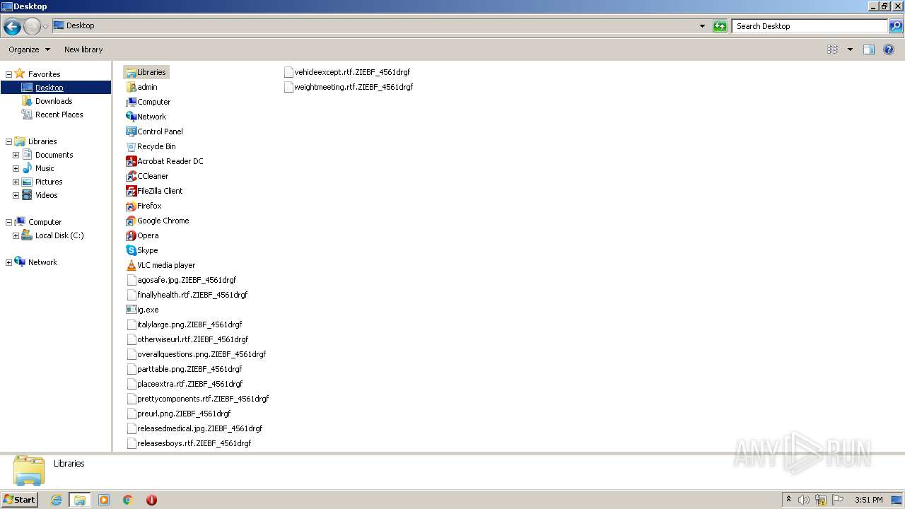
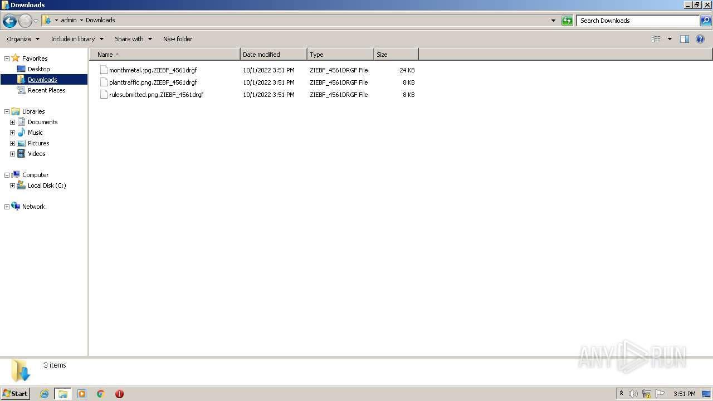

# HEUR-Trojan.MSIL.Witch.gen-4940614325f6ba206d9eab2b1b82af37e9f662a3b9c97eff00a7a398169e22fa

```
- _id: "4940614325f6ba206d9eab2b1b82af37e9f662a3b9c97eff00a7a398169e22fa"
  creation_date: 1609806637  # 2021-01-05 01:30:37 +0100 CET
  first_submission_date: 1609811545  # 2021-01-05 02:52:25 +0100 CET
  last_analysis_date: 1610294125  # 2021-01-10 16:55:25 +0100 CET
  last_analysis_results: 
    Kaspersky: 
      result: "HEUR:Trojan.MSIL.Witch.gen"
  magic: "PE32 executable for MS Windows (GUI) Intel 80386 32-bit Mono/.Net assembly"
  packers: 
    PEiD: ".NET executable"
  size: 21504
  trid: 
  - file_type: "Generic CIL Executable (.NET, Mono, etc.)"
    probability: 72.5
  - file_type: "Win64 Executable (generic)"
    probability: 10.4
  - file_type: "Win32 Dynamic Link Library (generic)"
    probability: 6.5
  - file_type: "Win32 Executable (generic)"
    probability: 4.4
  - file_type: "OS/2 Executable (generic)"
    probability: 2.0
```






















