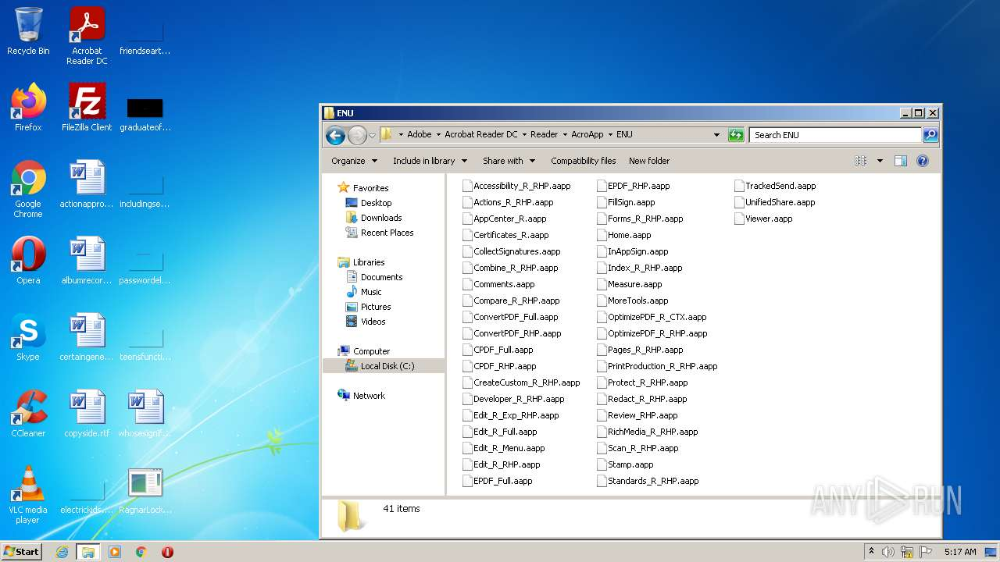

# HEUR-Trojan.Win32.Deapax.gen-68eb2d2d7866775d6bf106a914281491d23769a9eda88fc078328150b8432bb3

- https://any.run/report/68eb2d2d7866775d6bf106a914281491d23769a9eda88fc078328150b8432bb3/b3b0b183-bfd6-4ffc-a187-f5d92c083c8f

```
- _id: "68eb2d2d7866775d6bf106a914281491d23769a9eda88fc078328150b8432bb3"
  creation_date: 1489007805  # 2017-03-08 22:16:45 +0100 CET
  crowdsourced_yara_results: 
  - author: "McAfee ATR Team"
    description: "Rule to detect RagnarLocker samples"
    rule_name: "ragnarlocker_ransomware"
    ruleset_id: "001b3de217"
    ruleset_name: "RANSOM_ragnarlocker"
    source: "https://github.com/advanced-threat-research/Yara-Rules"
  first_submission_date: 1586788011  # 2020-04-13 16:26:51 +0200 CEST
  last_analysis_date: 1653630537  # 2022-05-27 07:48:57 +0200 CEST
  last_analysis_results: 
    Kaspersky: 
      result: "HEUR:Trojan.Win32.Deapax.gen"
  magic: "PE32 executable for MS Windows (GUI) Intel 80386 32-bit"
  packers: 
    PEiD: "Microsoft Visual C++"
  size: 118784
  trid: 
  - file_type: "Win32 Executable MS Visual C++ (generic)"
    probability: 48.8
  - file_type: "Win64 Executable (generic)"
    probability: 16.4
  - file_type: "Win32 Dynamic Link Library (generic)"
    probability: 10.2
  - file_type: "Win16 NE executable (generic)"
    probability: 7.8
  - file_type: "Win32 Executable (generic)"
    probability: 7.0
```


