# HEUR-Trojan.Win32.DelShad.gen-0f22ae8e435cfeb4e527199c9083e7093c79892656eff686d55909e8528493db

- https://any.run/report/0f22ae8e435cfeb4e527199c9083e7093c79892656eff686d55909e8528493db/917ba66c-c87f-463b-8a44-8aae9d11e8f7

```
- _id: "0f22ae8e435cfeb4e527199c9083e7093c79892656eff686d55909e8528493db"
  creation_date: 1636168755  # 2021-11-06 04:19:15 +0100 CET
  crowdsourced_yara_results: 
  - author: "Florian Roth"
    description: "Detects an XORed URL in an executable"
    rule_name: "SUSP_XORed_URL_in_EXE"
    ruleset_id: "000f44c4bb"
    ruleset_name: "gen_susp_xor"
    source: "https://github.com/Neo23x0/signature-base"
  first_submission_date: 1665661905  # 2022-10-13 13:51:45 +0200 CEST
  last_analysis_date: 1665661905  # 2022-10-13 13:51:45 +0200 CEST
  last_analysis_results: 
    Kaspersky: 
      result: "HEUR:Trojan.Win32.DelShad.gen"
  magic: "PE32 executable for MS Windows (console) Intel 80386 32-bit"
  size: 826880
  trid: 
  - file_type: "Win64 Executable (generic)"
    probability: 32.2
  - file_type: "Win32 Dynamic Link Library (generic)"
    probability: 20.1
  - file_type: "Win16 NE executable (generic)"
    probability: 15.4
  - file_type: "Win32 Executable (generic)"
    probability: 13.7
  - file_type: "OS/2 Executable (generic)"
    probability: 6.2
```

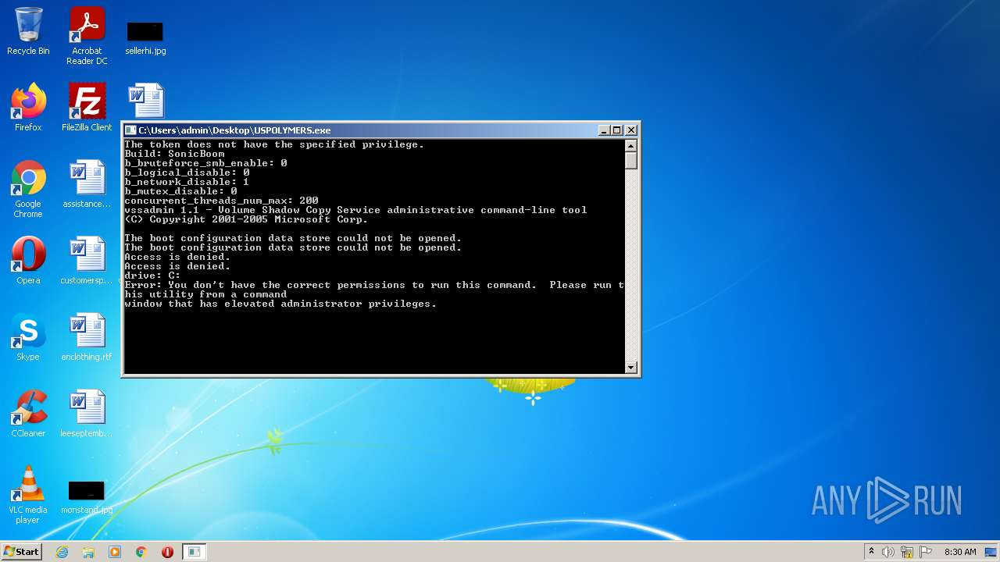
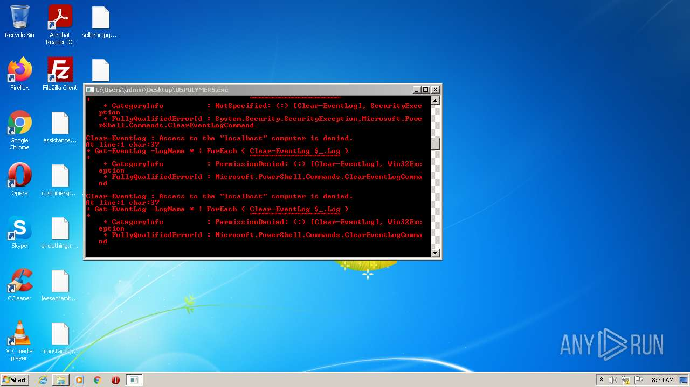
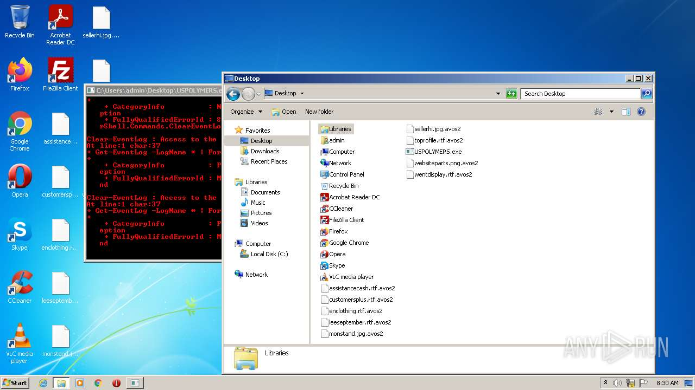
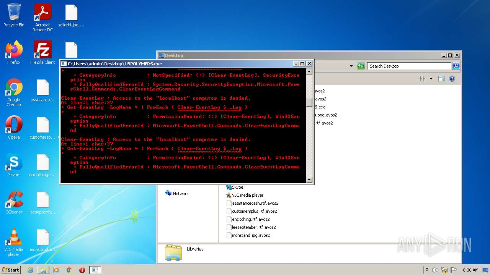

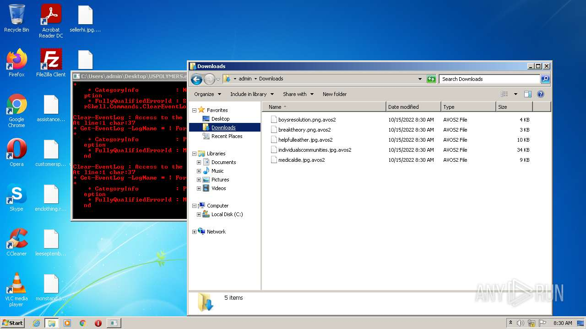
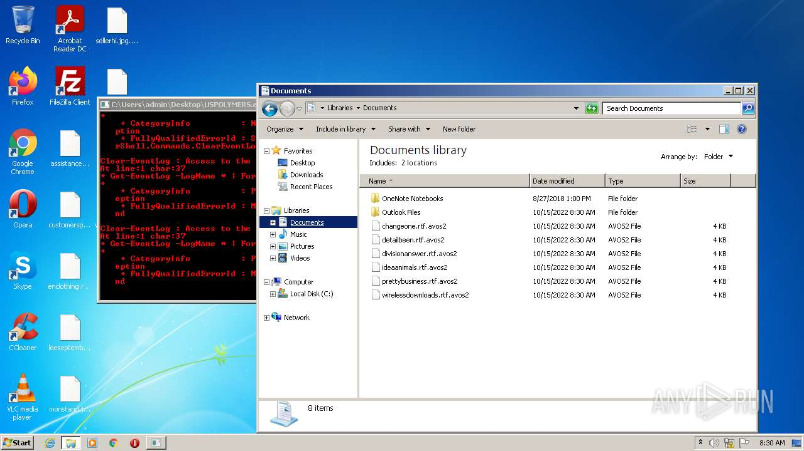
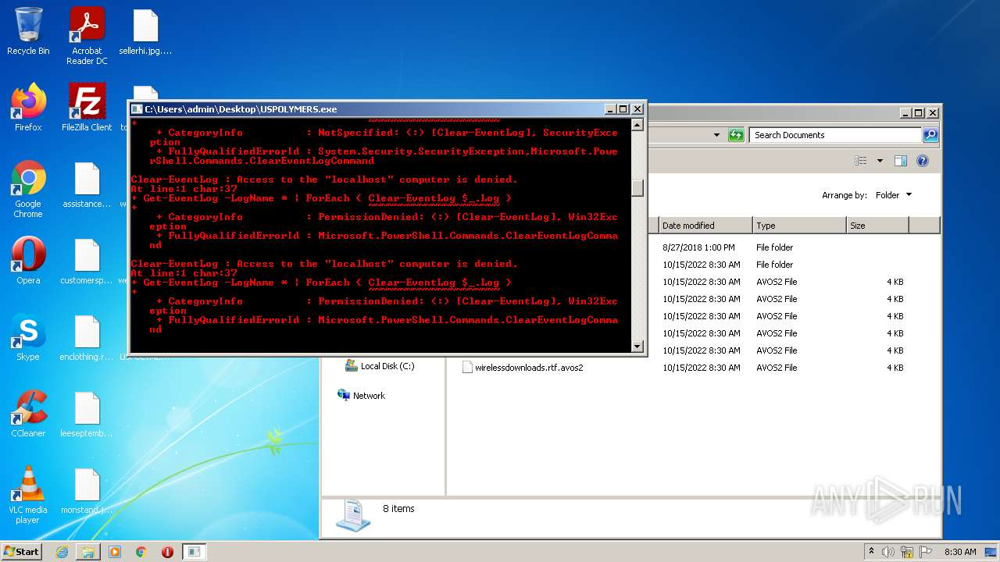
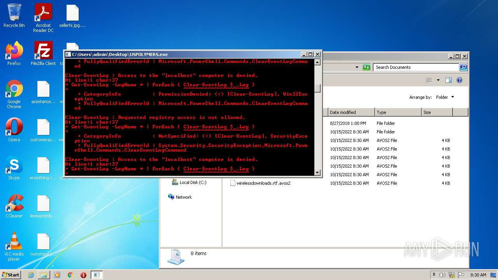

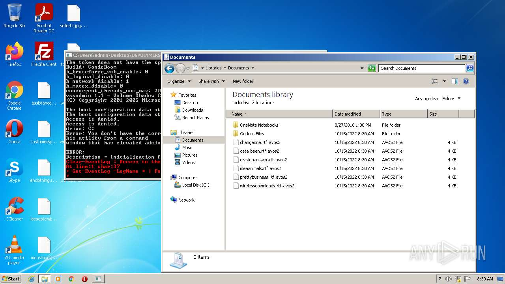
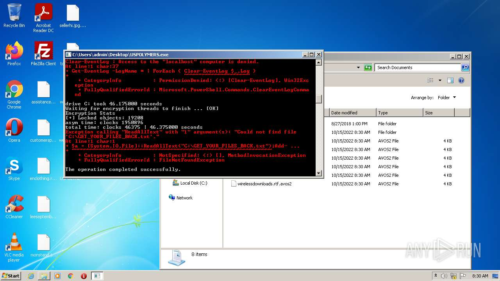
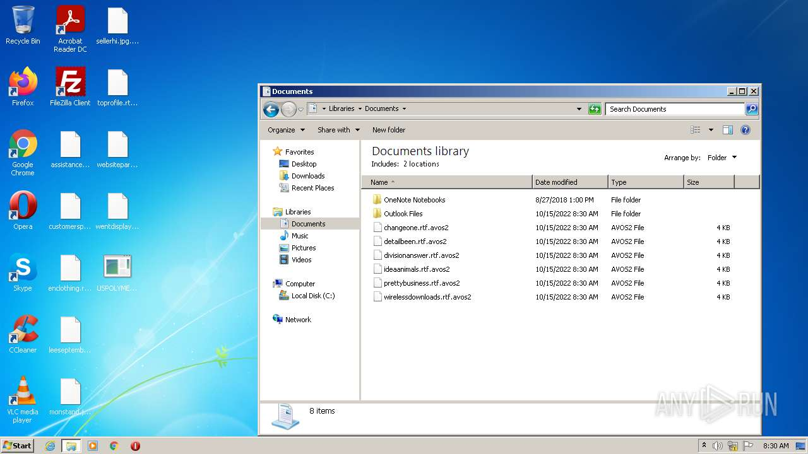
