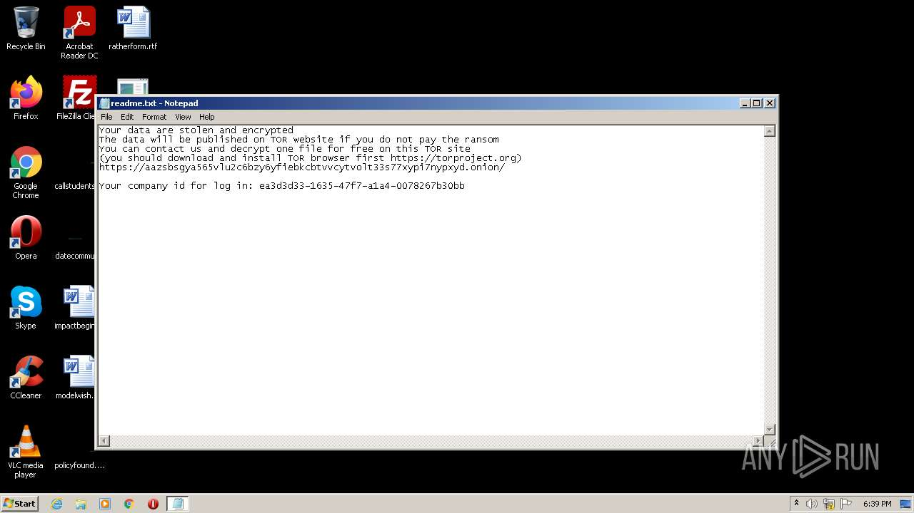
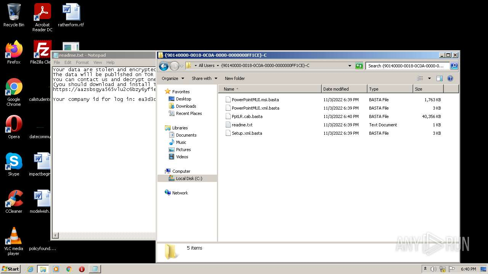
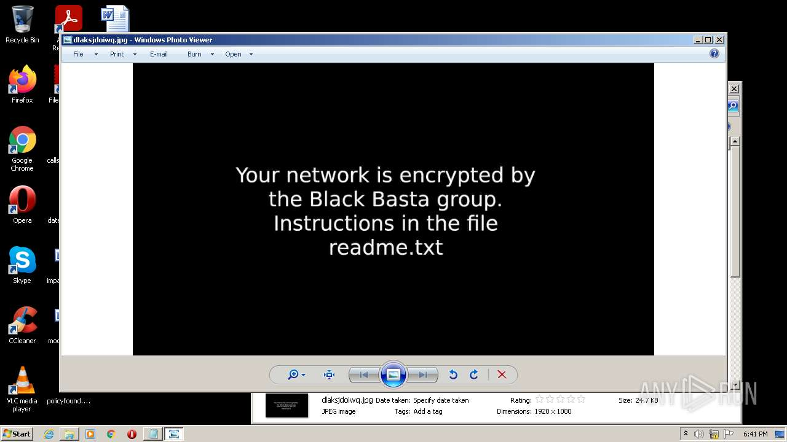
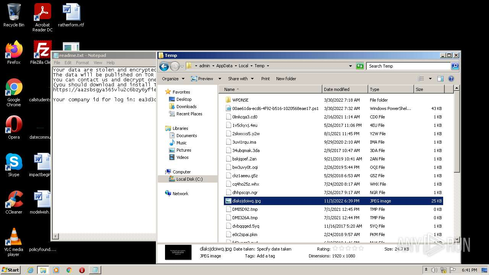
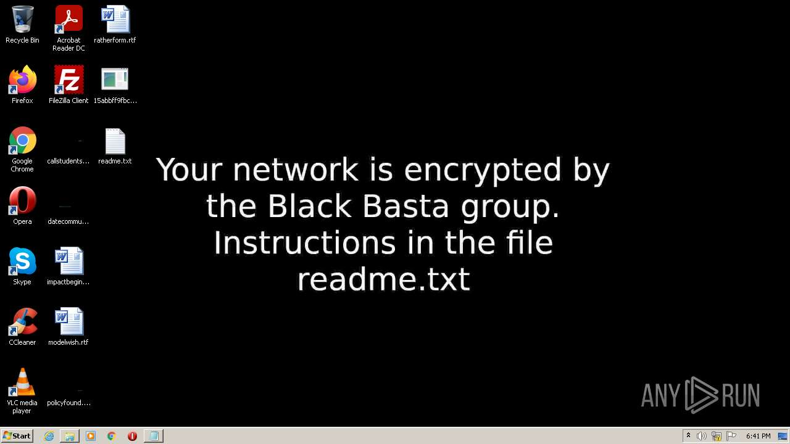
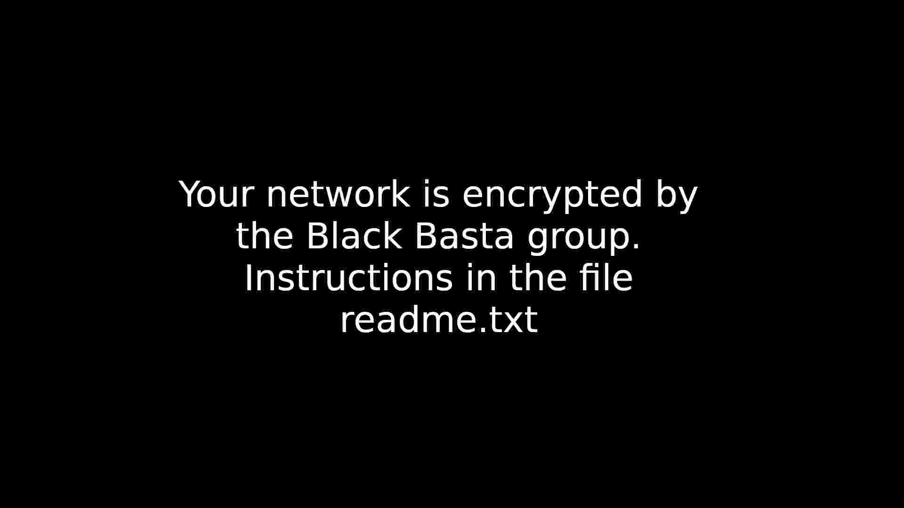

# HEUR-Trojan.Win32.DelShad.gen-15abbff9fbce7f5782c1654775938dcd2ce0a8ebd683a008547f8a4e421888c4

- https://any.run/report/15abbff9fbce7f5782c1654775938dcd2ce0a8ebd683a008547f8a4e421888c4/5a69e0f3-6b3d-45cf-8037-5553678f9372

```
- _id: "15abbff9fbce7f5782c1654775938dcd2ce0a8ebd683a008547f8a4e421888c4"
  creation_date: 1666140974  # 2022-10-19 02:56:14 +0200 CEST
  crowdsourced_yara_results: 
  - author: "ditekSHen"
    description: "detects command variations typically used by ransomware"
    rule_name: "INDICATOR_SUSPICIOUS_GENRansomware"
    ruleset_id: "00c3b8eb5d"
    ruleset_name: "indicator_suspicious"
    source: "https://github.com/ditekshen/detection"
  - author: "Elastic Security"
    rule_name: "Windows_Ransomware_BlackBasta_494d3c54"
    ruleset_id: "0157897c12"
    ruleset_name: "Windows_Ransomware_BlackBasta"
    source: "https://github.com/elastic/protections-artifacts"
  first_submission_date: 1666168795  # 2022-10-19 10:39:55 +0200 CEST
  last_analysis_date: 1667491534  # 2022-11-03 17:05:34 +0100 CET
  last_analysis_results: 
    Kaspersky: 
      result: "HEUR:Trojan.Win32.DelShad.gen"
  magic: "PE32 executable for MS Windows (console) Intel 80386 32-bit"
  size: 558592
  trid: 
  - file_type: "Win64 Executable (generic)"
    probability: 32.2
  - file_type: "Win32 Dynamic Link Library (generic)"
    probability: 20.1
  - file_type: "Win16 NE executable (generic)"
    probability: 15.4
  - file_type: "Win32 Executable (generic)"
    probability: 13.7
  - file_type: "OS/2 Executable (generic)"
    probability: 6.2
```







