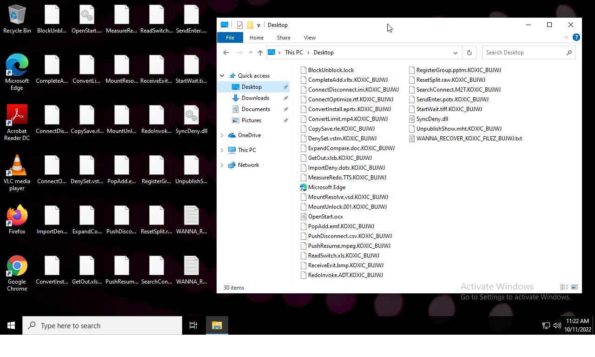
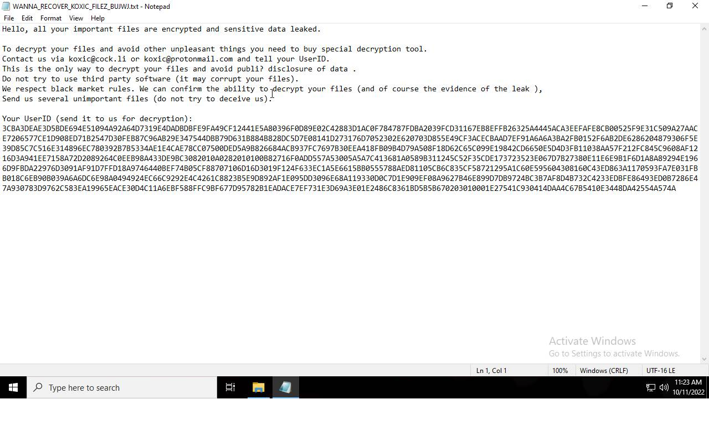
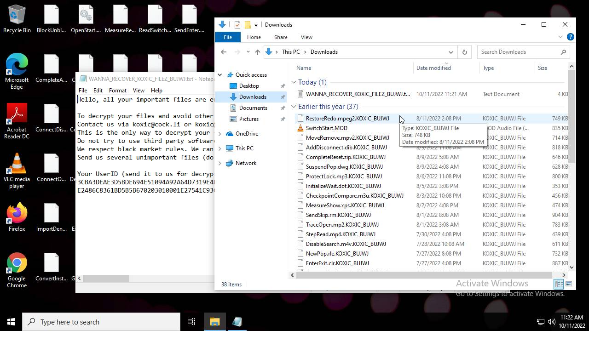

# HEUR-Trojan.Win32.DelShad.gen-7a5e20e021dc29a07cad61f4d0bdb98e22749f13c3ace58220bfe978908bb7e9

- https://tria.ge/221011-laklssfgd6/behavioral1

```
- _id: "7a5e20e021dc29a07cad61f4d0bdb98e22749f13c3ace58220bfe978908bb7e9"
  creation_date: 1631464882  # 2021-09-12 18:41:22 +0200 CEST
  crowdsourced_yara_results: 
  - author: "ditekSHen"
    description: "Detects executables embedding registry key / value combination indicative of disabling Windows Defedner features"
    rule_name: "INDICATOR_SUSPICIOUS_EXE_RegKeyComb_DisableWinDefender"
    ruleset_id: "00c3b8eb5d"
    ruleset_name: "indicator_suspicious"
    source: "https://github.com/ditekshen/detection"
  - author: "ditekSHen"
    description: "Detects Koxic ransomware"
    rule_name: "MALWARE_Win_Koxic"
    ruleset_id: "00cc803bdc"
    ruleset_name: "malware"
    source: "https://github.com/ditekshen/detection"
  first_submission_date: 1632389610  # 2021-09-23 11:33:30 +0200 CEST
  last_analysis_date: 1646461121  # 2022-03-05 07:18:41 +0100 CET
  last_analysis_results: 
    Kaspersky: 
      result: "HEUR:Trojan.Win32.DelShad.gen"
  magic: "PE32 executable for MS Windows (GUI) Intel 80386 32-bit"
  size: 388608
  trid: 
  - file_type: "Win64 Executable (generic)"
    probability: 40.3
  - file_type: "Win16 NE executable (generic)"
    probability: 19.3
  - file_type: "Win32 Executable (generic)"
    probability: 17.2
  - file_type: "OS/2 Executable (generic)"
    probability: 7.7
  - file_type: "Generic Win/DOS Executable"
    probability: 7.6
```




