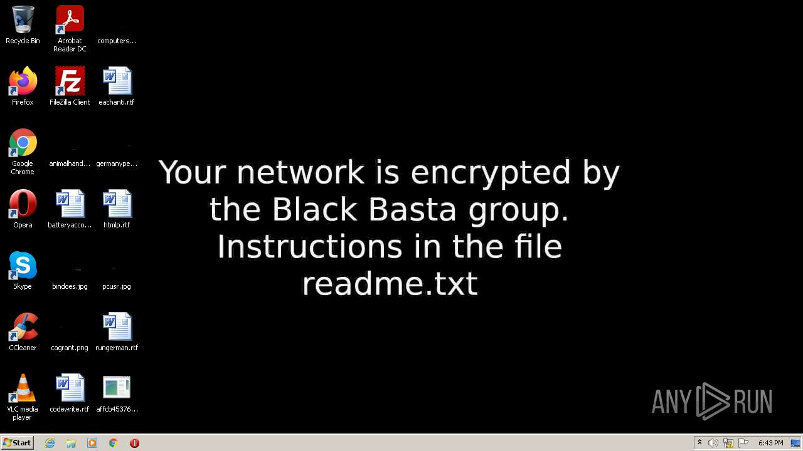
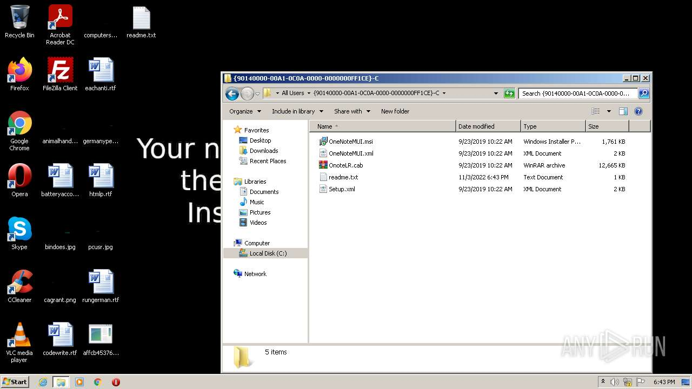
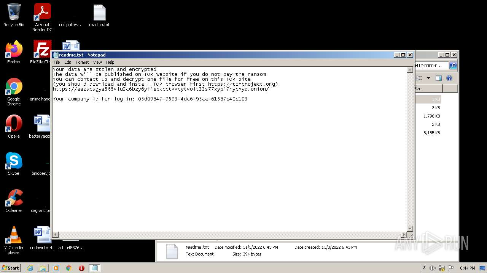
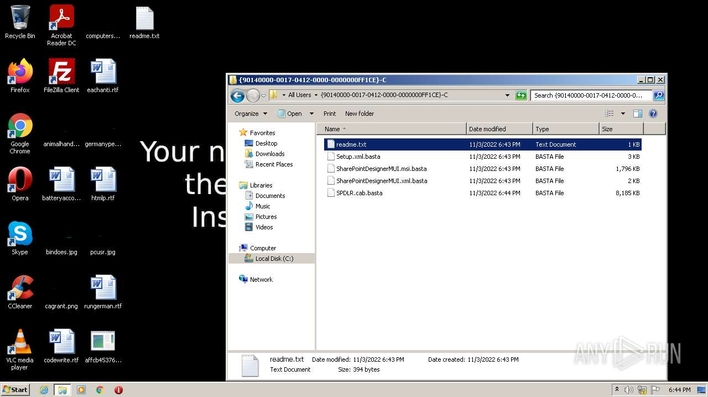

# HEUR-Trojan.Win32.DelShad.gen-affcb453760dbc48b39f8d4defbcc4fc65d00df6fae395ee27f031c1833abada

- https://any.run/report/affcb453760dbc48b39f8d4defbcc4fc65d00df6fae395ee27f031c1833abada/fb61a4b6-7d8a-45be-8c36-bfcea30953f7

```
- _id: "affcb453760dbc48b39f8d4defbcc4fc65d00df6fae395ee27f031c1833abada"
  creation_date: 1654678135  # 2022-06-08 10:48:55 +0200 CEST
  crowdsourced_yara_results: 
  - author: "ditekSHen"
    description: "detects command variations typically used by ransomware"
    rule_name: "INDICATOR_SUSPICIOUS_GENRansomware"
    ruleset_id: "00c3b8eb5d"
    ruleset_name: "indicator_suspicious"
    source: "https://github.com/ditekshen/detection"
  - rule_name: "Windows_Ransomware_BlackBasta_494d3c54"
    ruleset_id: "0157897c12"
    ruleset_name: "Windows_Ransomware_BlackBasta"
    source: "https://github.com/elastic/protections-artifacts"
  first_submission_date: 1663075824  # 2022-09-13 15:30:24 +0200 CEST
  last_analysis_date: 1663515721  # 2022-09-18 17:42:01 +0200 CEST
  last_analysis_results: 
    Kaspersky: 
      result: "HEUR:Trojan.Win32.DelShad.gen"
  magic: "PE32 executable for MS Windows (console) Intel 80386 32-bit"
  size: 559104
  trid: 
  - file_type: "Win64 Executable (generic)"
    probability: 32.2
  - file_type: "Win32 Dynamic Link Library (generic)"
    probability: 20.1
  - file_type: "Win16 NE executable (generic)"
    probability: 15.4
  - file_type: "Win32 Executable (generic)"
    probability: 13.7
  - file_type: "OS/2 Executable (generic)"
    probability: 6.2
```





