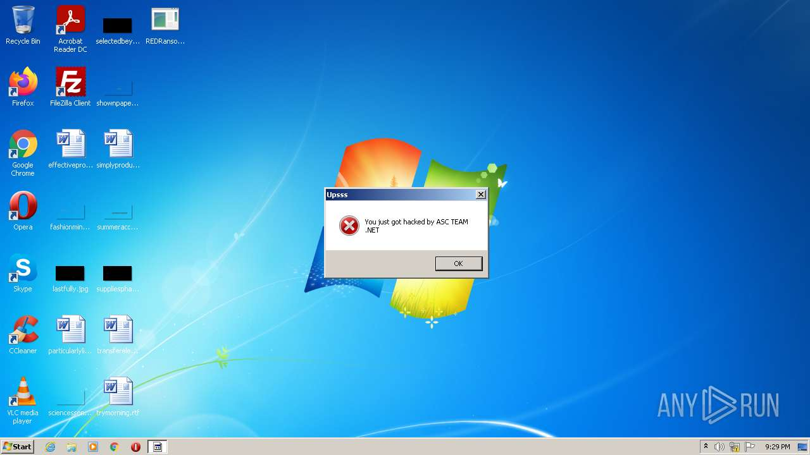
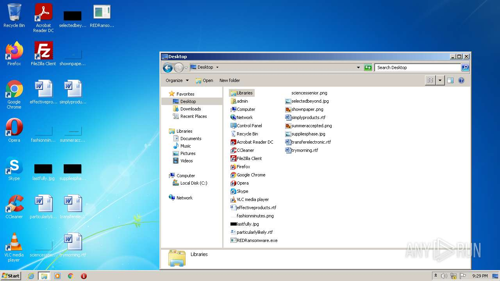
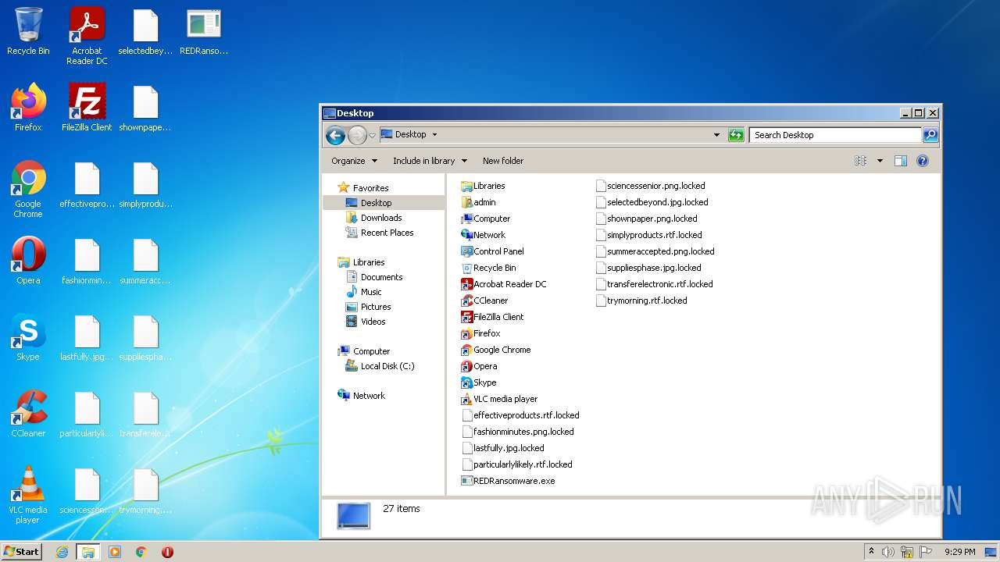
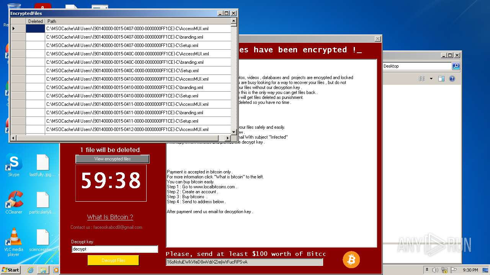
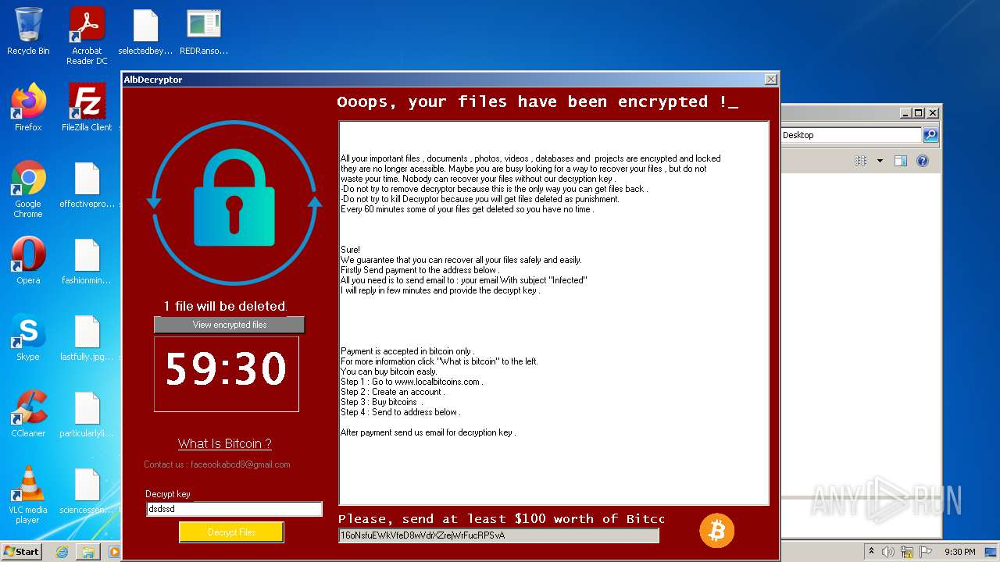
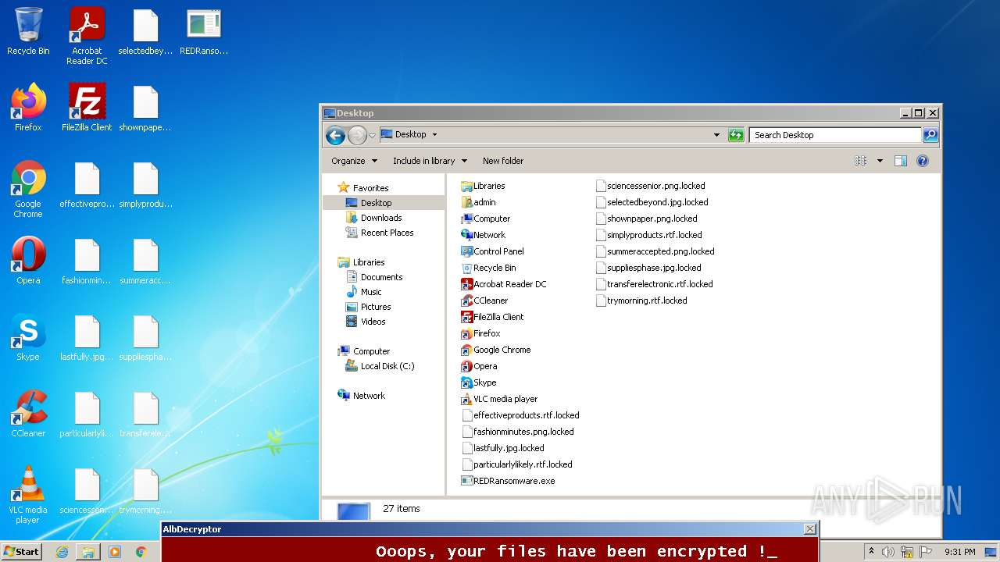

# HEUR-Trojan.Win32.Generic-023c9d8e64faa3e180d27e1d8f451162d990b8841d4b133d276dccc5b7dfd660

- https://any.run/report/023c9d8e64faa3e180d27e1d8f451162d990b8841d4b133d276dccc5b7dfd660/6cfa4f7d-eb6d-40b7-ae59-8dfc46a40133

```
- _id: "023c9d8e64faa3e180d27e1d8f451162d990b8841d4b133d276dccc5b7dfd660"
  creation_date: 1615761467  # 2021-03-14 23:37:47 +0100 CET
  first_submission_date: 1615788276  # 2021-03-15 07:04:36 +0100 CET
  last_analysis_date: 1664123032  # 2022-09-25 18:23:52 +0200 CEST
  last_analysis_results: 
    Kaspersky: 
      result: "HEUR:Trojan.Win32.Generic"
  magic: "PE32 executable for MS Windows (GUI) Intel 80386 Mono/.Net assembly"
  size: 138752
  trid: 
  - file_type: "Generic CIL Executable (.NET, Mono, etc.)"
    probability: 69.1
  - file_type: "Win64 Executable (generic)"
    probability: 9.9
  - file_type: "Win32 Dynamic Link Library (generic)"
    probability: 6.2
  - file_type: "Win16 NE executable (generic)"
    probability: 4.7
  - file_type: "Win32 Executable (generic)"
    probability: 4.2
```









