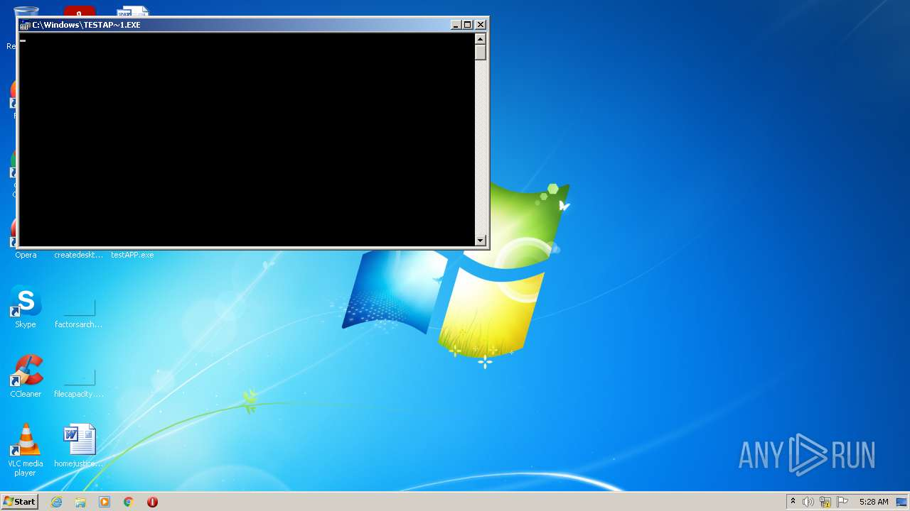
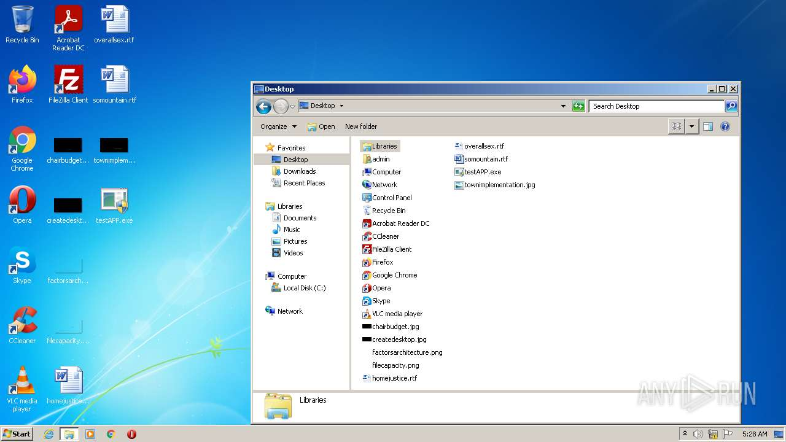
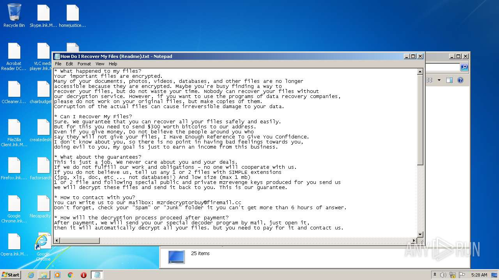
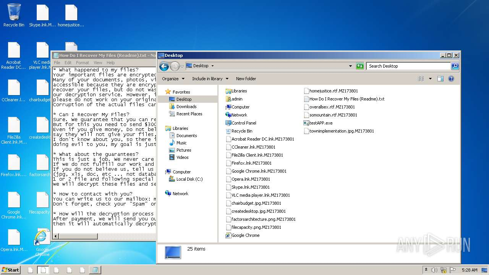
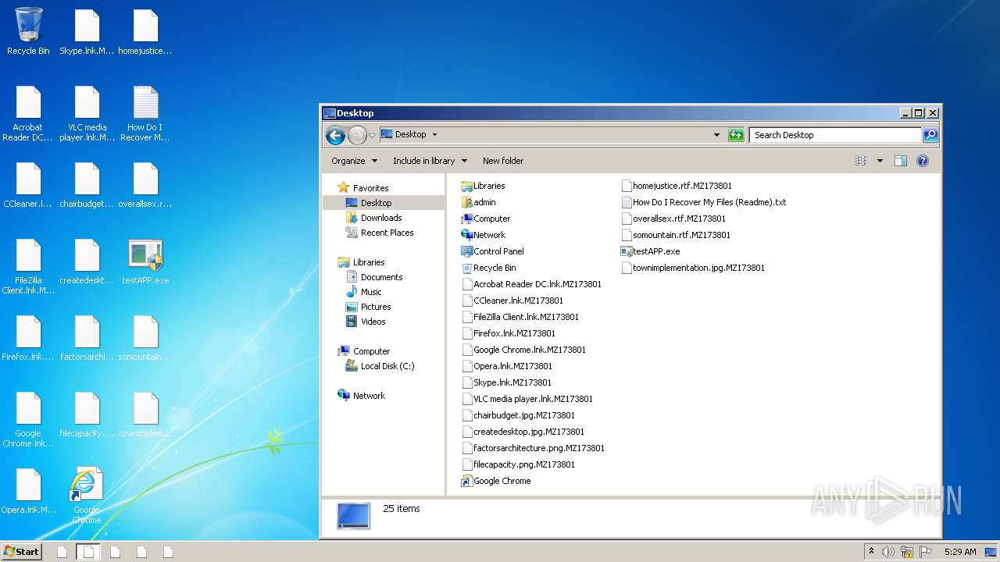
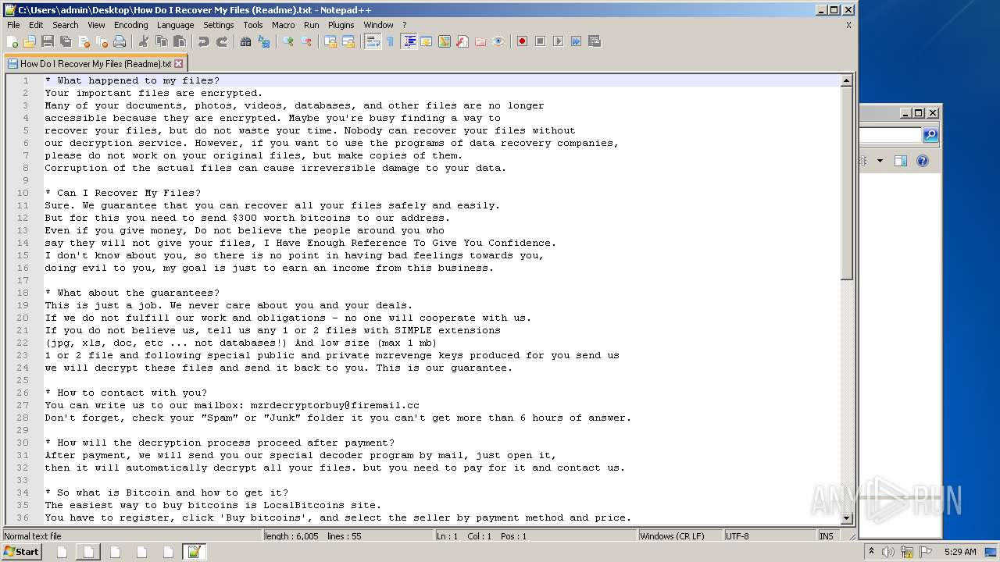
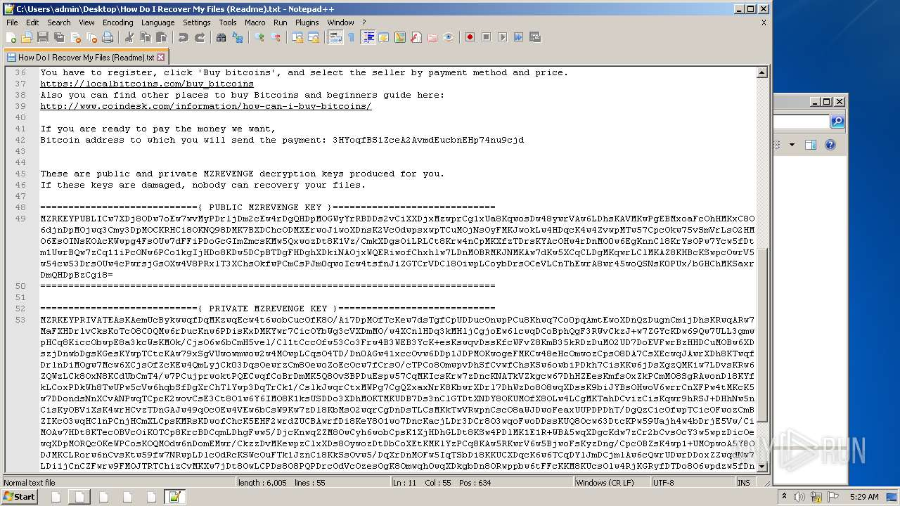
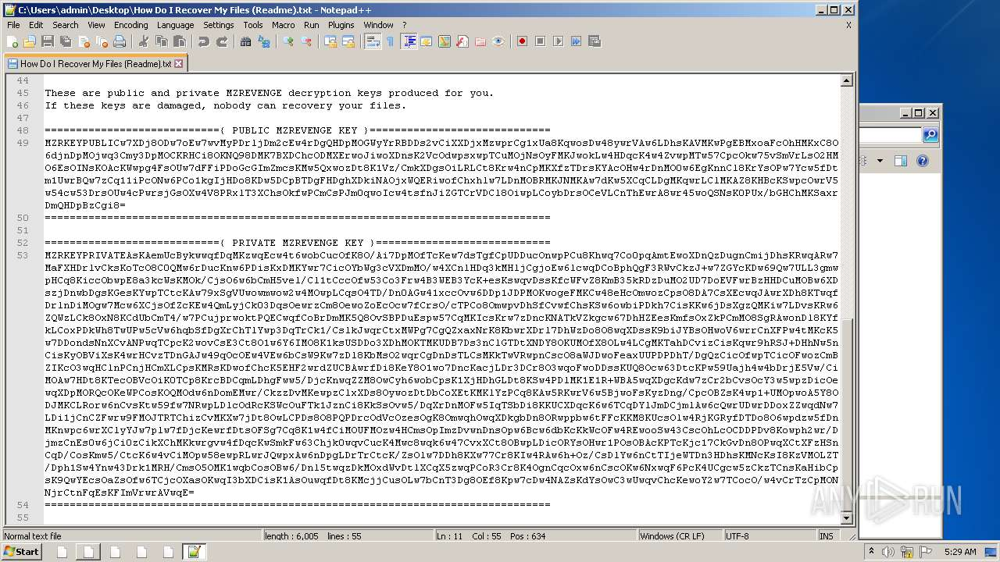
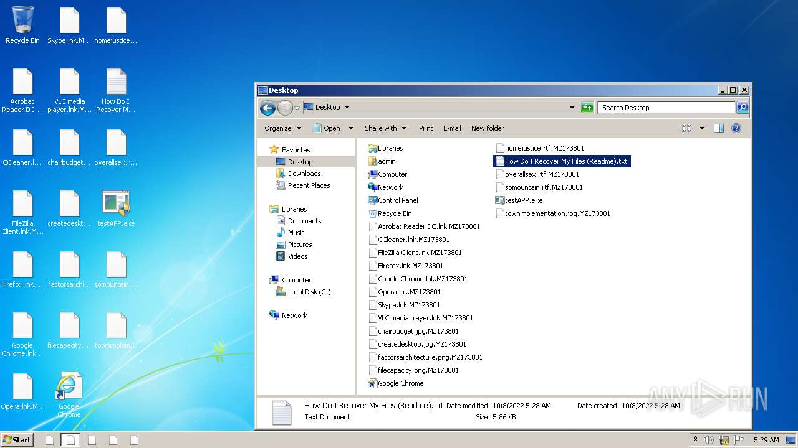
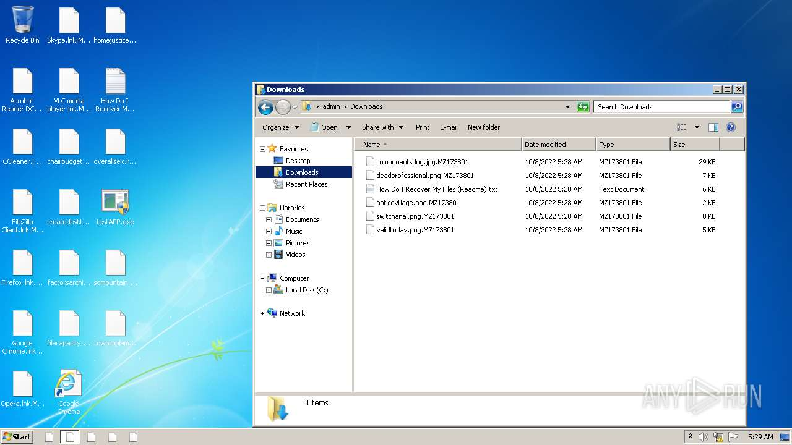

# HEUR-Trojan.Win32.Generic-0b4d0705fc9ce84fdfcd254b743c3508e5fb0584b10e243b195b3fb361f23f03

- https://any.run/report/0b4d0705fc9ce84fdfcd254b743c3508e5fb0584b10e243b195b3fb361f23f03/7ef827bf-18d0-4247-9ec1-397b2fcb2861

```
- _id: "0b4d0705fc9ce84fdfcd254b743c3508e5fb0584b10e243b195b3fb361f23f03"
  creation_date: 1408985539  # 2014-08-25 18:52:19 +0200 CEST
  first_submission_date: 1585554813  # 2020-03-30 09:53:33 +0200 CEST
  last_analysis_date: 1585554813  # 2020-03-30 09:53:33 +0200 CEST
  last_analysis_results: 
    Kaspersky: 
      result: "HEUR:Trojan.Win32.Generic"
  magic: "PE32 executable for MS Windows (GUI) Intel 80386 32-bit Mono/.Net assembly"
  packers: 
    PEiD: ".NET executable"
  size: 437900
  trid: 
  - file_type: "Generic CIL Executable (.NET, Mono, etc.)"
    probability: 55.8
  - file_type: "Win64 Executable (generic)"
    probability: 21.0
  - file_type: "Windows screen saver"
    probability: 10.0
  - file_type: "Win32 Dynamic Link Library (generic)"
    probability: 5.0
  - file_type: "Win32 Executable (generic)"
    probability: 3.4
```











