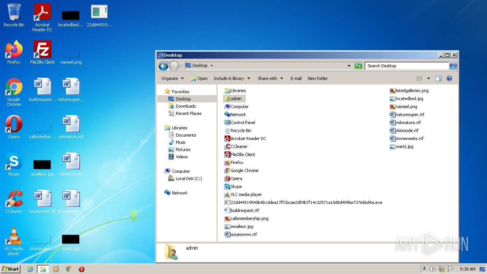
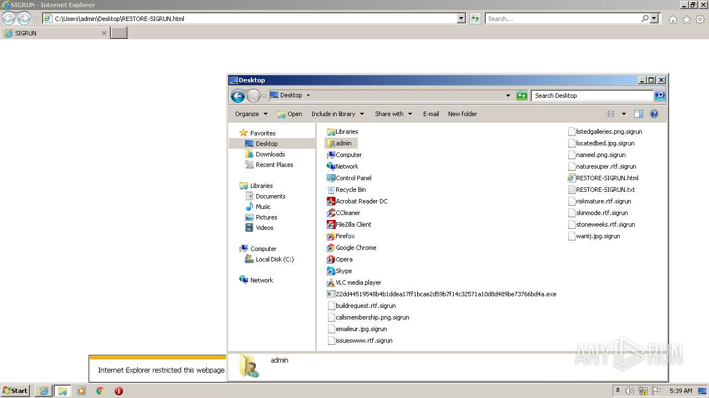
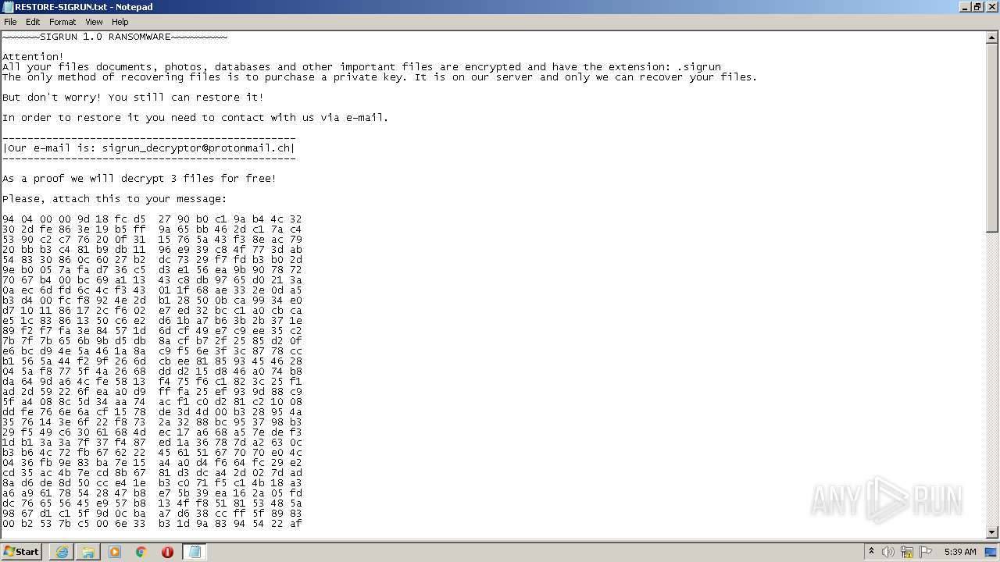
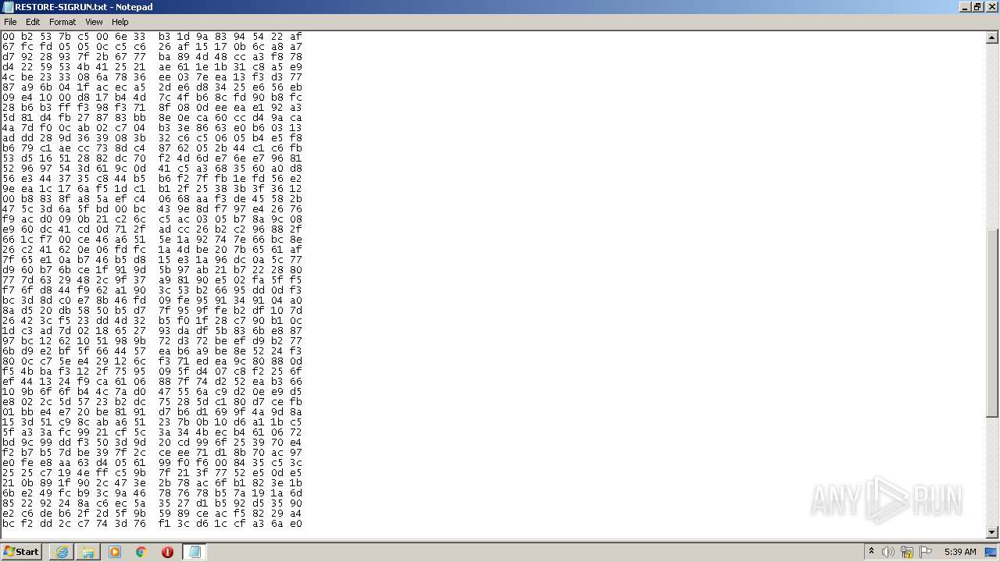
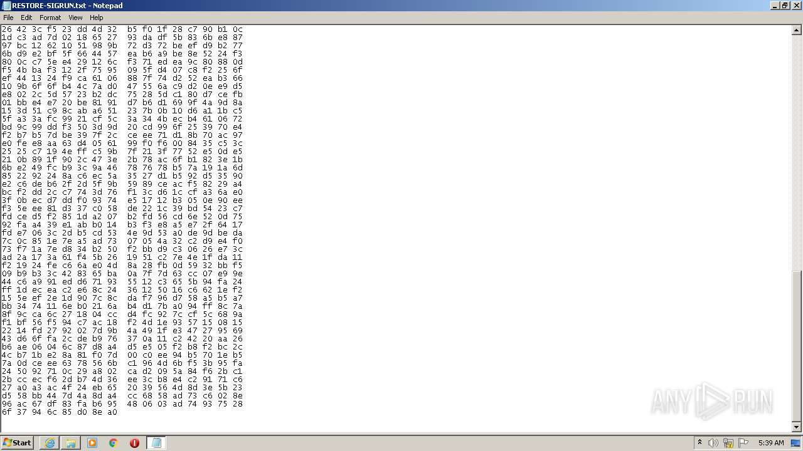
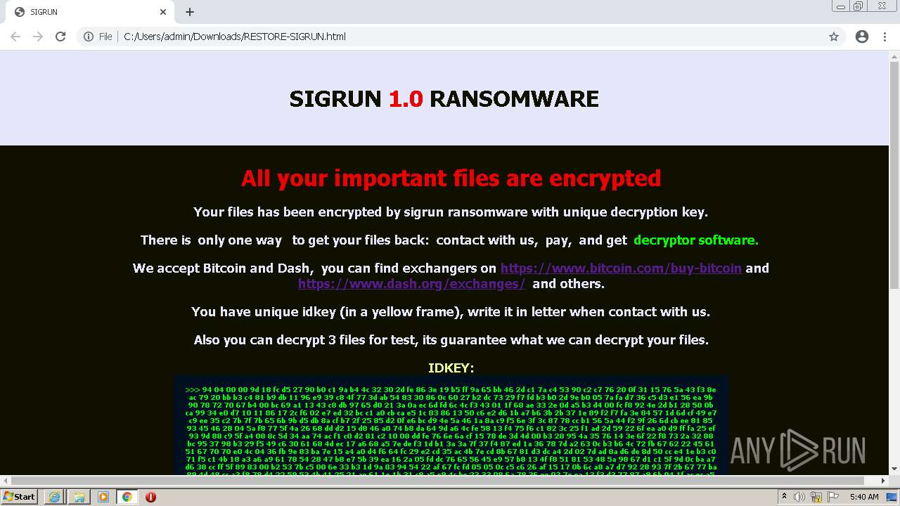
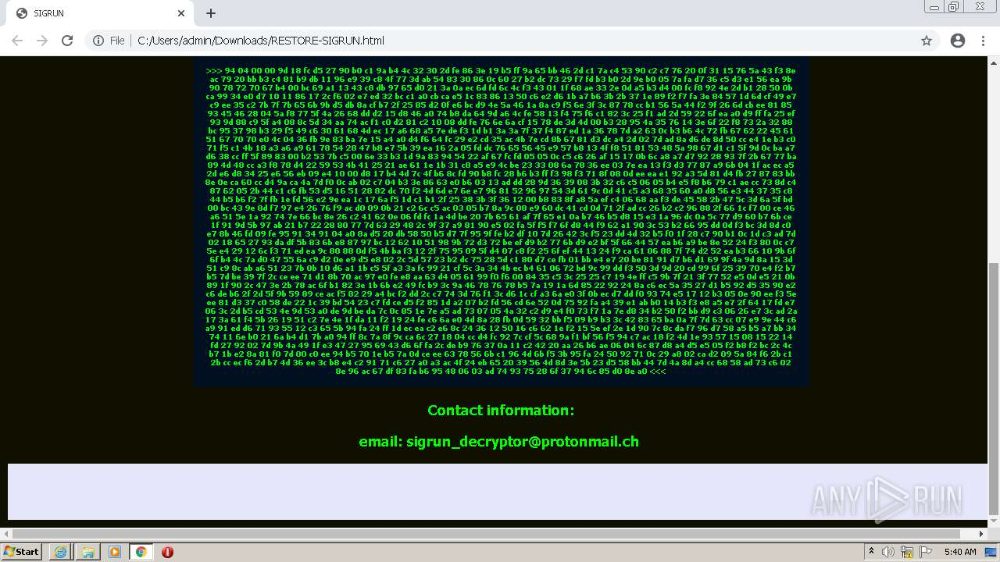
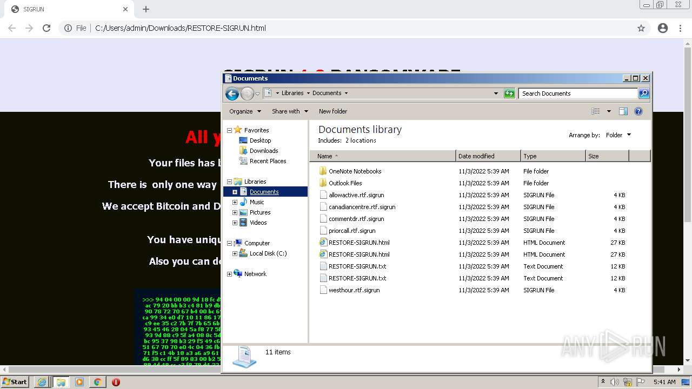

# HEUR-Trojan.Win32.Generic-22dd44519548b4b1ddea17ff1bcae2d59b7f14c32571a10d8d489be73766bd4a

- https://any.run/report/22dd44519548b4b1ddea17ff1bcae2d59b7f14c32571a10d8d489be73766bd4a/9b773e7a-b39a-4f30-a719-b7eaea13320b

```
- _id: "22dd44519548b4b1ddea17ff1bcae2d59b7f14c32571a10d8d489be73766bd4a"
  creation_date: 1526603901  # 2018-05-18 02:38:21 +0200 CEST
  crowdsourced_yara_results: 
  - author: "ReversingLabs"
    description: "Yara rule that detects Sigrun ransomware."
    rule_name: "Win32_Ransomware_Sigrun"
    ruleset_id: "005c920ac8"
    ruleset_name: "Win32.Ransomware.Sigrun"
    source: "https://github.com/reversinglabs/reversinglabs-yara-rules"
  first_submission_date: 1667139823  # 2022-10-30 15:23:43 +0100 CET
  last_analysis_date: 1667291565  # 2022-11-01 09:32:45 +0100 CET
  last_analysis_results: 
    Kaspersky: 
      result: "HEUR:Trojan.Win32.Generic"
  magic: "PE32 executable for MS Windows (GUI) Intel 80386 32-bit"
  size: 12951552
  trid: 
  - file_type: "DirectShow filter"
    probability: 31.6
  - file_type: "Windows Control Panel Item (generic)"
    probability: 30.9
  - file_type: "Windows ActiveX control"
    probability: 18.2
  - file_type: "Win32 EXE PECompact compressed (generic)"
    probability: 6.5
  - file_type: "Win32 Executable MS Visual C++ (generic)"
    probability: 4.8
```









