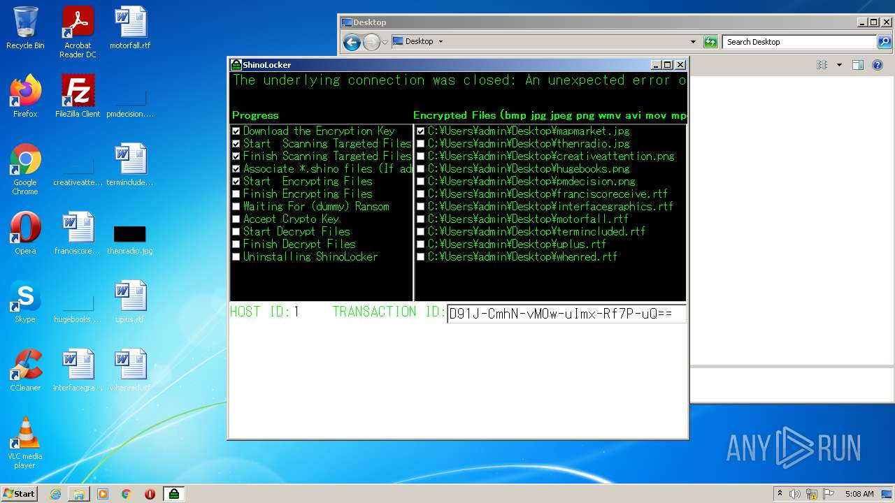
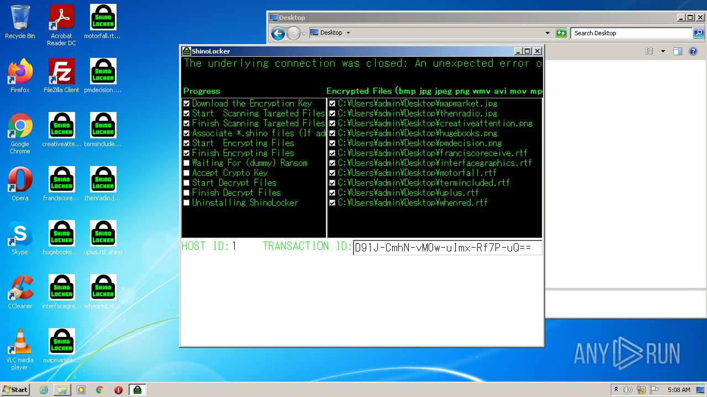
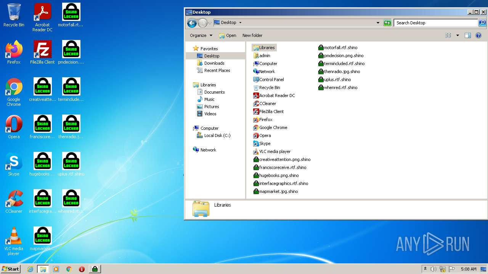
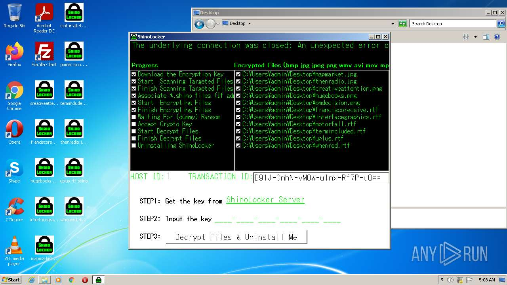
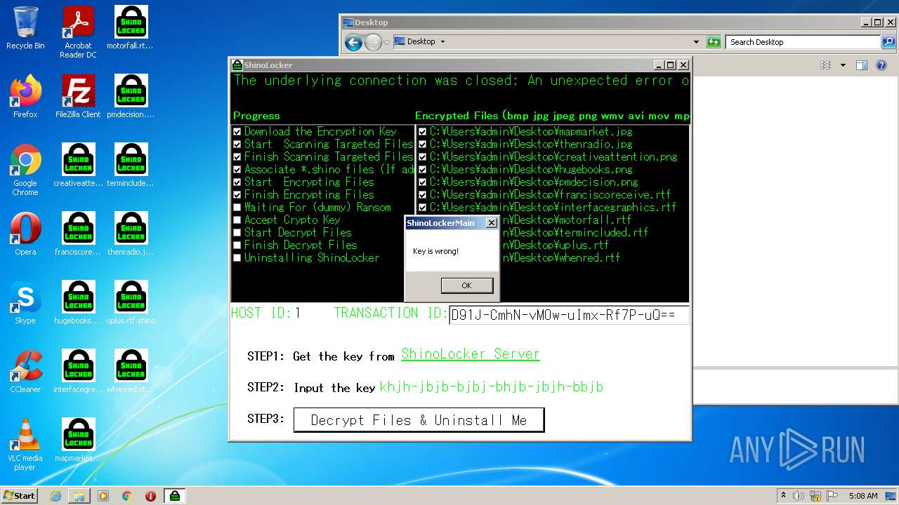
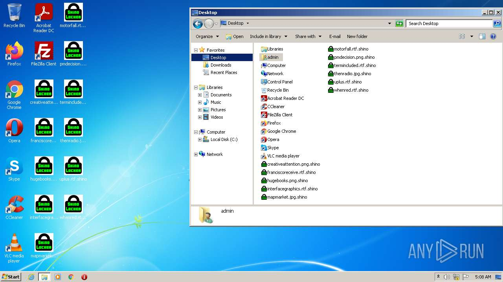

# HEUR-Trojan.Win32.Generic-2f2dc7ea3bfe40f226357e703448bf25ecb19a206a5ecc3e1767bc7f93947c6b

- https://any.run/report/2f2dc7ea3bfe40f226357e703448bf25ecb19a206a5ecc3e1767bc7f93947c6b/d6aaa3f0-7894-417c-bc1a-db9c870a1ee3

```
- _id: "2f2dc7ea3bfe40f226357e703448bf25ecb19a206a5ecc3e1767bc7f93947c6b"
  creation_date: 1655342225  # 2022-06-16 03:17:05 +0200 CEST
  first_submission_date: 1655434627  # 2022-06-17 04:57:07 +0200 CEST
  last_analysis_date: 1664658083  # 2022-10-01 23:01:23 +0200 CEST
  last_analysis_results: 
    Kaspersky: 
      result: "HEUR:Trojan.Win32.Generic"
  magic: "PE32 executable for MS Windows (GUI) Intel 80386 Mono/.Net assembly"
  packers: 
    PEiD: ".NET executable"
  size: 195072
  trid: 
  - file_type: "Generic CIL Executable (.NET, Mono, etc.)"
    probability: 64.2
  - file_type: "Windows screen saver"
    probability: 11.5
  - file_type: "Win64 Executable (generic)"
    probability: 9.2
  - file_type: "Win32 Dynamic Link Library (generic)"
    probability: 5.7
  - file_type: "Win32 Executable (generic)"
    probability: 3.9
```








