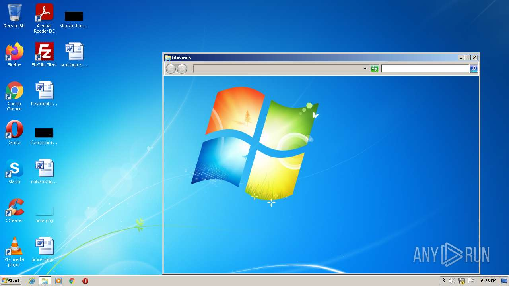
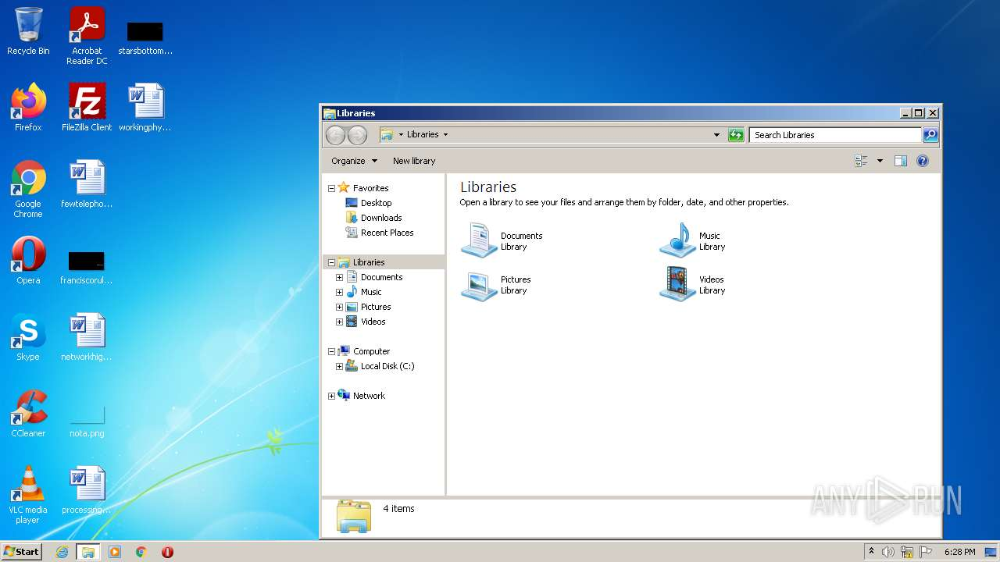
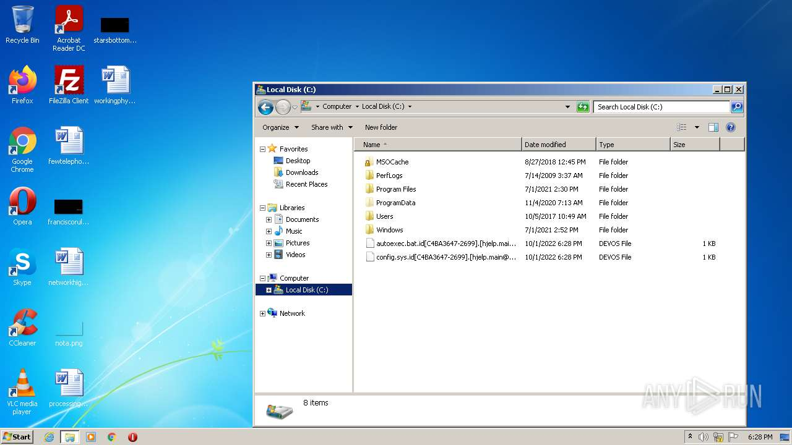
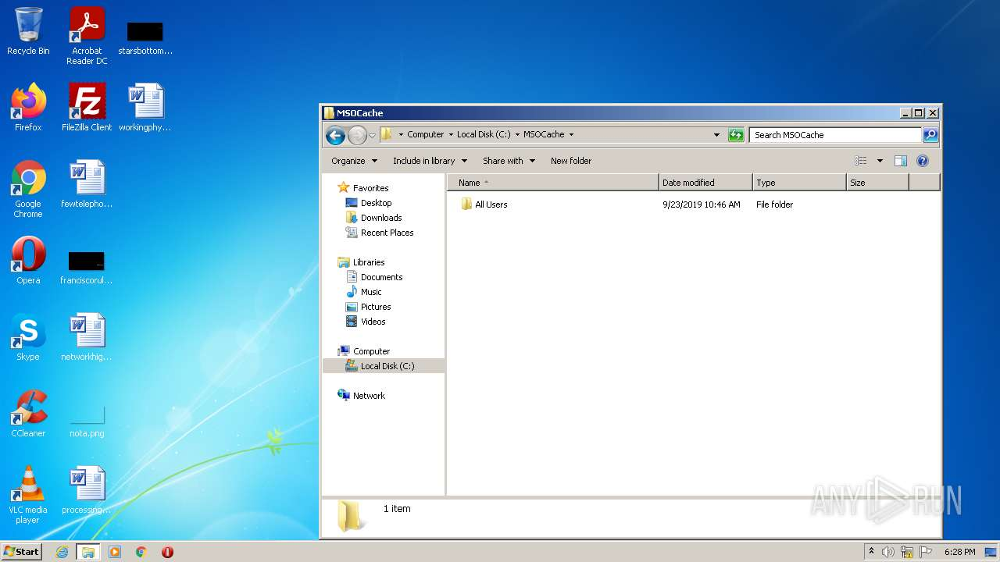
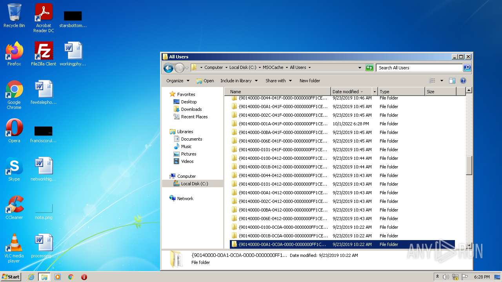
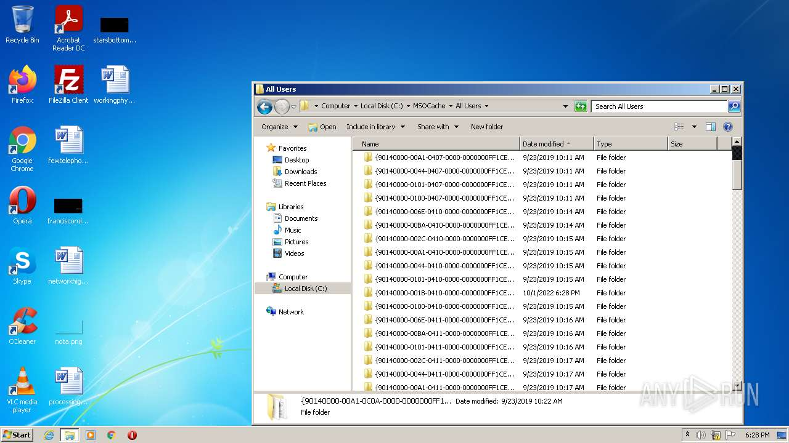
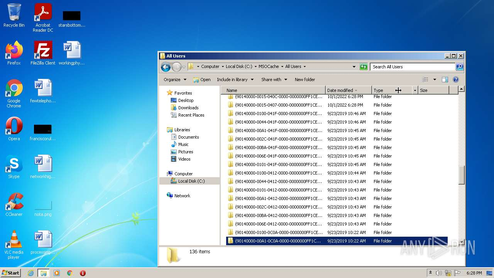
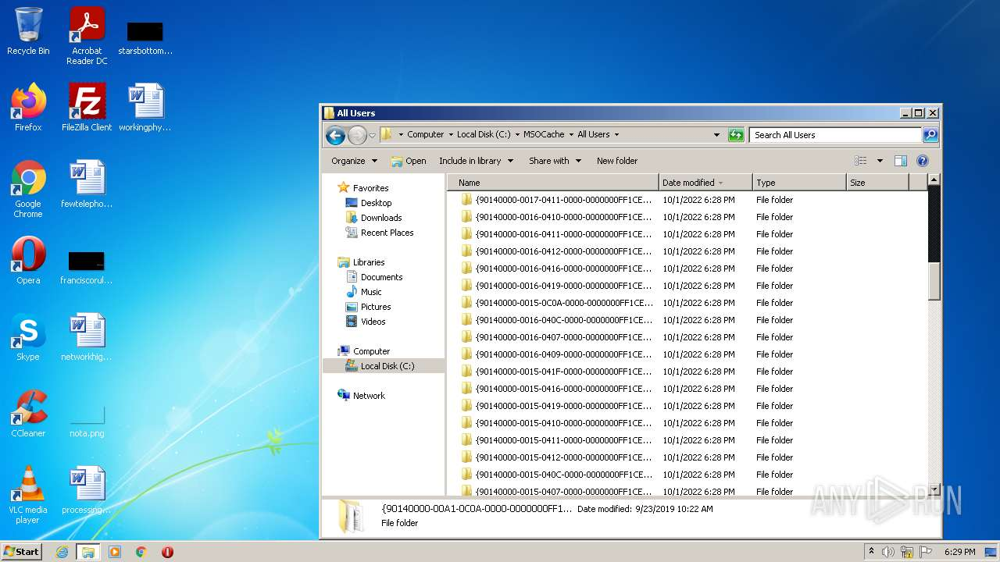
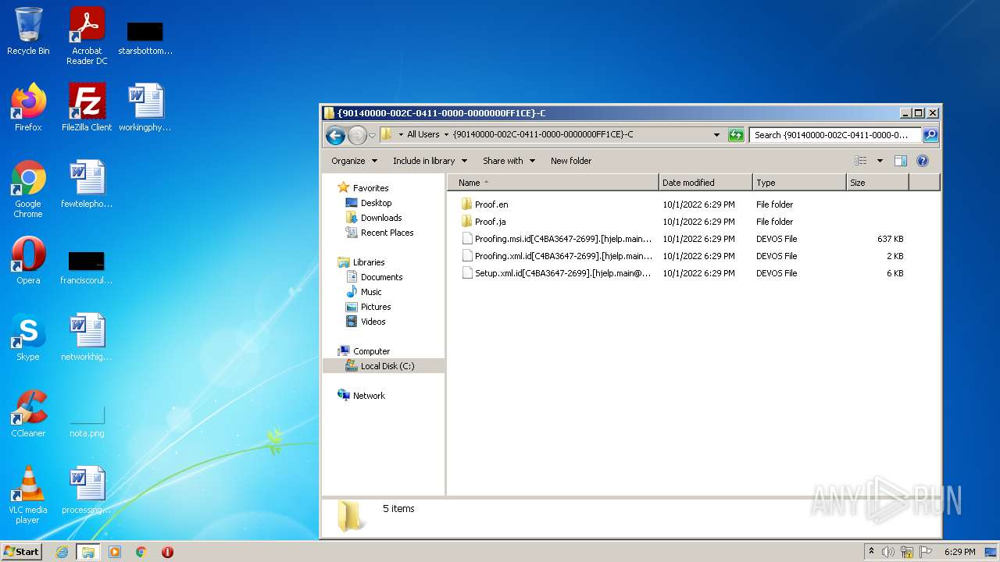
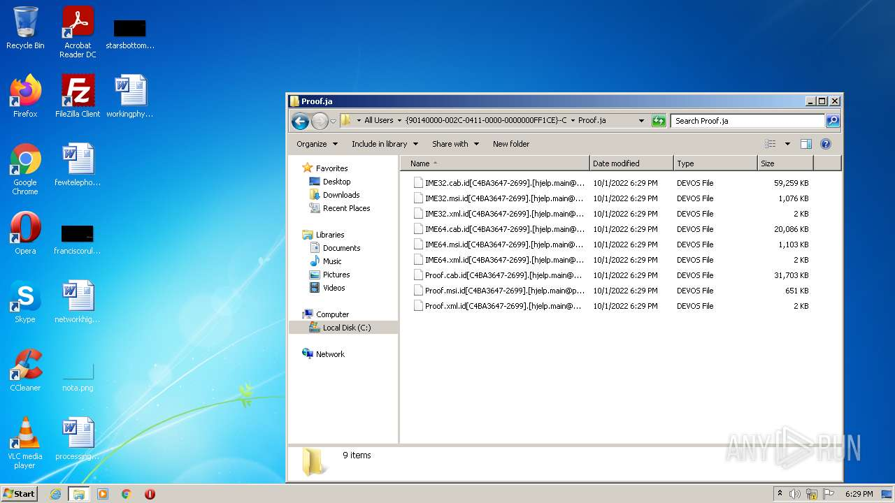

# HEUR-Trojan.Win32.Generic-38c47ad9fdb1ca30b15b2692431171b568556cbff7dfb17ba16c37d7daae9a05

```
- _id: "38c47ad9fdb1ca30b15b2692431171b568556cbff7dfb17ba16c37d7daae9a05"
  creation_date: 1579963043  # 2020-01-25 15:37:23 +0100 CET
  crowdsourced_yara_results: 
  - author: "ditekshen"
    description: "Detects Phobos ransomware"
    rule_name: "MALWARE_Win_Phobos"
    ruleset_id: "00cc803bdc"
    ruleset_name: "malware"
    source: "https://github.com/ditekshen/detection"
  first_submission_date: 1581166960  # 2020-02-08 14:02:40 +0100 CET
  last_analysis_date: 1655989650  # 2022-06-23 15:07:30 +0200 CEST
  last_analysis_results: 
    Kaspersky: 
      result: "HEUR:Trojan.Win32.Generic"
  magic: "PE32 executable for MS Windows (GUI) Intel 80386 32-bit"
  size: 56832
  trid: 
  - file_type: "Win64 Executable (generic)"
    probability: 32.2
  - file_type: "Win32 Dynamic Link Library (generic)"
    probability: 20.1
  - file_type: "Win16 NE executable (generic)"
    probability: 15.4
  - file_type: "Win32 Executable (generic)"
    probability: 13.7
  - file_type: "OS/2 Executable (generic)"
    probability: 6.2
```














