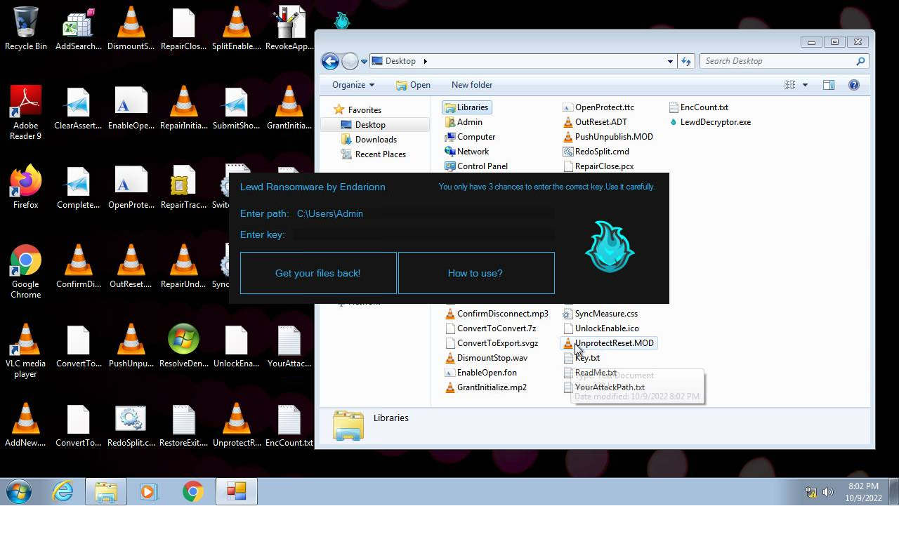
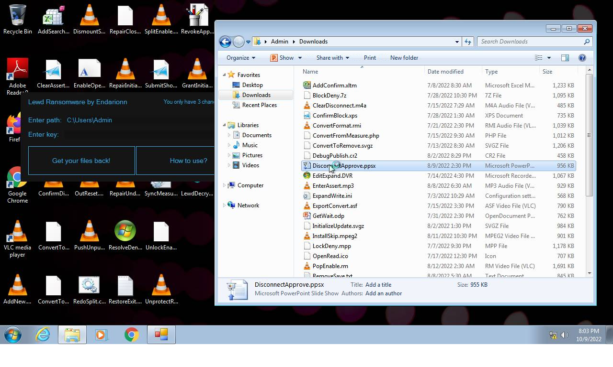
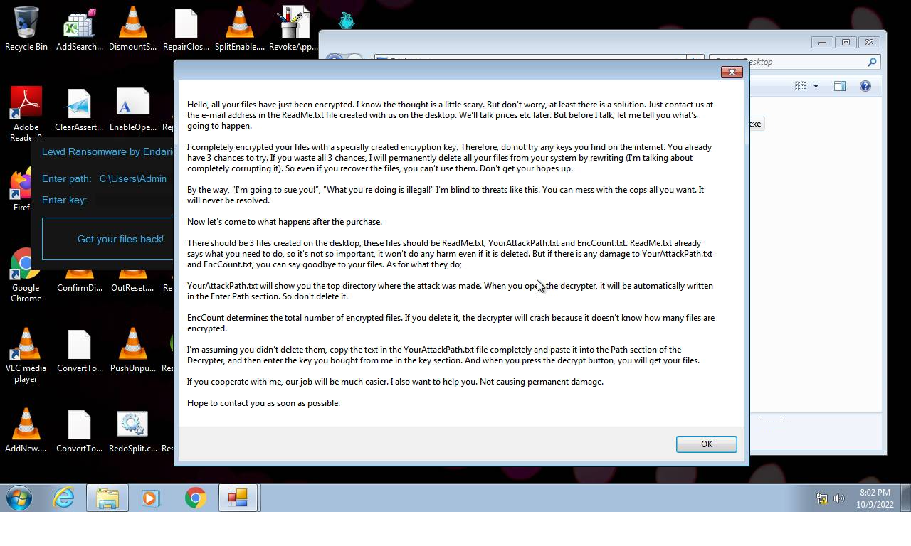
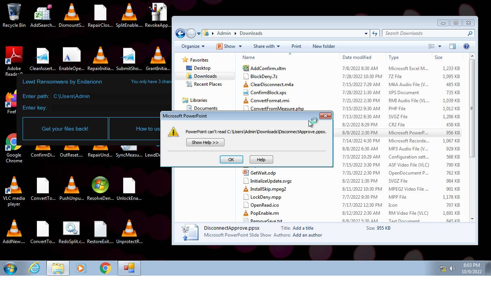

# HEUR-Trojan.Win32.Generic-39a531e512b962305ec4c182a8f6378698f16c8fa74522a861b734d07925f5f6

- https://tria.ge/221009-wl91yahdd5/behavioral1

```
- _id: "39a531e512b962305ec4c182a8f6378698f16c8fa74522a861b734d07925f5f6"
  creation_date: 2563717121  # 2051-03-29 17:38:41 +0200 CEST
  first_submission_date: 1663515428  # 2022-09-18 17:37:08 +0200 CEST
  last_analysis_date: 1663515428  # 2022-09-18 17:37:08 +0200 CEST
  last_analysis_results: 
    Kaspersky: 
      result: "HEUR:Trojan.Win32.Generic"
  magic: "PE32 executable for MS Windows (GUI) Intel 80386 Mono/.Net assembly"
  size: 324096
  trid: 
  - file_type: "Generic CIL Executable (.NET, Mono, etc.)"
    probability: 72.5
  - file_type: "Win64 Executable (generic)"
    probability: 10.4
  - file_type: "Win32 Dynamic Link Library (generic)"
    probability: 6.5
  - file_type: "Win32 Executable (generic)"
    probability: 4.4
  - file_type: "OS/2 Executable (generic)"
    probability: 2.0
```





