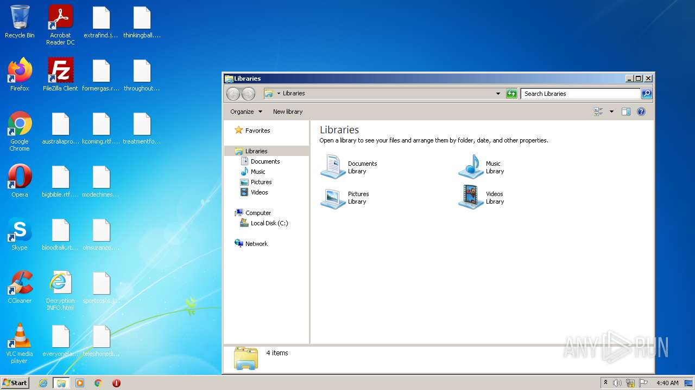
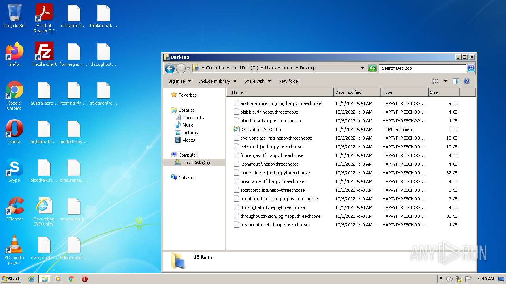
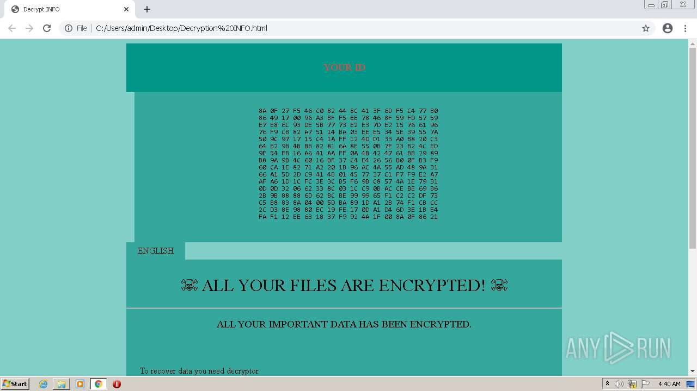
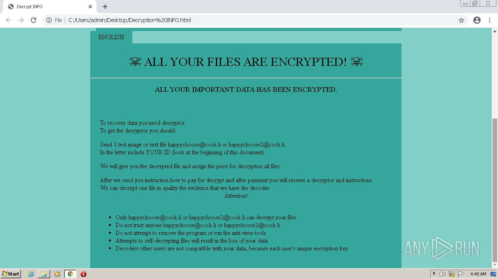
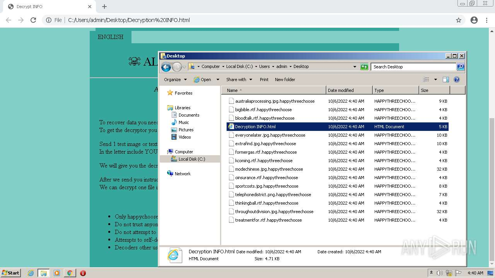
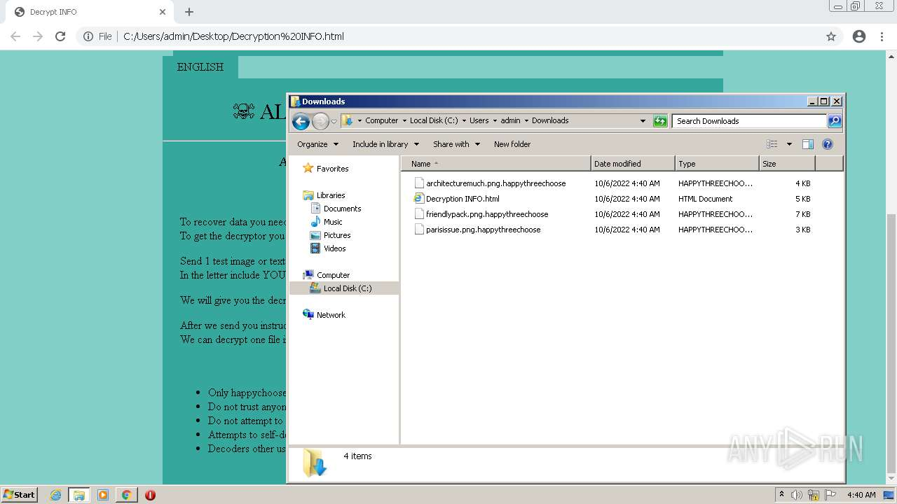
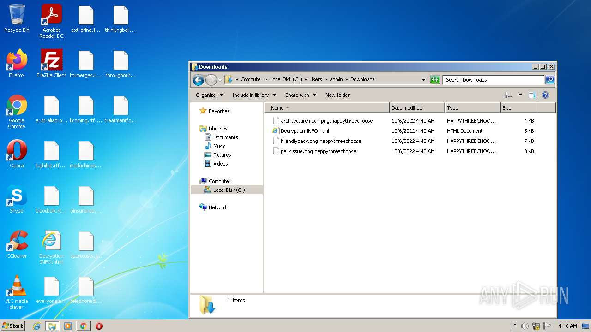
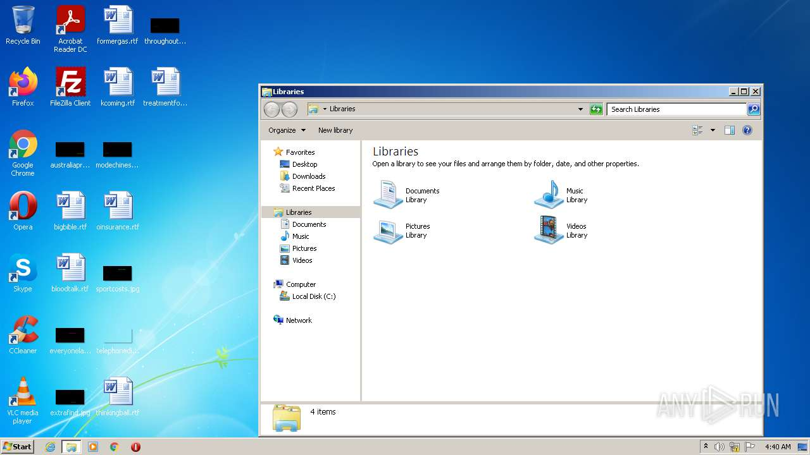

# HEUR-Trojan.Win32.Generic-43ecc5c09916a12a7793b5040a6c0118cf791db8d3e16a62785a819722500e1e

- https://any.run/report/43ecc5c09916a12a7793b5040a6c0118cf791db8d3e16a62785a819722500e1e/55b33cfc-669c-46f5-bf19-4dadef43738f

```
- _id: "43ecc5c09916a12a7793b5040a6c0118cf791db8d3e16a62785a819722500e1e"
  creation_date: 1549046179  # 2019-02-01 19:36:19 +0100 CET
  first_submission_date: 1580868043  # 2020-02-05 03:00:43 +0100 CET
  last_analysis_date: 1581926742  # 2020-02-17 09:05:42 +0100 CET
  last_analysis_results: 
    Kaspersky: 
      result: "HEUR:Trojan.Win32.Generic"
  magic: "PE32 executable for MS Windows (GUI) Intel 80386 32-bit"
  size: 54784
  trid: 
  - file_type: "Win64 Executable (generic)"
    probability: 61.7
  - file_type: "Win32 Dynamic Link Library (generic)"
    probability: 14.7
  - file_type: "Win32 Executable (generic)"
    probability: 10.0
  - file_type: "OS/2 Executable (generic)"
    probability: 4.5
  - file_type: "Generic Win/DOS Executable"
    probability: 4.4
```










