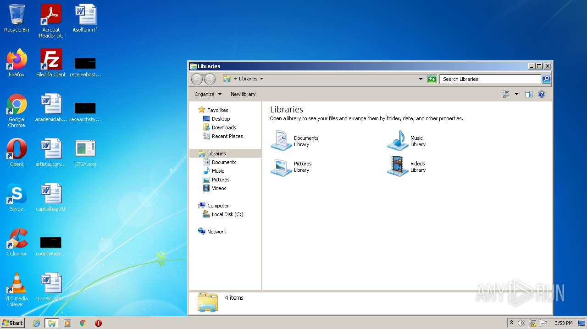
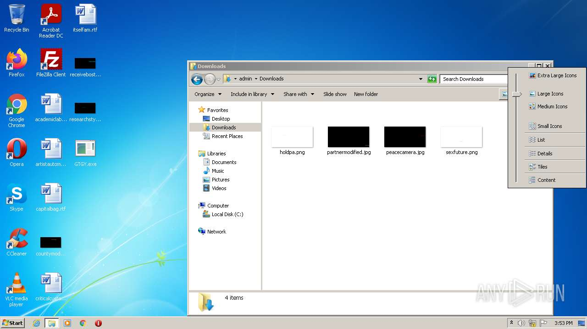
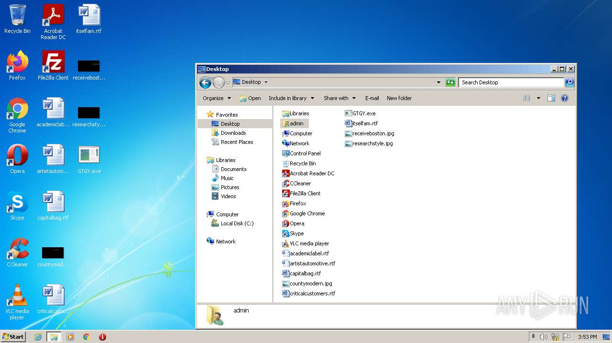
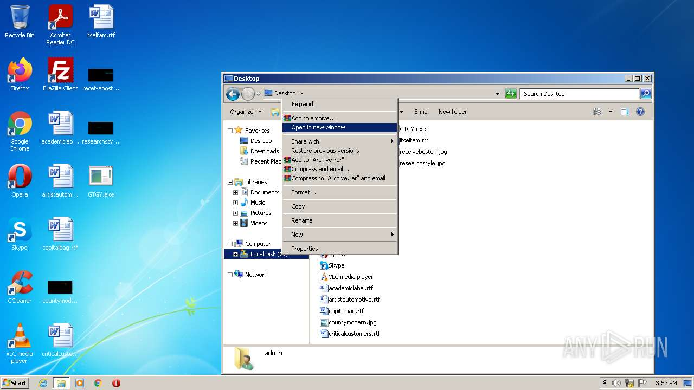
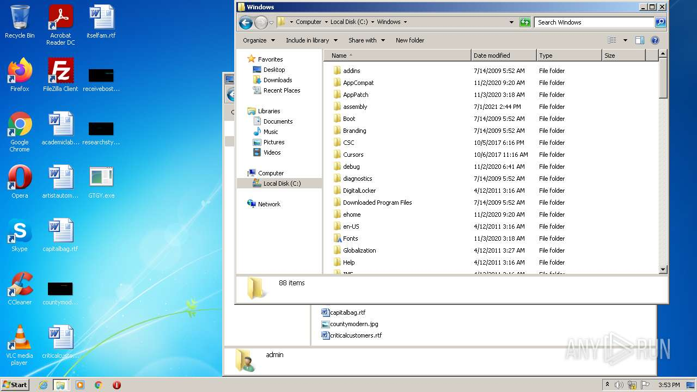
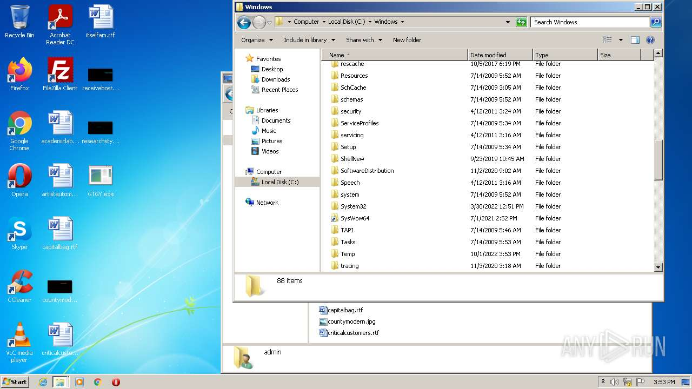
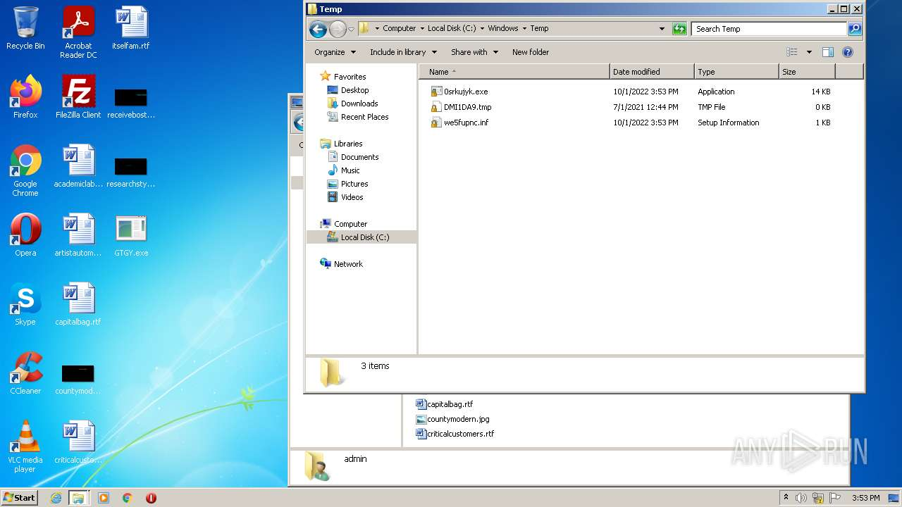
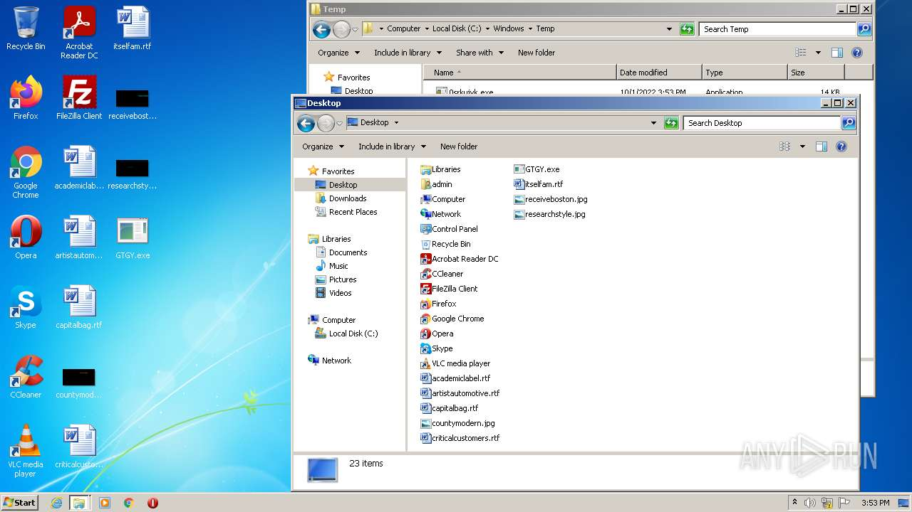

# HEUR-Trojan.Win32.Generic-46786b3dd5da890db7c01400163de649842b28735e4483738d4b071c5c81911e

```
- _id: "46786b3dd5da890db7c01400163de649842b28735e4483738d4b071c5c81911e"
  creation_date: 1609806473  # 2021-01-05 01:27:53 +0100 CET
  first_submission_date: 1609836985  # 2021-01-05 09:56:25 +0100 CET
  last_analysis_date: 1609836985  # 2021-01-05 09:56:25 +0100 CET
  last_analysis_results: 
    Kaspersky: 
      result: "HEUR:Trojan.Win32.Generic"
  magic: "PE32 executable for MS Windows (GUI) Intel 80386 32-bit Mono/.Net assembly"
  packers: 
    PEiD: ".NET executable"
  size: 21504
  trid: 
  - file_type: "Generic CIL Executable (.NET, Mono, etc.)"
    probability: 72.5
  - file_type: "Win64 Executable (generic)"
    probability: 10.4
  - file_type: "Win32 Dynamic Link Library (generic)"
    probability: 6.5
  - file_type: "Win32 Executable (generic)"
    probability: 4.4
  - file_type: "OS/2 Executable (generic)"
    probability: 2.0
```

















