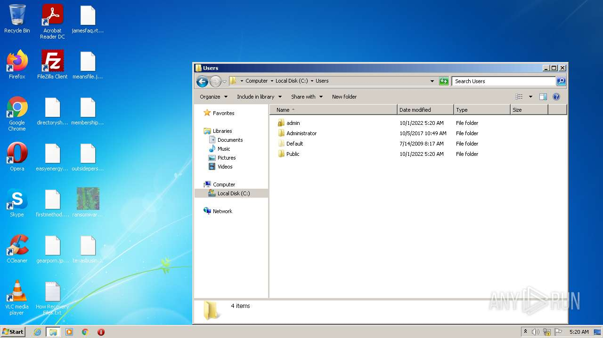
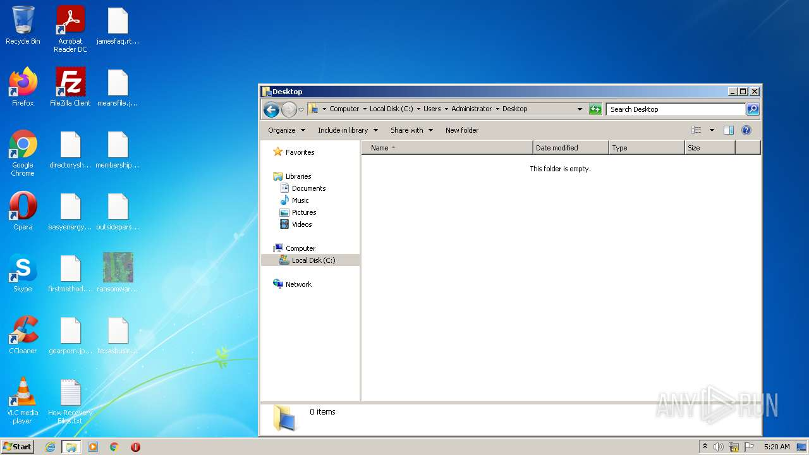
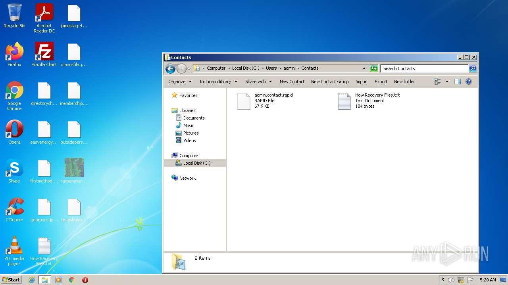
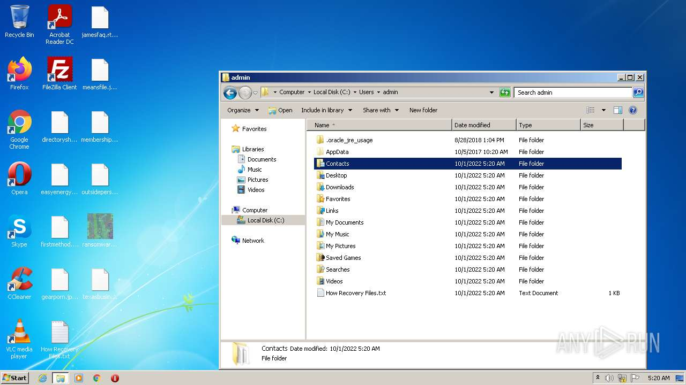
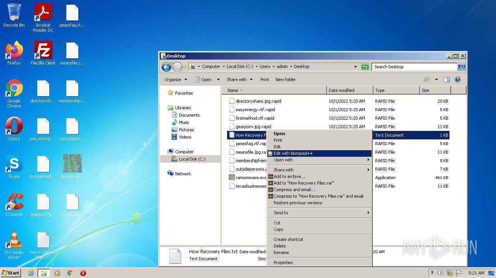
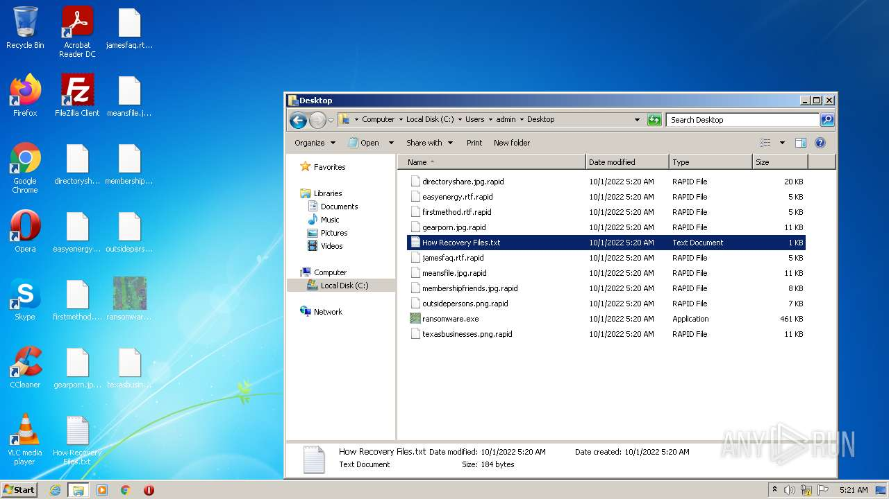

# HEUR-Trojan.Win32.Generic-6467c9547b788f24ee3a2f2034f0f773b4fbc0e1a5977b50aed5369f3d70c8ab

```
- _id: "6467c9547b788f24ee3a2f2034f0f773b4fbc0e1a5977b50aed5369f3d70c8ab"
  creation_date: 1518079969  # 2018-02-08 09:52:49 +0100 CET
  first_submission_date: 1518094929  # 2018-02-08 14:02:09 +0100 CET
  last_analysis_date: 1657585933  # 2022-07-12 02:32:13 +0200 CEST
  last_analysis_results: 
    Kaspersky: 
      result: "HEUR:Trojan.Win32.Generic"
  magic: "PE32 executable for MS Windows (GUI) Intel 80386 32-bit"
  size: 471552
  trid: 
  - file_type: "Win64 Executable (generic)"
    probability: 40.3
  - file_type: "Win16 NE executable (generic)"
    probability: 19.3
  - file_type: "Win32 Executable (generic)"
    probability: 17.2
  - file_type: "OS/2 Executable (generic)"
    probability: 7.7
  - file_type: "Generic Win/DOS Executable"
    probability: 7.6
```















