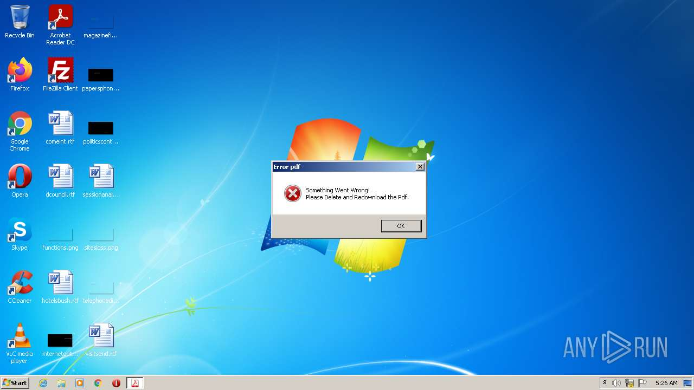
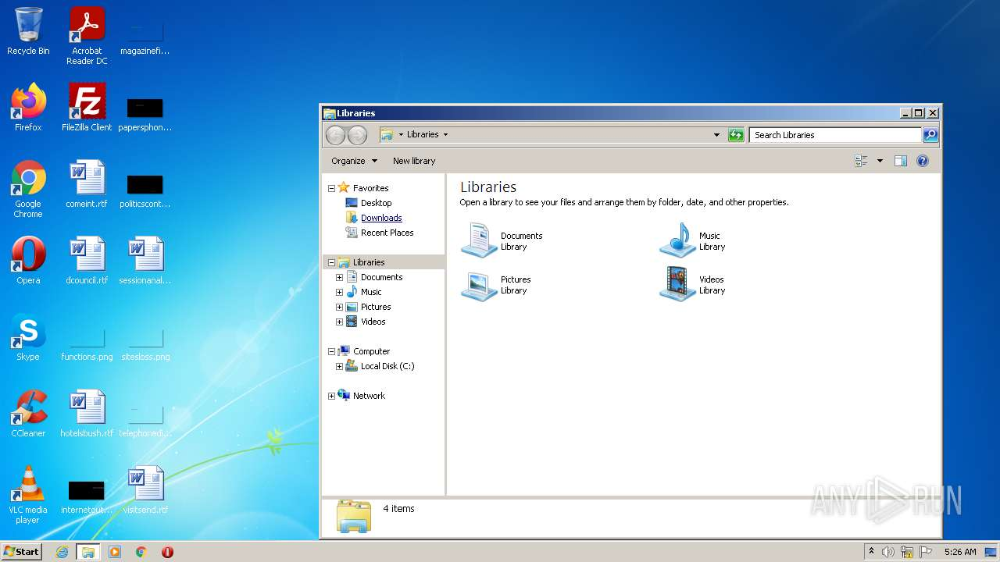
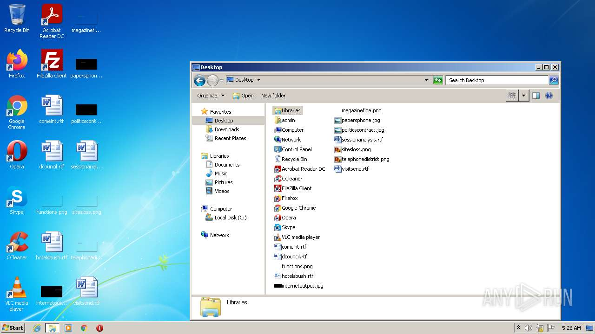
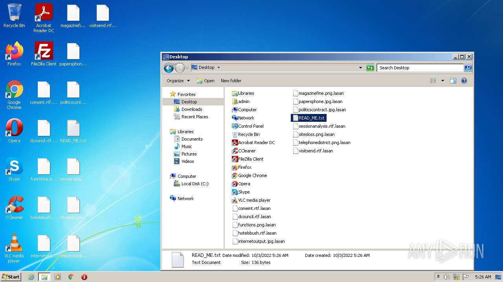
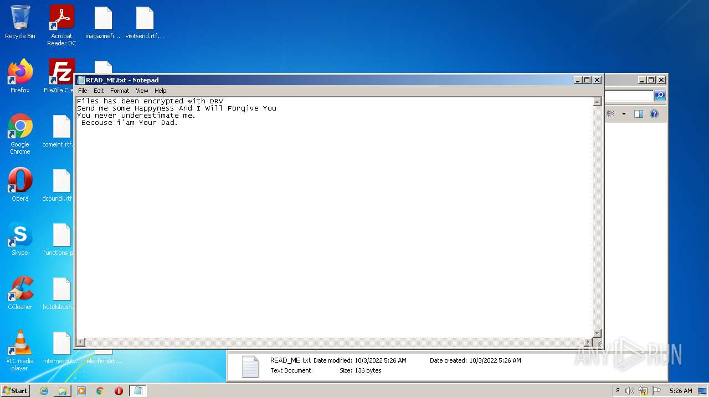

# HEUR-Trojan.Win32.Generic-7106abd949facec5c437f730d05b2c69a2aa1e2bde1bf8d6c4789f5e0ba5dedb

- https://any.run/report/7106abd949facec5c437f730d05b2c69a2aa1e2bde1bf8d6c4789f5e0ba5dedb/b32b324f-e50c-4b56-8f94-a0ed5647a846

```
- _id: "7106abd949facec5c437f730d05b2c69a2aa1e2bde1bf8d6c4789f5e0ba5dedb"
  creation_date: 1579944995  # 2020-01-25 10:36:35 +0100 CET
  crowdsourced_yara_results: 
  - author: "Florian Roth"
    description: "Detects ransomware distributed in COVID-19 theme"
    rule_name: "MAL_RANSOM_COVID19_Apr20_1"
    ruleset_id: "000f8b51a1"
    ruleset_name: "crime_covid_ransom"
    source: "https://github.com/Neo23x0/signature-base"
  first_submission_date: 1580017204  # 2020-01-26 06:40:04 +0100 CET
  last_analysis_date: 1642681044  # 2022-01-20 13:17:24 +0100 CET
  last_analysis_results: 
    Kaspersky: 
      result: "HEUR:Trojan.Win32.Generic"
  magic: "PE32 executable for MS Windows (GUI) Intel 80386 Mono/.Net assembly"
  size: 216064
  trid: 
  - file_type: "Generic CIL Executable (.NET, Mono, etc.)"
    probability: 72.5
  - file_type: "Win64 Executable (generic)"
    probability: 10.4
  - file_type: "Win32 Dynamic Link Library (generic)"
    probability: 6.5
  - file_type: "Win32 Executable (generic)"
    probability: 4.4
  - file_type: "OS/2 Executable (generic)"
    probability: 2.0
```






