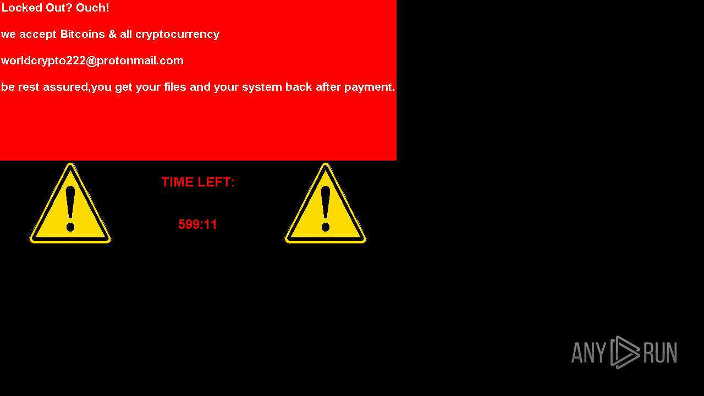

# HEUR-Trojan.Win32.Generic-9353cf6347377bf1194349bff4001485fac99a5cd3ee03781e81c157452dae68

- https://any.run/report/9353cf6347377bf1194349bff4001485fac99a5cd3ee03781e81c157452dae68/23803dff-9f7c-4696-885d-5f2f246c1975

```
- _id: "9353cf6347377bf1194349bff4001485fac99a5cd3ee03781e81c157452dae68"
  creation_date: 1627792834  # 2021-08-01 06:40:34 +0200 CEST
  crowdsourced_yara_results: 
  - author: "ditekSHen"
    description: "Detects executables signed with stolen, revoked or invalid certificate"
    match_in_subfile: true
    rule_name: "INDICATOR_KB_CERT_033ed5eda065d1b8c91dfcf92a6c9bd8"
    ruleset_id: "00cf90f35f"
    ruleset_name: "indicator_knownbad_certs"
    source: "https://github.com/ditekshen/detection"
  - author: "@bartblaze"
    description: "Identifies executable converted using PyInstaller."
    rule_name: "PyInstaller"
    ruleset_id: "002735f19d"
    ruleset_name: "PyInstaller"
    source: "https://github.com/bartblaze/Yara-rules"
  first_submission_date: 1629520059  # 2021-08-21 06:27:39 +0200 CEST
  last_analysis_date: 1659992715  # 2022-08-08 23:05:15 +0200 CEST
  last_analysis_results: 
    Kaspersky: 
      result: "HEUR:Trojan.Win32.Generic"
  magic: "PE32 executable for MS Windows (GUI) Intel 80386 32-bit"
  packers: 
    Cyren: "DFL, deflate"
  size: 12504942
  trid: 
  - file_type: "Win64 Executable (generic)"
    probability: 40.3
  - file_type: "Win16 NE executable (generic)"
    probability: 19.3
  - file_type: "Win32 Executable (generic)"
    probability: 17.2
  - file_type: "OS/2 Executable (generic)"
    probability: 7.7
  - file_type: "Generic Win/DOS Executable"
    probability: 7.6
```



