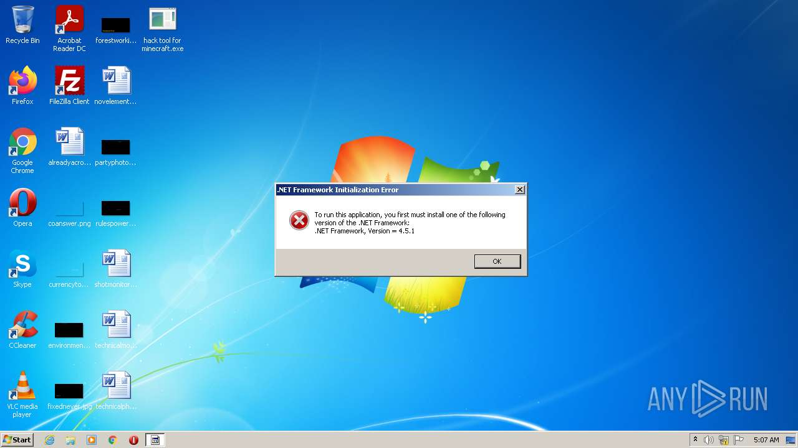
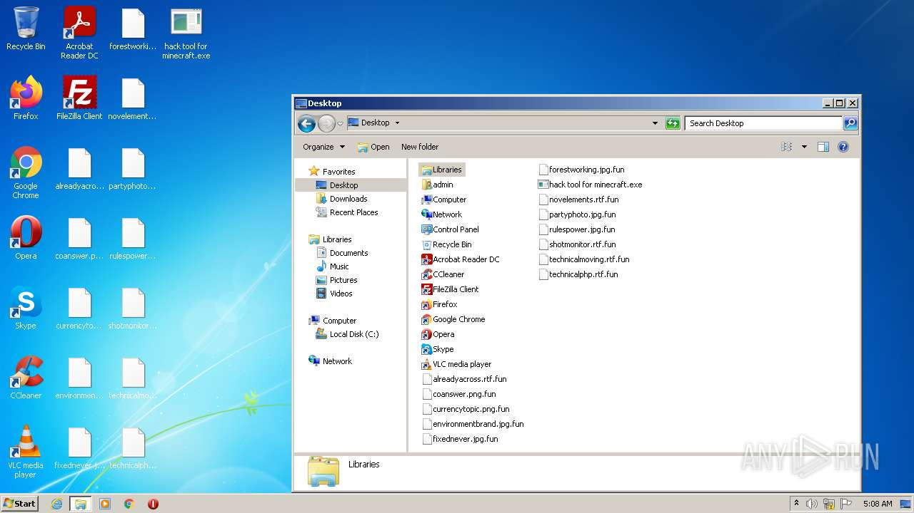
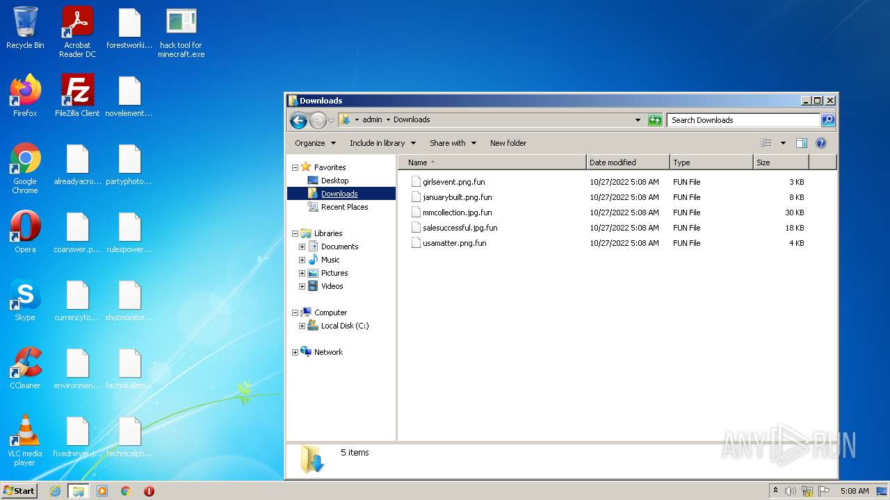
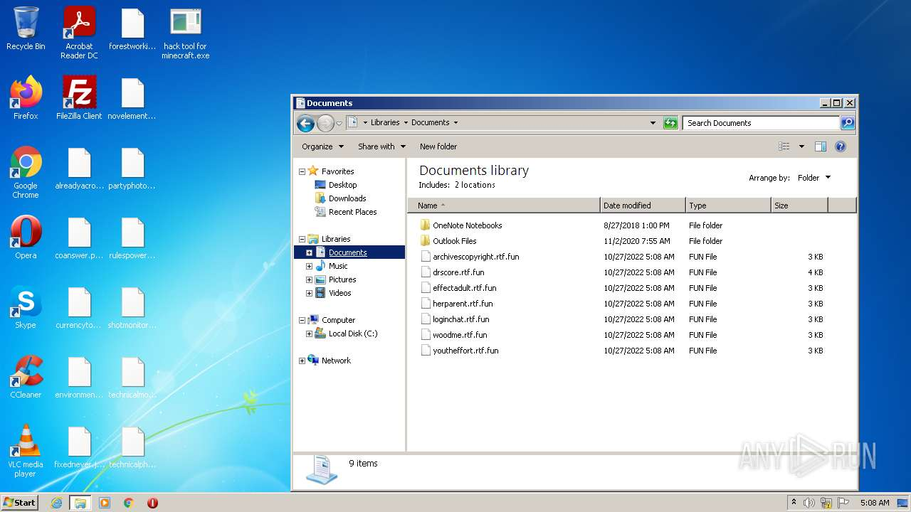
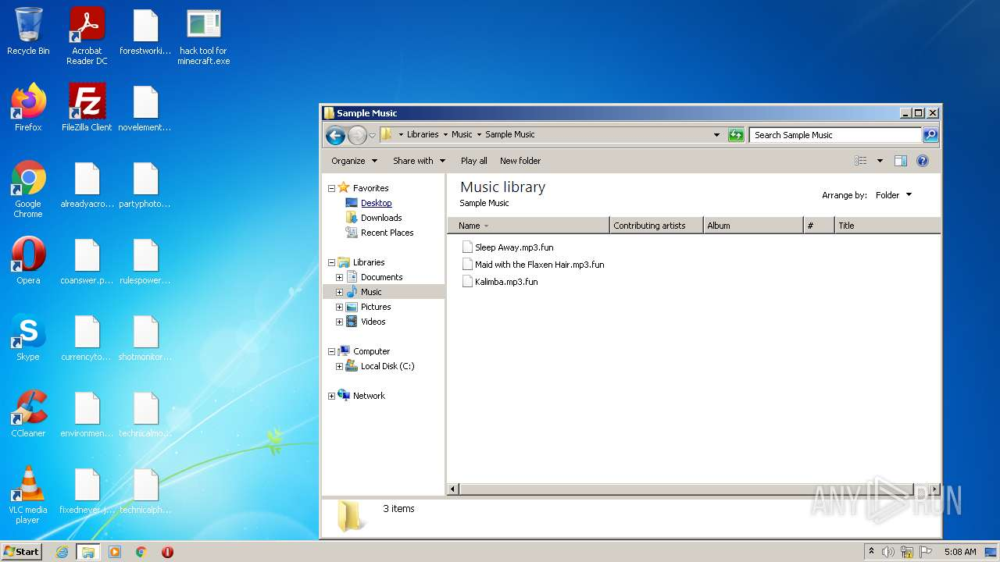
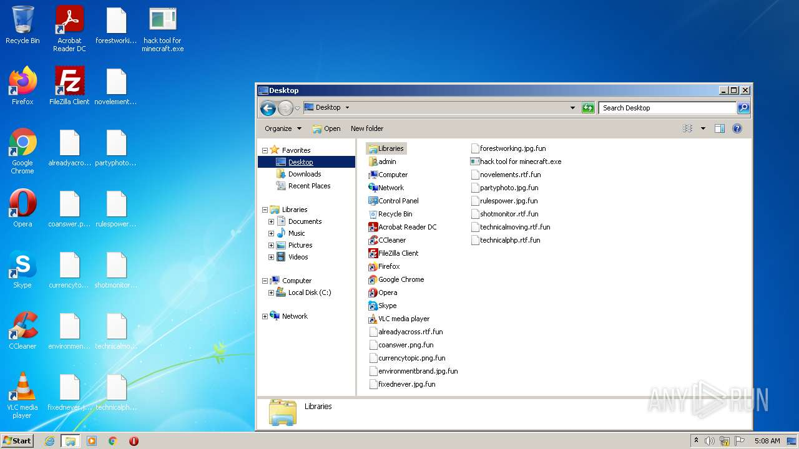
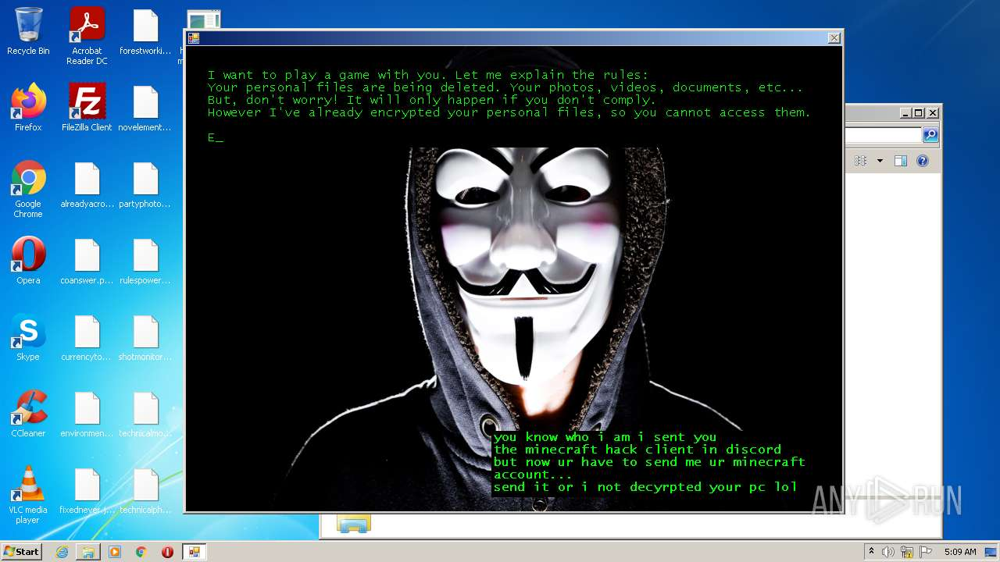
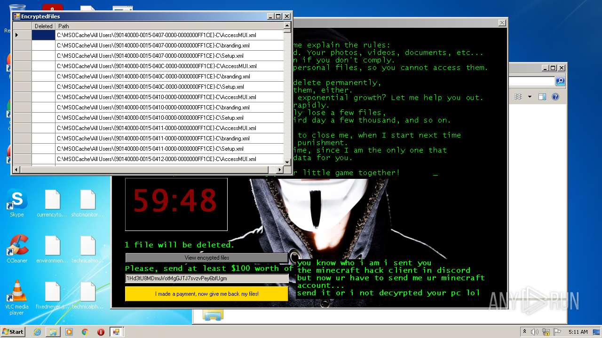
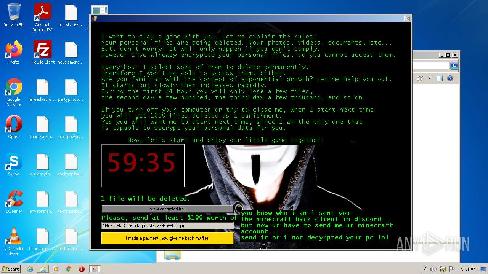

# HEUR-Trojan.Win32.Generic-9f3c538a1118f82d49a993967c520be4c7f14ad994eb17c4d778e5d7f32241a7

- https://any.run/report/9f3c538a1118f82d49a993967c520be4c7f14ad994eb17c4d778e5d7f32241a7/42572414-79c3-4bfd-9beb-b85ae6628aeb

```
- _id: "9f3c538a1118f82d49a993967c520be4c7f14ad994eb17c4d778e5d7f32241a7"
  creation_date: 1666738234  # 2022-10-26 00:50:34 +0200 CEST
  first_submission_date: 1666742591  # 2022-10-26 02:03:11 +0200 CEST
  last_analysis_date: 1666786624  # 2022-10-26 14:17:04 +0200 CEST
  last_analysis_results: 
    Kaspersky: 
      result: "HEUR:Trojan.Win32.Generic"
  magic: "PE32 executable for MS Windows (GUI) Intel 80386 Mono/.Net assembly"
  size: 431616
  trid: 
  - file_type: "Generic CIL Executable (.NET, Mono, etc.)"
    probability: 69.1
  - file_type: "Win64 Executable (generic)"
    probability: 9.9
  - file_type: "Win32 Dynamic Link Library (generic)"
    probability: 6.2
  - file_type: "Win16 NE executable (generic)"
    probability: 4.7
  - file_type: "Win32 Executable (generic)"
    probability: 4.2
```











