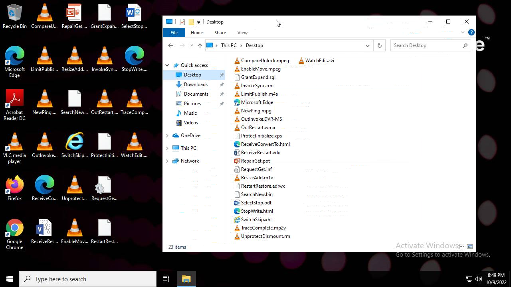
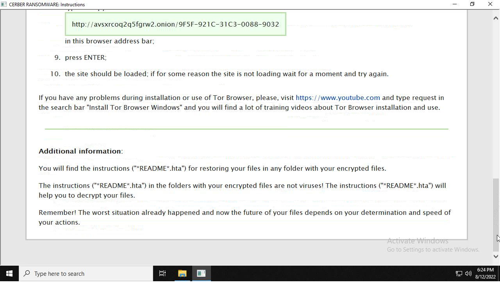
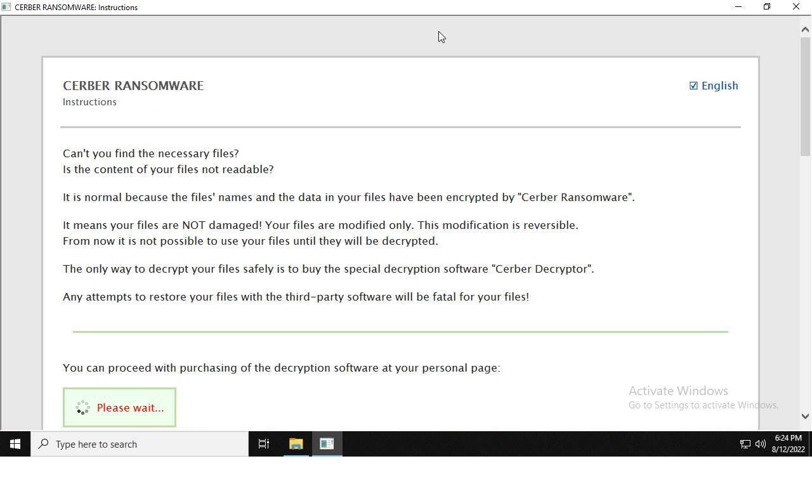
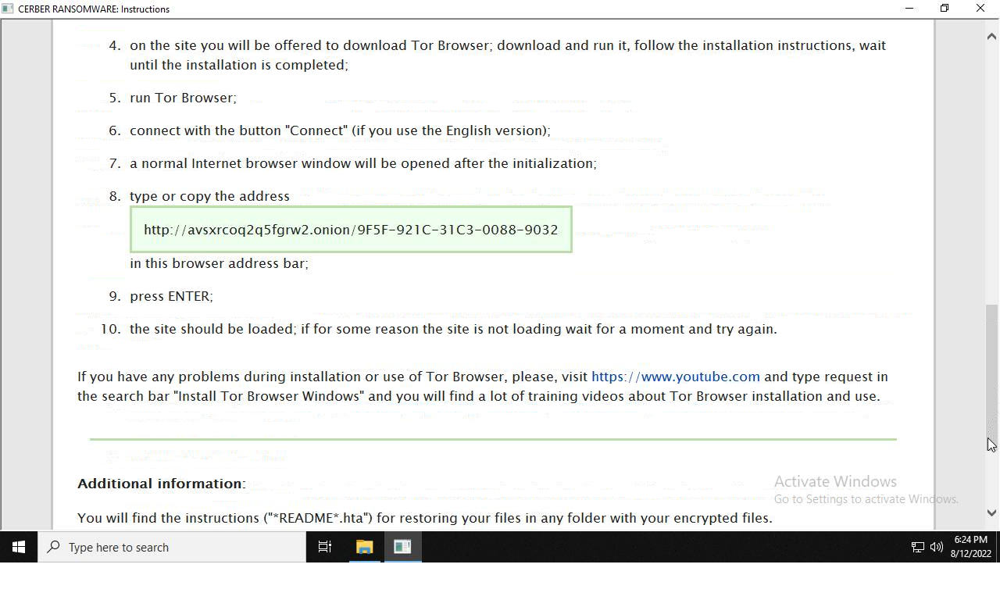
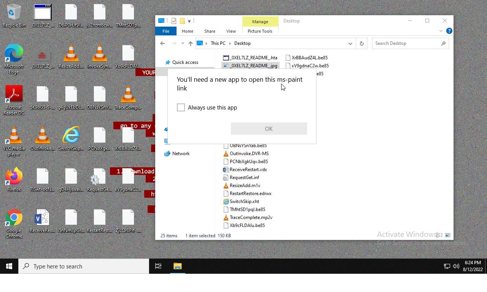
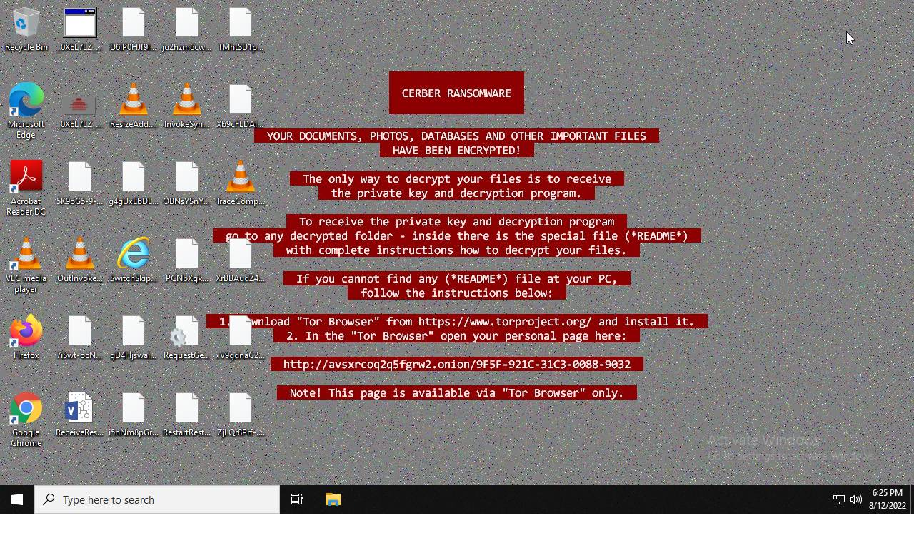
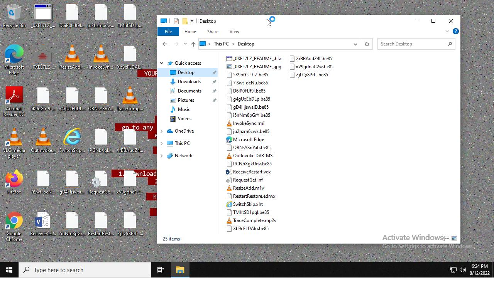
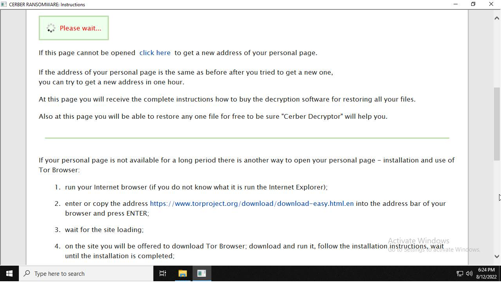

# HEUR-Trojan.Win32.Generic-a063b01567e2579701e5f671da30dddef7279a0f7c7ac94dbcc7b3d936e7f33d

- https://tria.ge/221009-xglyzsheb4/behavioral1

```
- _id: "a063b01567e2579701e5f671da30dddef7279a0f7c7ac94dbcc7b3d936e7f33d"
  creation_date: 1399838739  # 2014-05-11 22:05:39 +0200 CEST
  first_submission_date: 1482562970  # 2016-12-24 08:02:50 +0100 CET
  last_analysis_date: 1652457347  # 2022-05-13 17:55:47 +0200 CEST
  last_analysis_results: 
    Kaspersky: 
      result: "HEUR:Trojan.Win32.Generic"
  magic: "PE32 executable for MS Windows (GUI) Intel 80386 32-bit"
  packers: 
    Cyren: "NSIS"
    F-PROT: "NSIS"
  size: 486469
  trid: 
  - file_type: "NSIS - Nullsoft Scriptable Install System"
    probability: 92.9
  - file_type: "Win32 Executable MS Visual C++ (generic)"
    probability: 3.4
  - file_type: "Win64 Executable (generic)"
    probability: 1.1
  - file_type: "Win32 Dynamic Link Library (generic)"
    probability: 0.7
  - file_type: "Win16 NE executable (generic)"
    probability: 0.5
```









