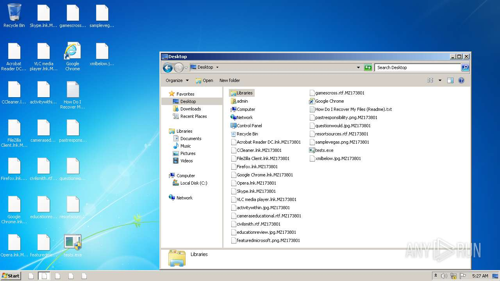

# HEUR-Trojan.Win32.Generic-a525078301820aae1fa5d6f0861d444a403ffc46912b731846cd9c7127ec18ca

- https://any.run/report/a525078301820aae1fa5d6f0861d444a403ffc46912b731846cd9c7127ec18ca/3e47ebda-807e-4382-9d23-abc1c8c6c234

```
- _id: "a525078301820aae1fa5d6f0861d444a403ffc46912b731846cd9c7127ec18ca"
  creation_date: 1408985539  # 2014-08-25 18:52:19 +0200 CEST
  first_submission_date: 1585664168  # 2020-03-31 16:16:08 +0200 CEST
  last_analysis_date: 1585664168  # 2020-03-31 16:16:08 +0200 CEST
  last_analysis_results: 
    Kaspersky: 
      result: "HEUR:Trojan.Win32.Generic"
  magic: "PE32 executable for MS Windows (GUI) Intel 80386 32-bit Mono/.Net assembly"
  packers: 
    PEiD: ".NET executable"
  size: 437900
  trid: 
  - file_type: "Generic CIL Executable (.NET, Mono, etc.)"
    probability: 55.8
  - file_type: "Win64 Executable (generic)"
    probability: 21.0
  - file_type: "Windows screen saver"
    probability: 10.0
  - file_type: "Win32 Dynamic Link Library (generic)"
    probability: 5.0
  - file_type: "Win32 Executable (generic)"
    probability: 3.4
```



