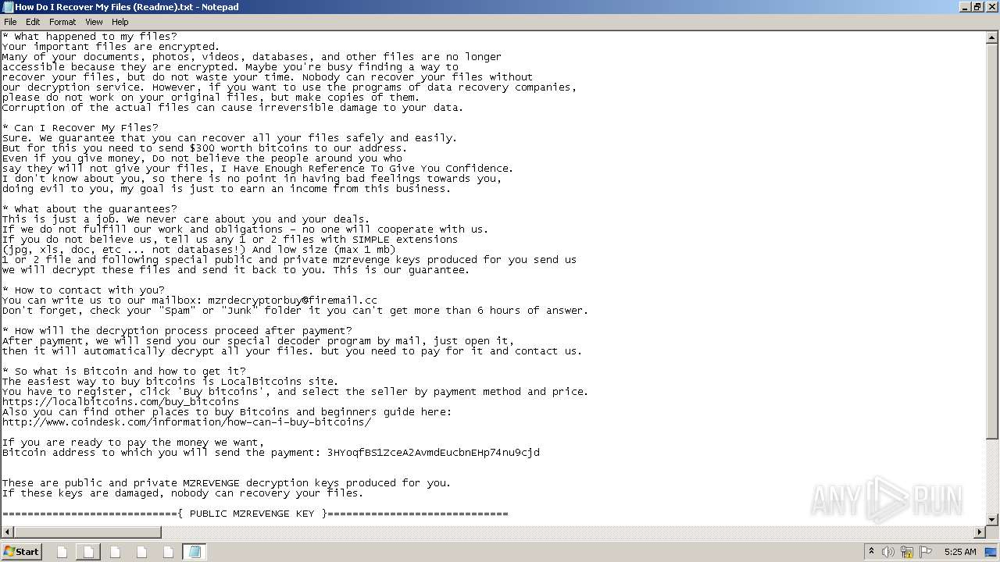
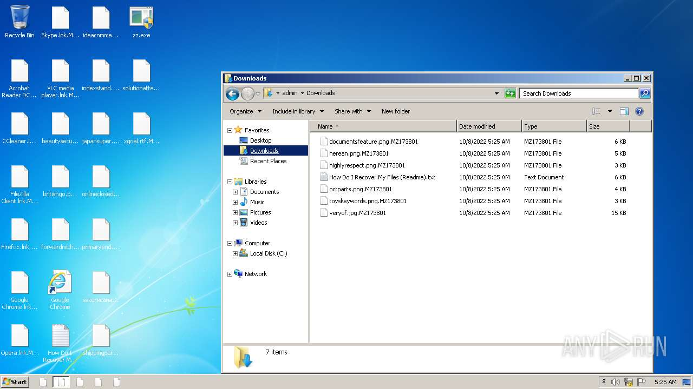

# HEUR-Trojan.Win32.Generic-a6320713aa2827cae0a39361babaa3a05a3a8f7f25fe8b71a191e9e7c74c464d

- https://any.run/report/a6320713aa2827cae0a39361babaa3a05a3a8f7f25fe8b71a191e9e7c74c464d/23ef858a-0980-431c-87b2-f63445dd0963

```
- _id: "a6320713aa2827cae0a39361babaa3a05a3a8f7f25fe8b71a191e9e7c74c464d"
  creation_date: 1408985539  # 2014-08-25 18:52:19 +0200 CEST
  first_submission_date: 1585555140  # 2020-03-30 09:59:00 +0200 CEST
  last_analysis_date: 1595243383  # 2020-07-20 13:09:43 +0200 CEST
  last_analysis_results: 
    Kaspersky: 
      result: "HEUR:Trojan.Win32.Generic"
  magic: "PE32 executable for MS Windows (GUI) Intel 80386 32-bit Mono/.Net assembly"
  packers: 
    PEiD: ".NET executable"
  size: 437900
  trid: 
  - file_type: "Generic CIL Executable (.NET, Mono, etc.)"
    probability: 55.8
  - file_type: "Win64 Executable (generic)"
    probability: 21.0
  - file_type: "Windows screen saver"
    probability: 10.0
  - file_type: "Win32 Dynamic Link Library (generic)"
    probability: 5.0
  - file_type: "Win32 Executable (generic)"
    probability: 3.4
```








