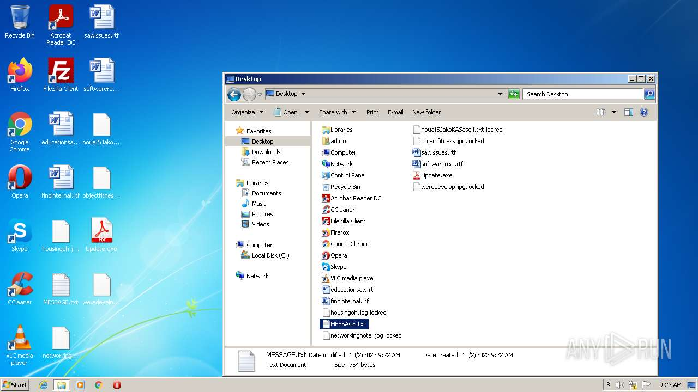
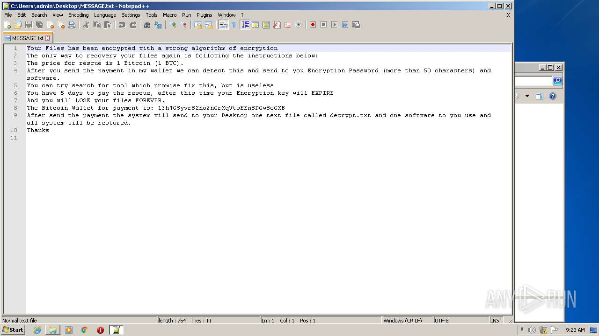
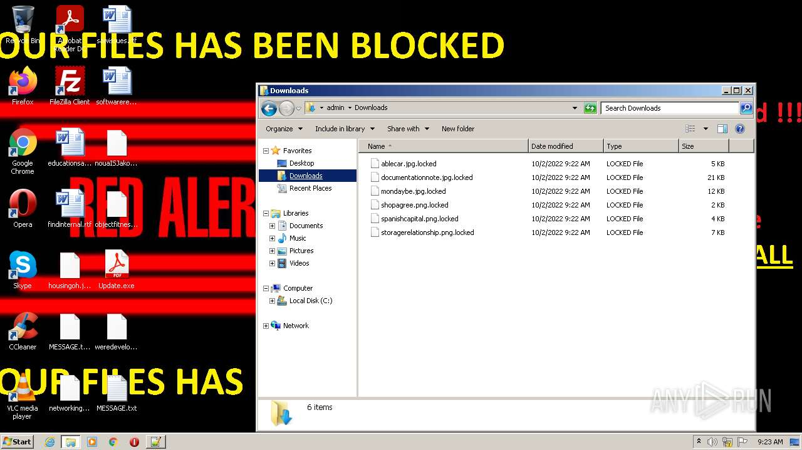
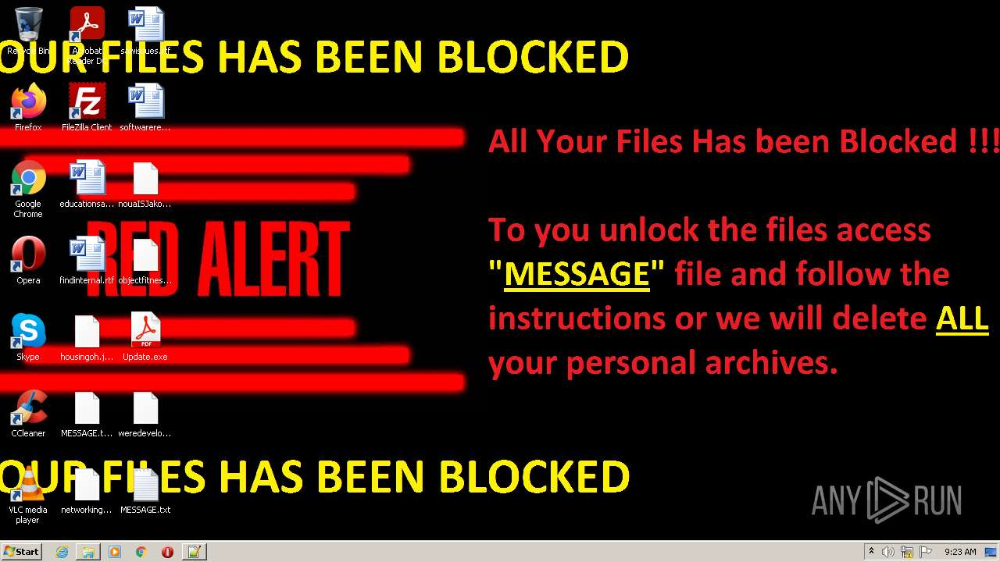
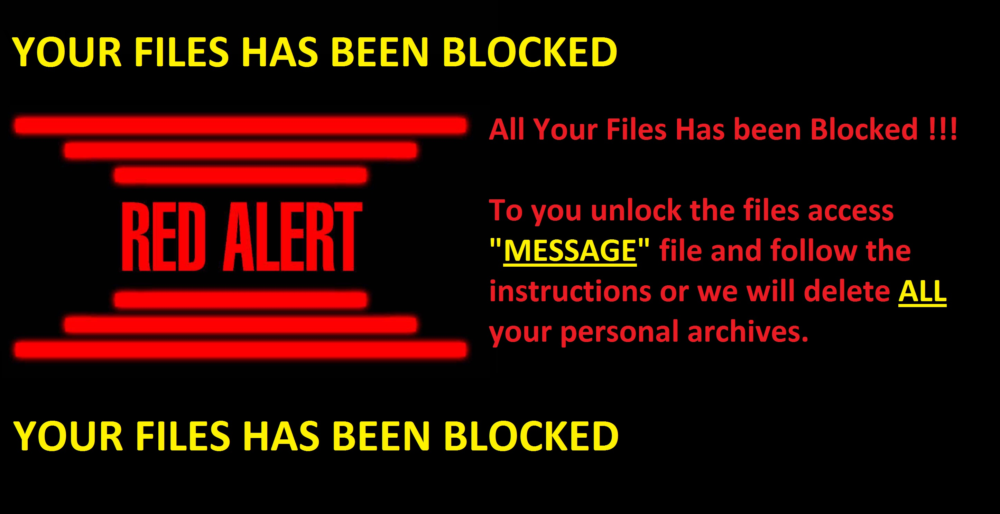

# HEUR-Trojan.Win32.Generic-b8be4f4beb811b4cbd9cdd015f19ee95eaaeb3357aa39bb98cc4db2e5d8c3142

- https://any.run/report/b8be4f4beb811b4cbd9cdd015f19ee95eaaeb3357aa39bb98cc4db2e5d8c3142/677b8527-f8c4-4b43-afcd-7291210ef3ad

```
- _id: "b8be4f4beb811b4cbd9cdd015f19ee95eaaeb3357aa39bb98cc4db2e5d8c3142"
  creation_date: 1483264392  # 2017-01-01 10:53:12 +0100 CET
  crowdsourced_yara_results: 
  - author: "Florian Roth"
    description: "Detects ransomware distributed in COVID-19 theme"
    rule_name: "MAL_RANSOM_COVID19_Apr20_1"
    ruleset_id: "000f8b51a1"
    ruleset_name: "crime_covid_ransom"
    source: "https://github.com/Neo23x0/signature-base"
  first_submission_date: 1483270590  # 2017-01-01 12:36:30 +0100 CET
  last_analysis_date: 1657603038  # 2022-07-12 07:17:18 +0200 CEST
  last_analysis_results: 
    Kaspersky: 
      result: "HEUR:Trojan.Win32.Generic"
  magic: "PE32 executable for MS Windows (GUI) Intel 80386 32-bit Mono/.Net assembly"
  packers: 
    PEiD: ".NET executable"
  size: 215552
  trid: 
  - file_type: "Generic CIL Executable (.NET, Mono, etc.)"
    probability: 72.5
  - file_type: "Win64 Executable (generic)"
    probability: 10.4
  - file_type: "Win32 Dynamic Link Library (generic)"
    probability: 6.5
  - file_type: "Win32 Executable (generic)"
    probability: 4.4
  - file_type: "OS/2 Executable (generic)"
    probability: 2.0
```









