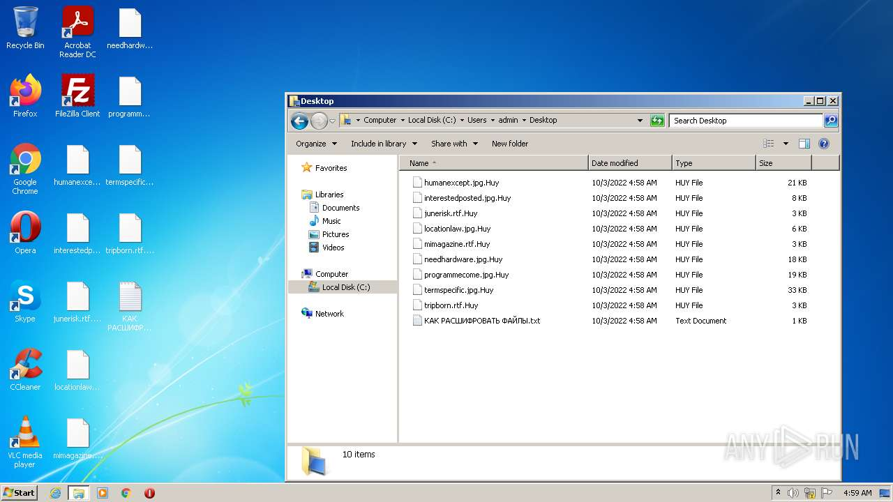
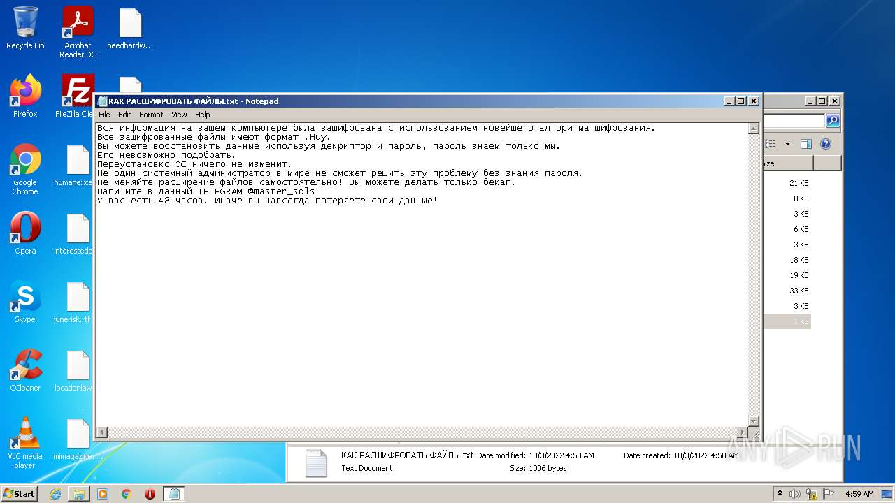
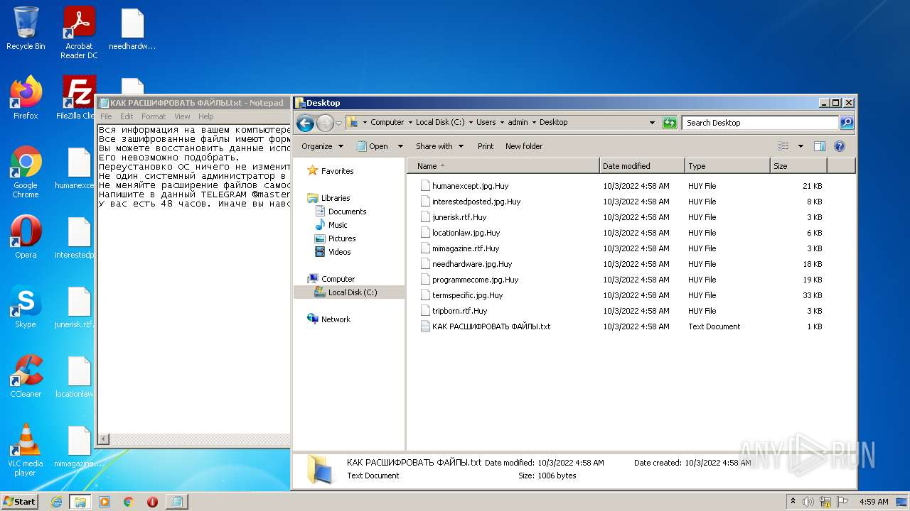

# HEUR-Trojan.Win32.Generic-b97fa6dabe16e8c28c2b1a9b340237a48e653bac63c3500e1d8c1e75b1709620

- https://any.run/report/b97fa6dabe16e8c28c2b1a9b340237a48e653bac63c3500e1d8c1e75b1709620/a6336bc4-cff6-4e33-b0e7-aab99dabd46a

```
- _id: "b97fa6dabe16e8c28c2b1a9b340237a48e653bac63c3500e1d8c1e75b1709620"
  creation_date: 1562171121  # 2019-07-03 18:25:21 +0200 CEST
  first_submission_date: 1580470666  # 2020-01-31 12:37:46 +0100 CET
  last_analysis_date: 1581319057  # 2020-02-10 08:17:37 +0100 CET
  last_analysis_results: 
    Kaspersky: 
      result: "HEUR:Trojan.Win32.Generic"
  magic: "PE32 executable for MS Windows (GUI) Intel 80386 Mono/.Net assembly"
  size: 130128
  trid: 
  - file_type: "Win64 Executable (generic)"
    probability: 61.7
  - file_type: "Win32 Dynamic Link Library (generic)"
    probability: 14.7
  - file_type: "Win32 Executable (generic)"
    probability: 10.0
  - file_type: "OS/2 Executable (generic)"
    probability: 4.5
  - file_type: "Generic Win/DOS Executable"
    probability: 4.4
```





