# HEUR-Trojan.Win32.Generic-c3359a67295f17a74006403e304e27335139b1ef1317379c6117317b83682a2c

- https://any.run/report/c3359a67295f17a74006403e304e27335139b1ef1317379c6117317b83682a2c/dd03dd61-43d0-4d5f-b286-f0ba7f98058b

```
- _id: "c3359a67295f17a74006403e304e27335139b1ef1317379c6117317b83682a2c"
  creation_date: 1519666737  # 2018-02-26 18:38:57 +0100 CET
  crowdsourced_yara_results: 
  - author: "Florian Roth"
    description: "Detects Arid Viper malware sample"
    match_in_subfile: true
    rule_name: "MAL_AirdViper_Sample_Apr18_1"
    ruleset_id: "00070be7f4"
    ruleset_name: "apt_winnti_burning_umbrella"
    source: "https://github.com/Neo23x0/signature-base"
  - author: "Florian Roth"
    description: "Detects ransomware indicator"
    match_in_subfile: true
    rule_name: "SUSP_RANSOMWARE_Indicator_Jul20"
    ruleset_id: "000a7d3924"
    ruleset_name: "crime_ransom_generic"
    source: "https://github.com/Neo23x0/signature-base"
  first_submission_date: 1580952052  # 2020-02-06 02:20:52 +0100 CET
  last_analysis_date: 1634589493  # 2021-10-18 22:38:13 +0200 CEST
  last_analysis_results: 
    Kaspersky: 
      result: "HEUR:Trojan.Win32.Generic"
  magic: "PE32 executable for MS Windows (GUI) Intel 80386 32-bit"
  packers: 
    F-PROT: "UPX"
  size: 240640
  trid: 
  - file_type: "UPX compressed Win32 Executable"
    probability: 54.9
  - file_type: "Win32 Dynamic Link Library (generic)"
    probability: 13.3
  - file_type: "Win16 NE executable (generic)"
    probability: 10.2
  - file_type: "Win32 Executable (generic)"
    probability: 9.1
  - file_type: "OS/2 Executable (generic)"
    probability: 4.1
```


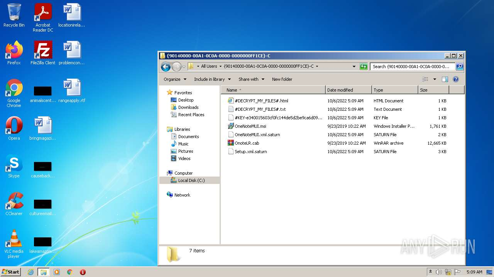
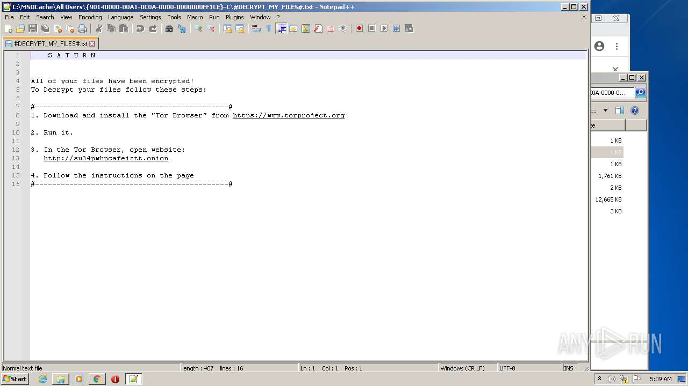
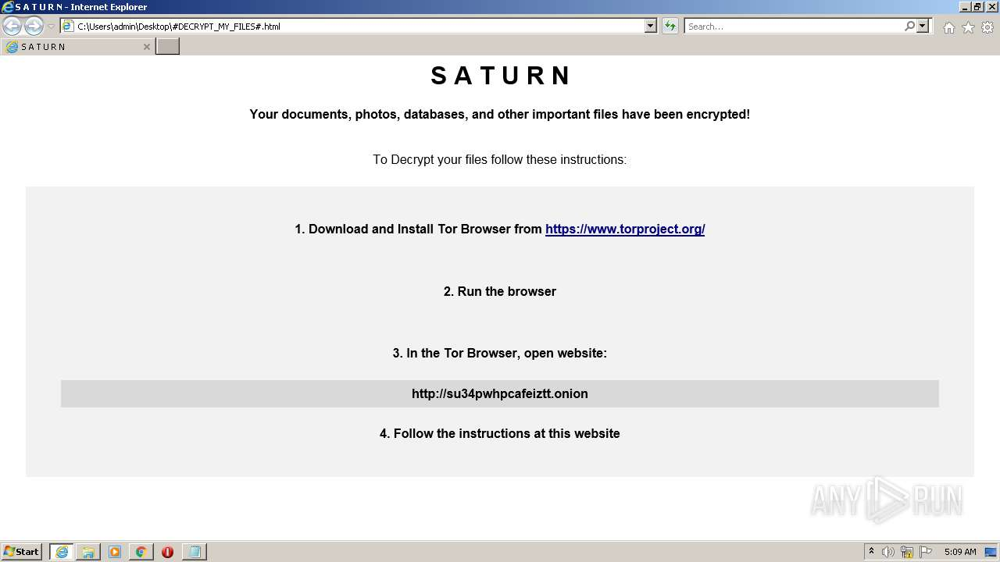
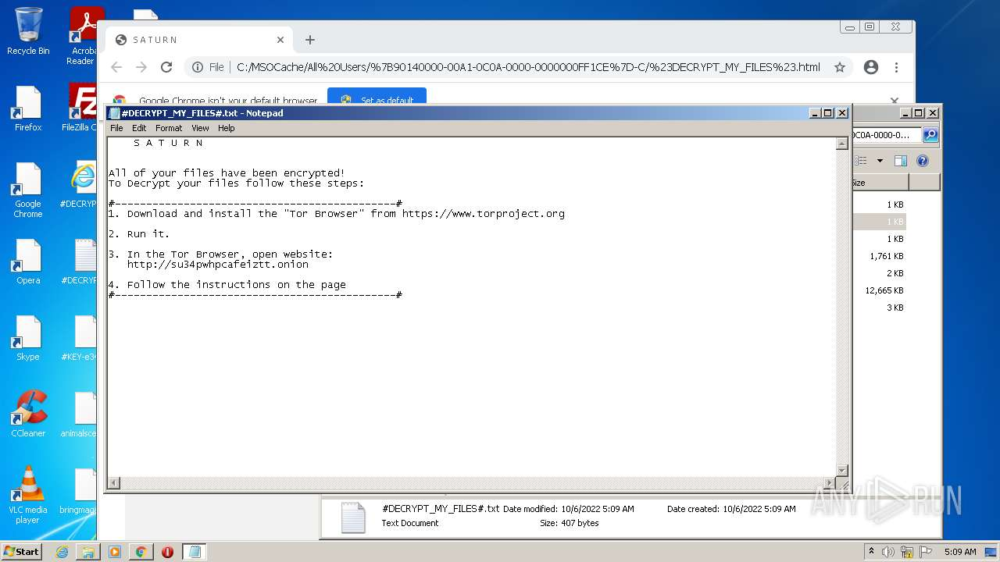
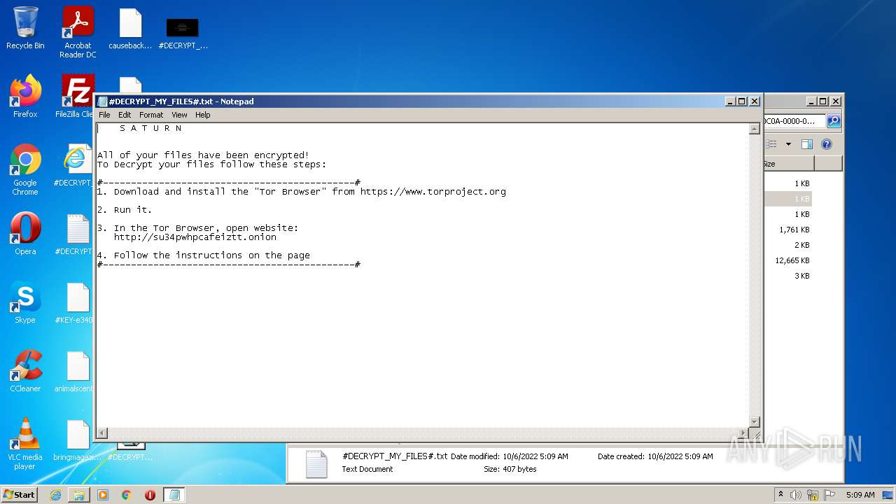
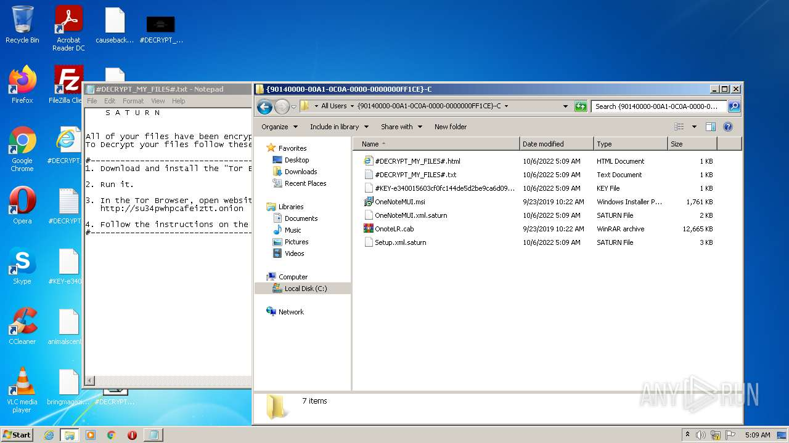
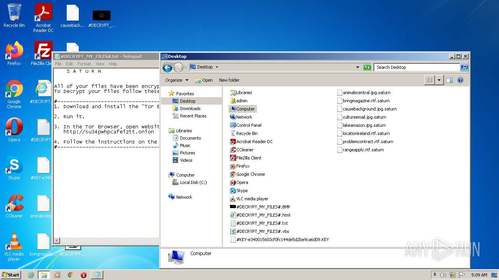
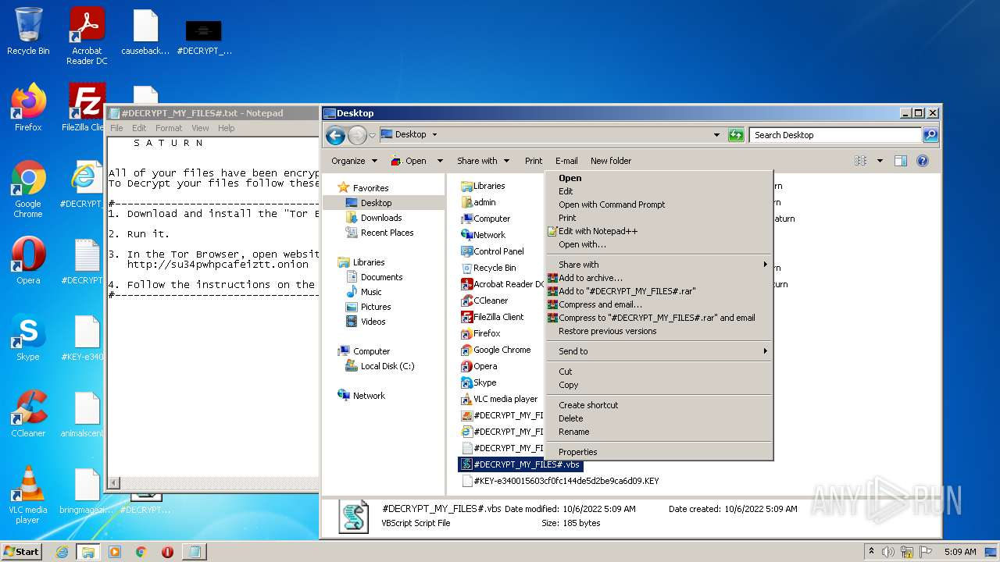
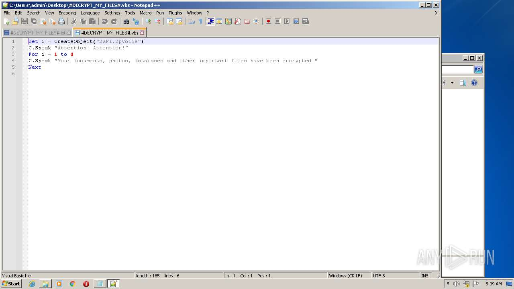
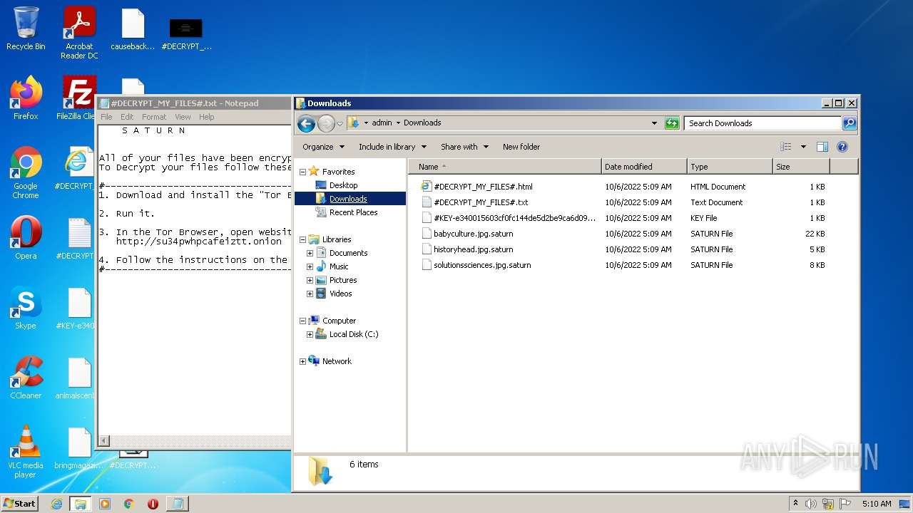
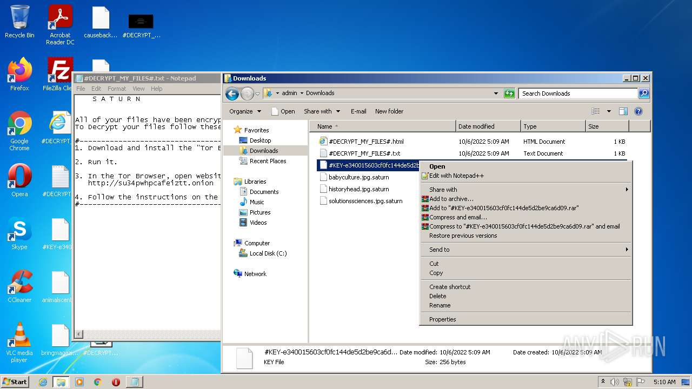
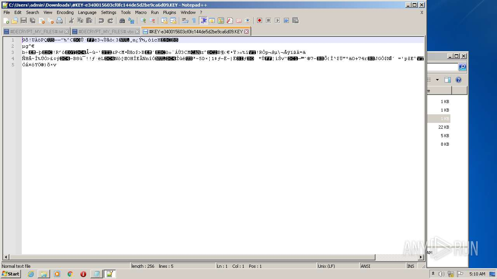
