# HEUR-Trojan.Win32.Generic-e67834d1e8b38ec5864cfa101b140aeaba8f1900a6e269e6a94c90fcbfe56678

```
- _id: "e67834d1e8b38ec5864cfa101b140aeaba8f1900a6e269e6a94c90fcbfe56678"
  creation_date: 1495658914  # 2017-05-24 22:48:34 +0200 CEST
  first_submission_date: 1495574262  # 2017-05-23 23:17:42 +0200 CEST
  last_analysis_date: 1663114722  # 2022-09-14 02:18:42 +0200 CEST
  last_analysis_results: 
    Kaspersky: 
      result: "HEUR:Trojan.Win32.Generic"
  magic: "PE32 executable for MS Windows (GUI) Intel 80386 32-bit"
  size: 619008
  trid: 
  - file_type: "Win32 Executable MS Visual C++ (generic)"
    probability: 38.8
  - file_type: "Microsoft Visual C++ compiled executable (generic)"
    probability: 20.5
  - file_type: "Win64 Executable (generic)"
    probability: 13.0
  - file_type: "Win32 Dynamic Link Library (generic)"
    probability: 8.1
  - file_type: "Win16 NE executable (generic)"
    probability: 6.2
```


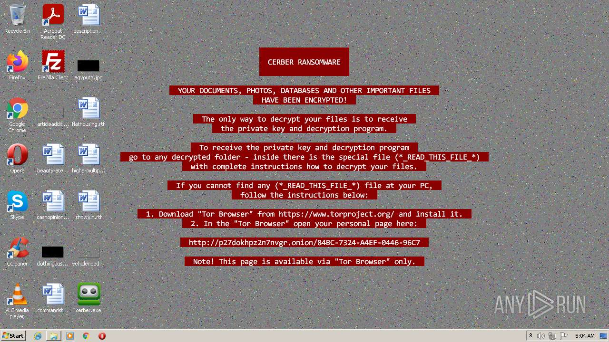
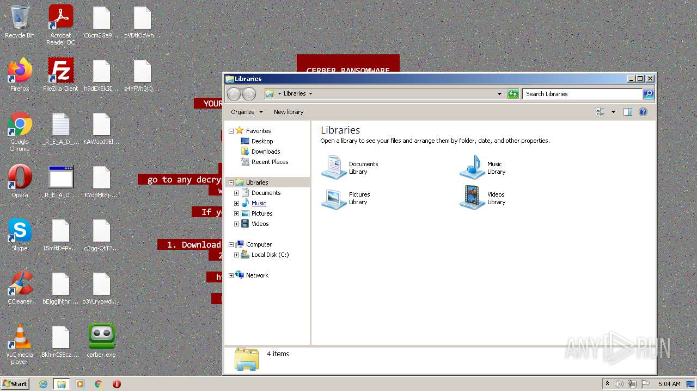


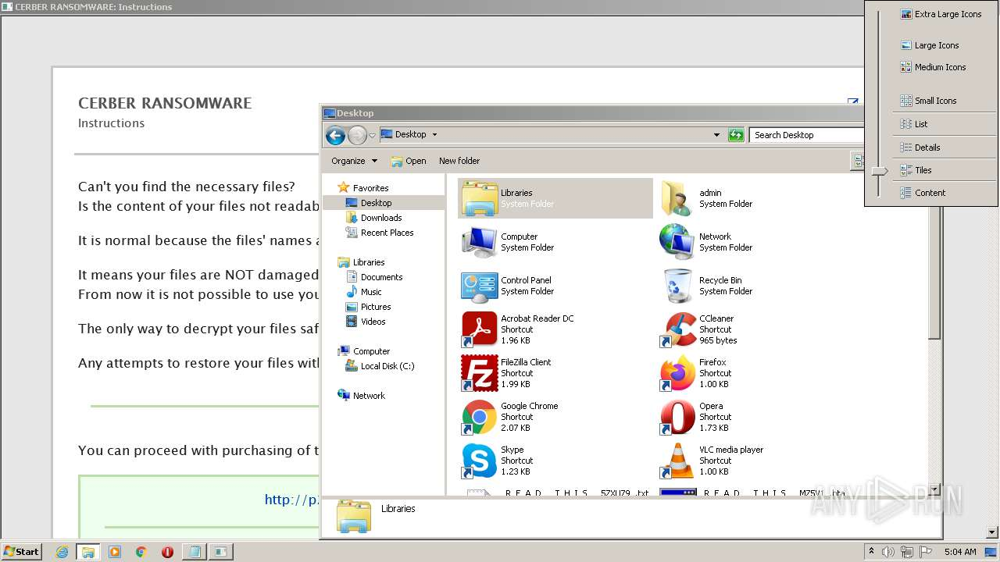
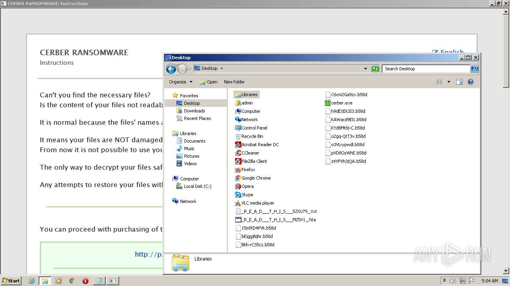


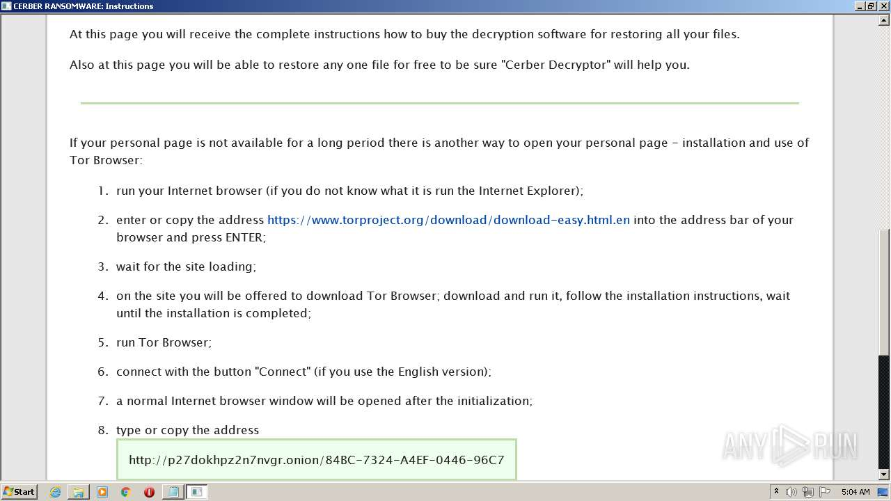


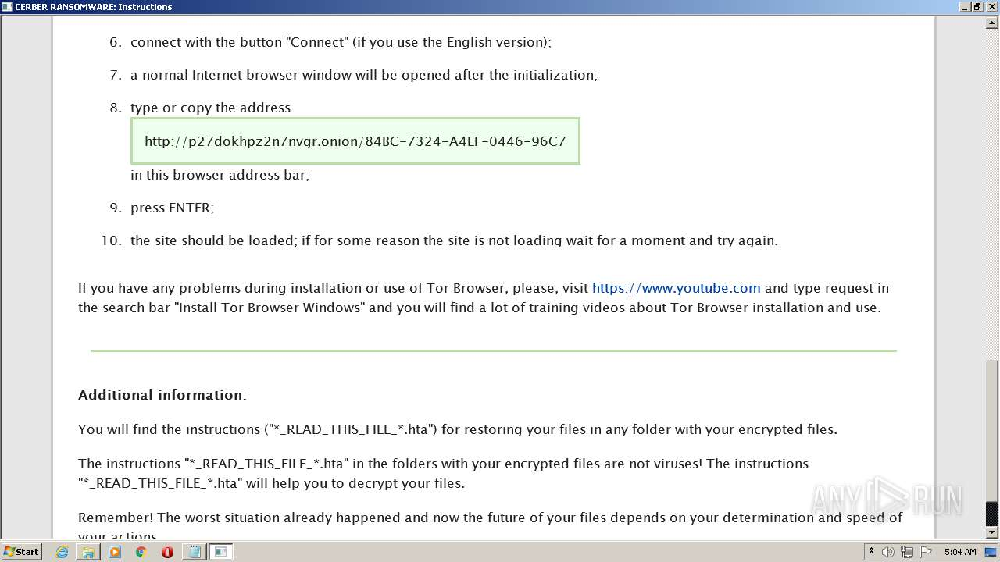
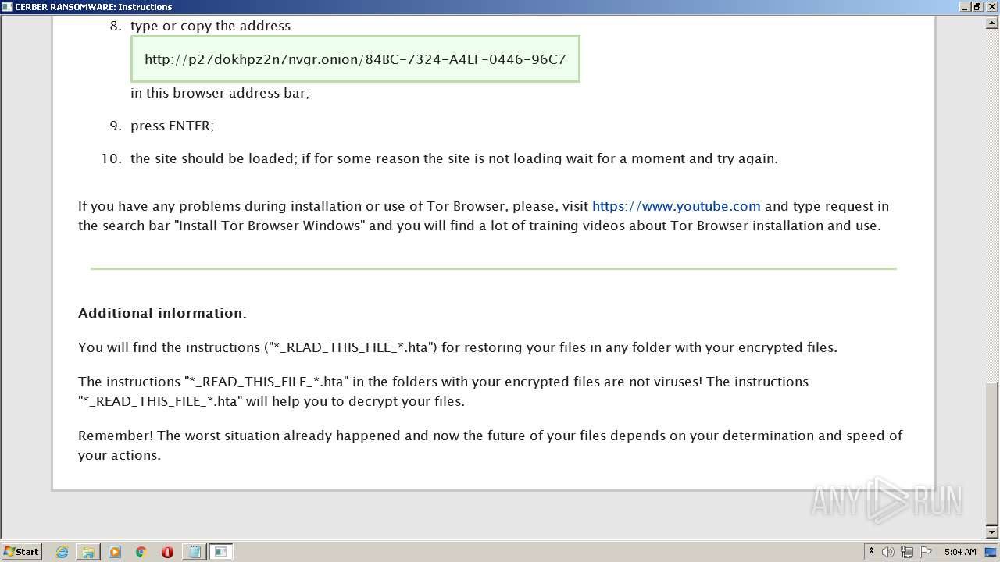

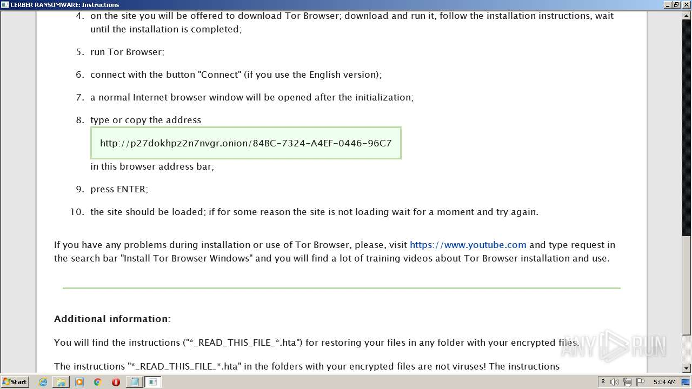


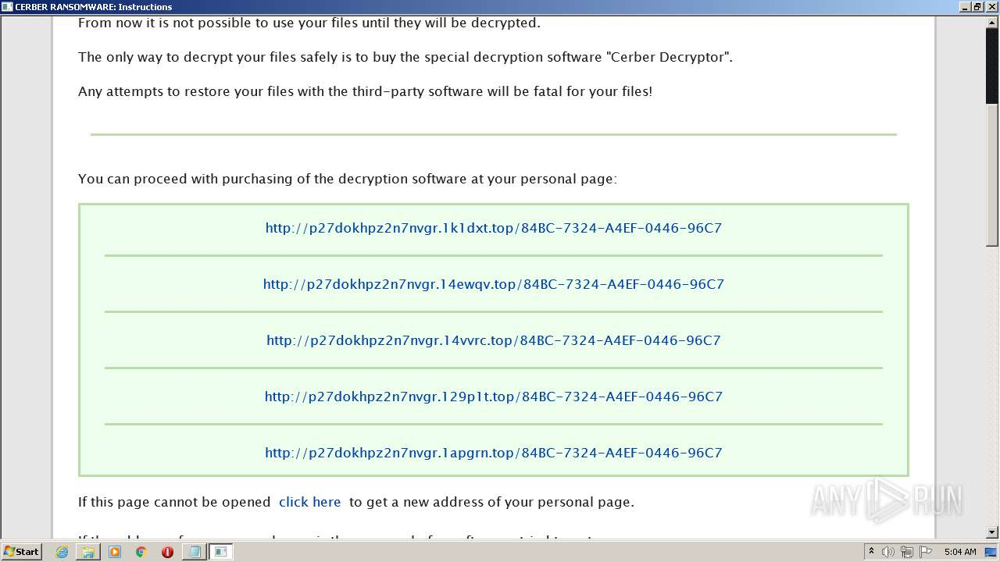
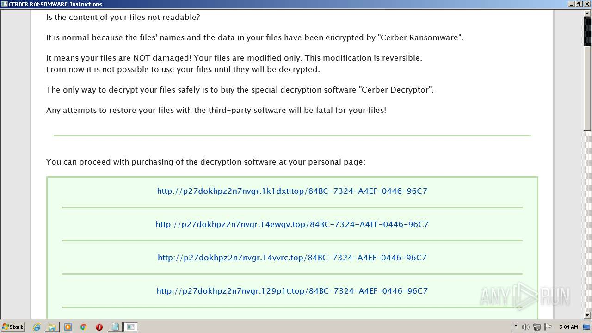


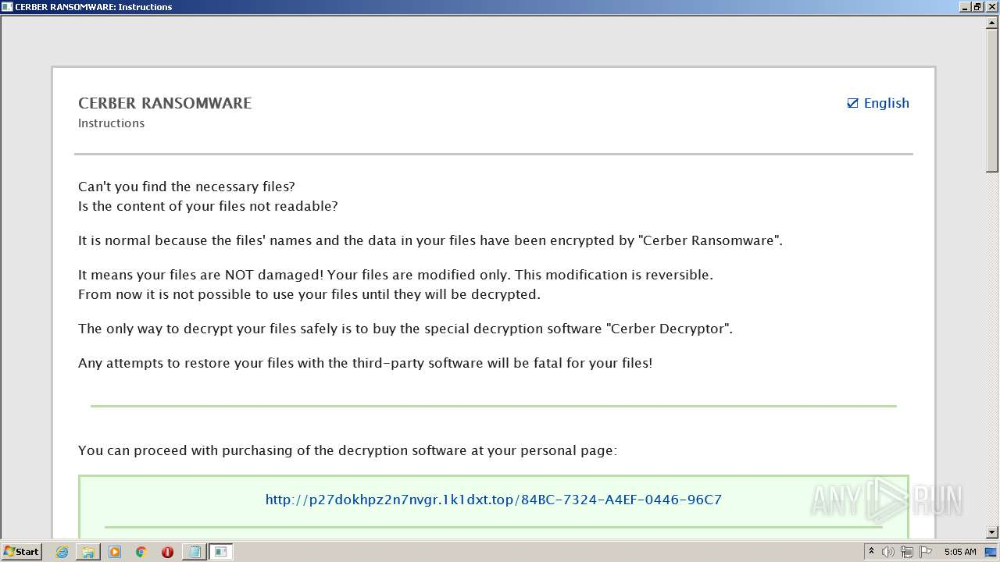
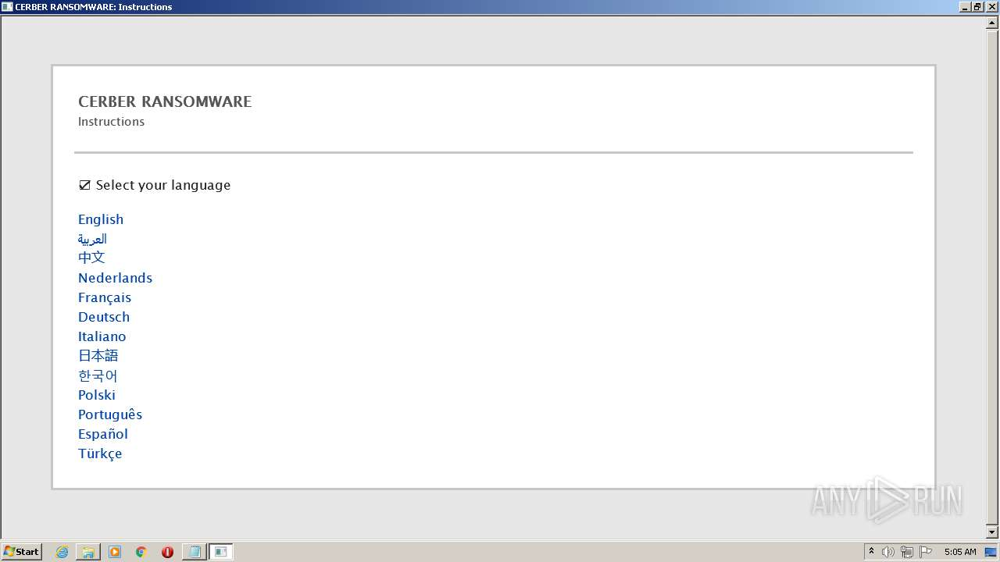

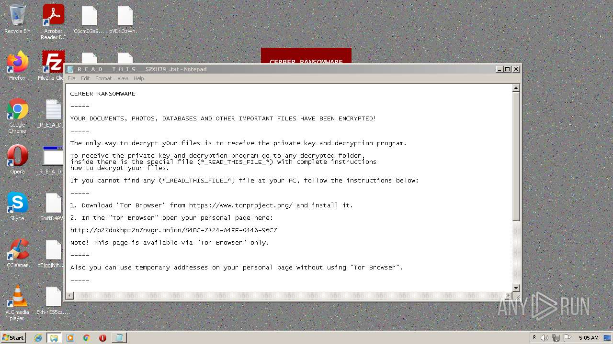
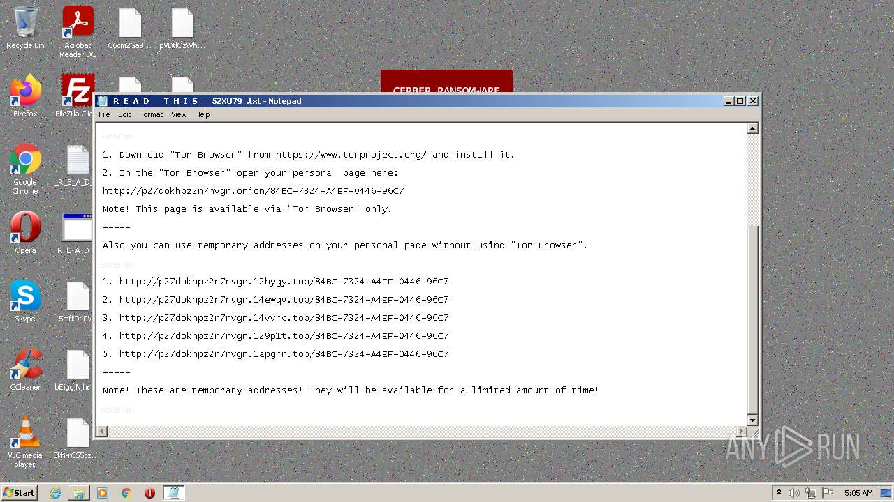


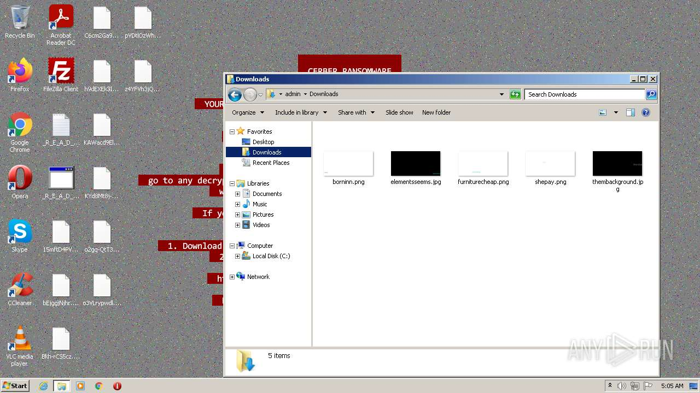

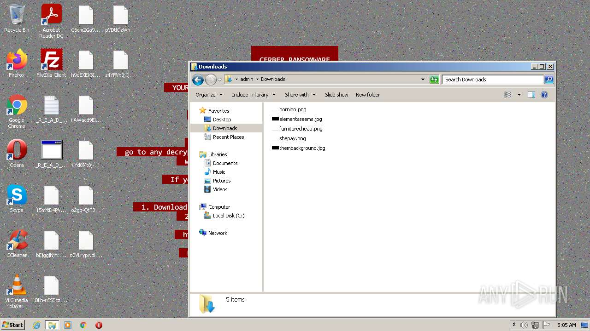
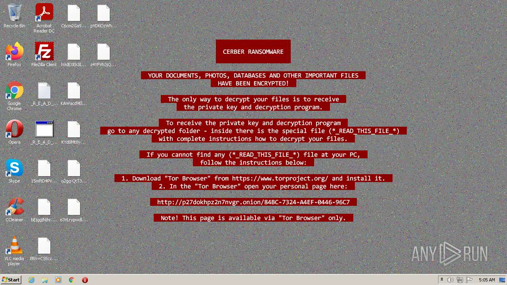
