# HEUR-Trojan.Win32.Zenpak.pef-d09f4bce2e2b4396f2f0f06b0c18c689131a3266e7592fb0ab935ec3b8a08563

- https://any.run/report/d09f4bce2e2b4396f2f0f06b0c18c689131a3266e7592fb0ab935ec3b8a08563/fd64222b-db10-467f-bcc4-9daabda9034c

```
- _id: "d09f4bce2e2b4396f2f0f06b0c18c689131a3266e7592fb0ab935ec3b8a08563"
  creation_date: 1549588204  # 2019-02-08 02:10:04 +0100 CET
  first_submission_date: 1580711612  # 2020-02-03 07:33:32 +0100 CET
  last_analysis_date: 1623864914  # 2021-06-16 19:35:14 +0200 CEST
  last_analysis_results: 
    Kaspersky: 
      result: "HEUR:Trojan.Win32.Zenpak.pef"
  magic: "PE32 executable for MS Windows (GUI) Intel 80386 32-bit"
  size: 158720
  trid: 
  - file_type: "Win64 Executable (generic)"
    probability: 40.3
  - file_type: "Win16 NE executable (generic)"
    probability: 19.3
  - file_type: "Win32 Executable (generic)"
    probability: 17.2
  - file_type: "OS/2 Executable (generic)"
    probability: 7.7
  - file_type: "Generic Win/DOS Executable"
    probability: 7.6
```


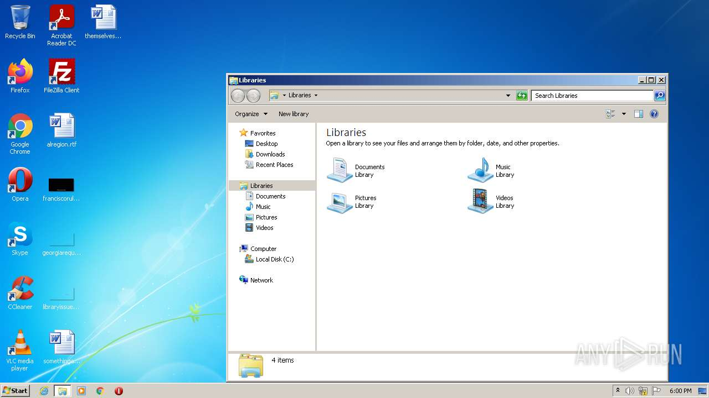
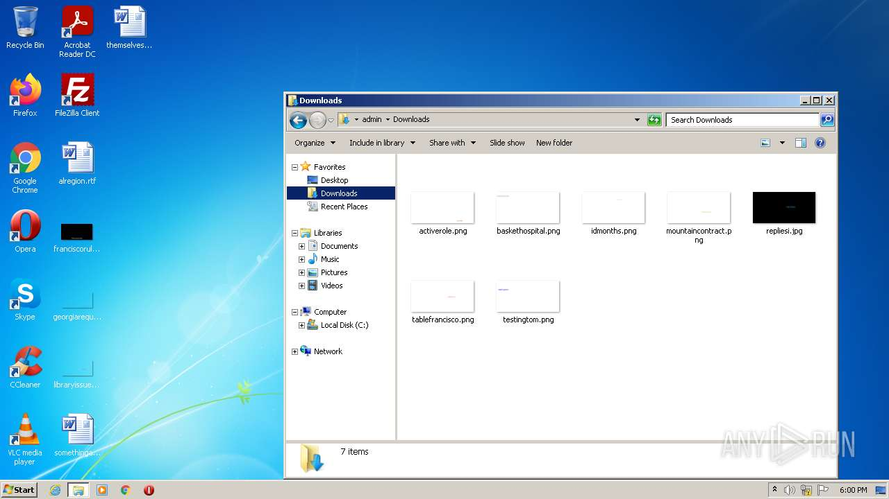
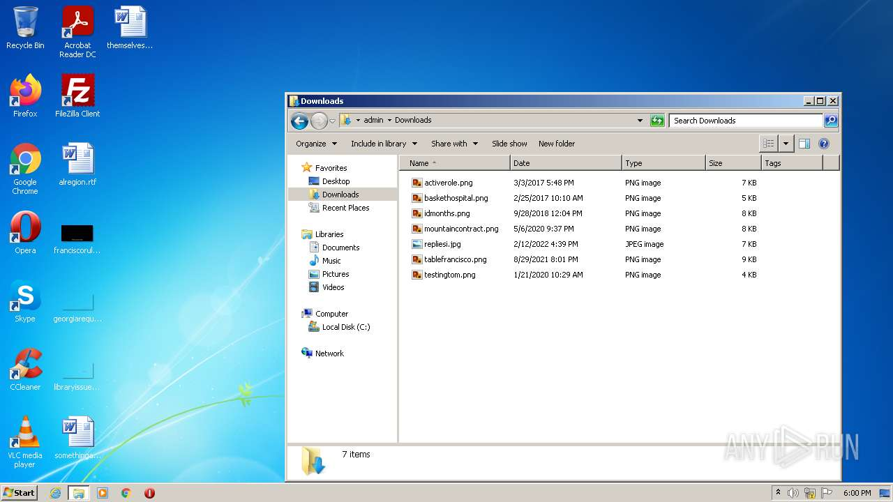
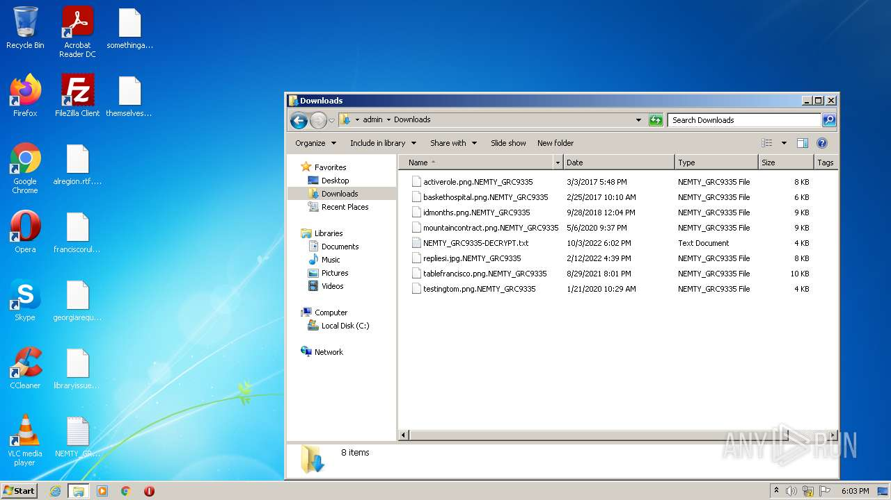
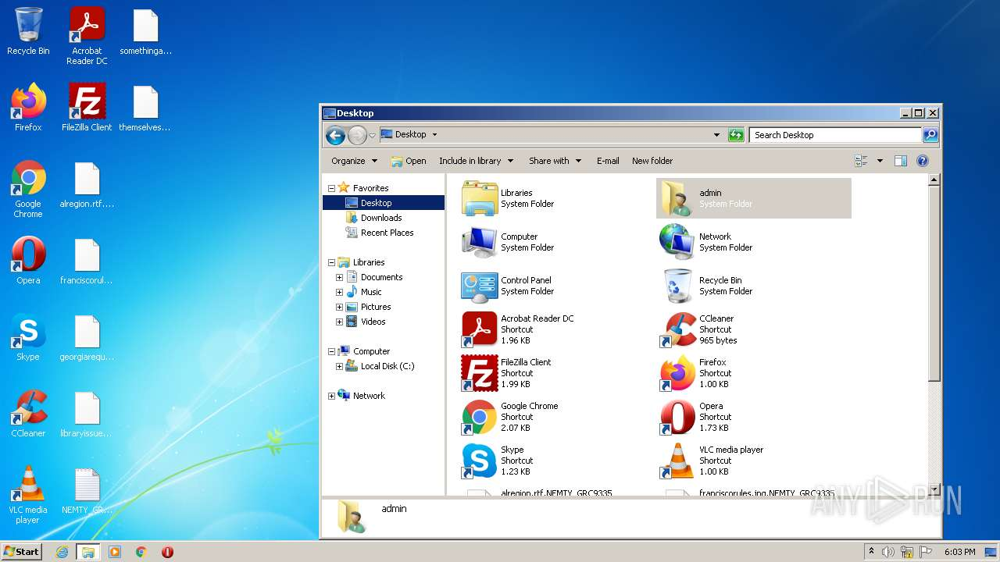

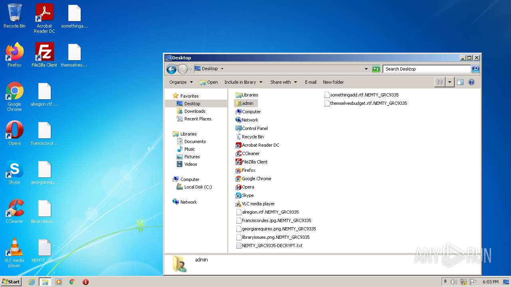
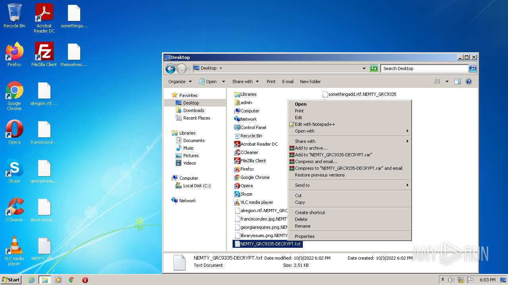
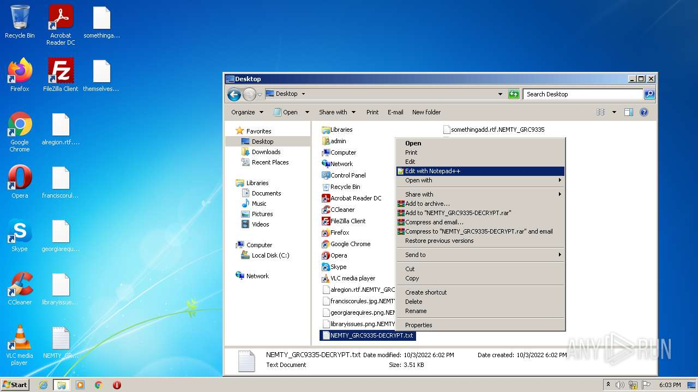
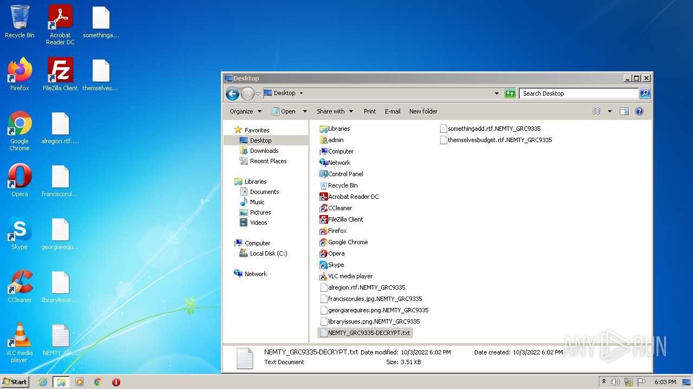
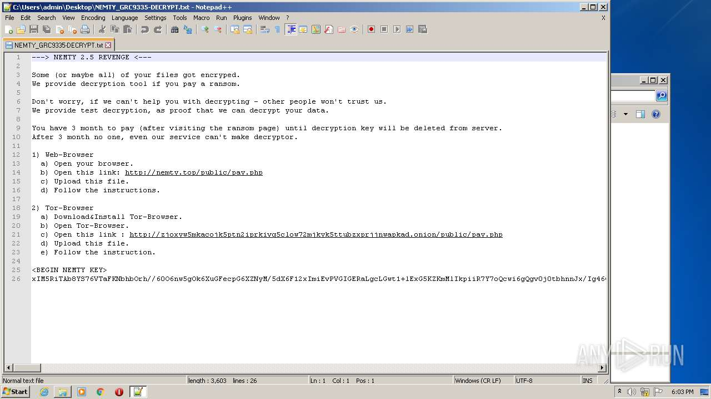
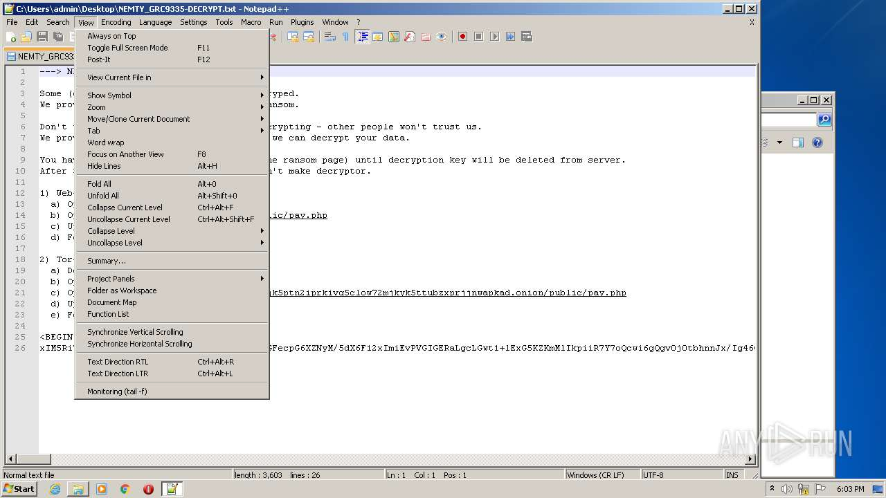
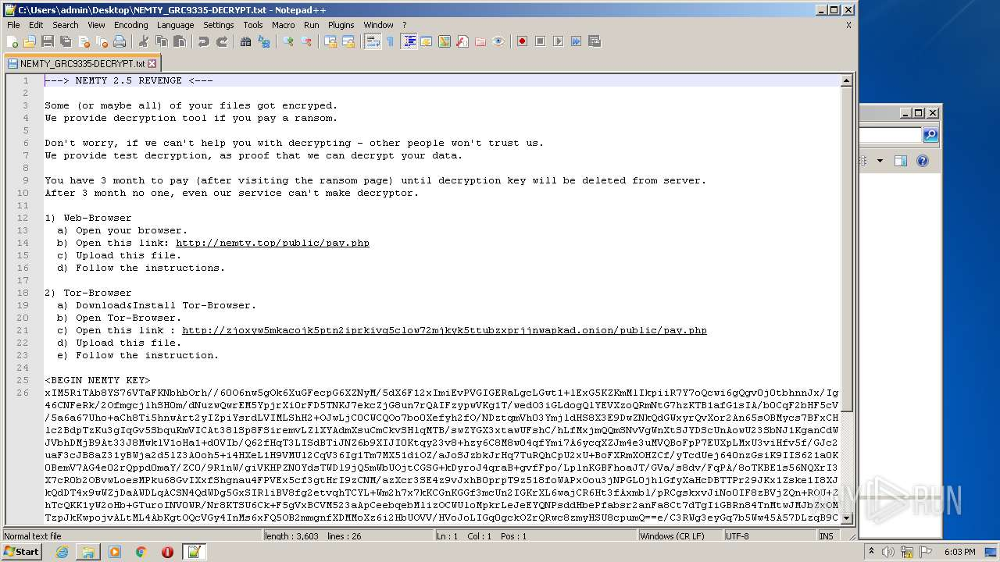
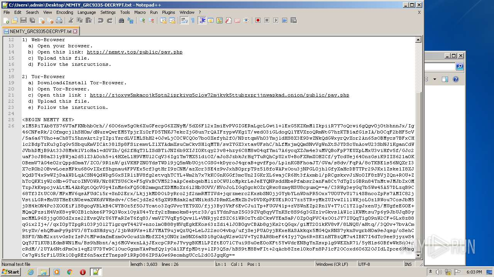
