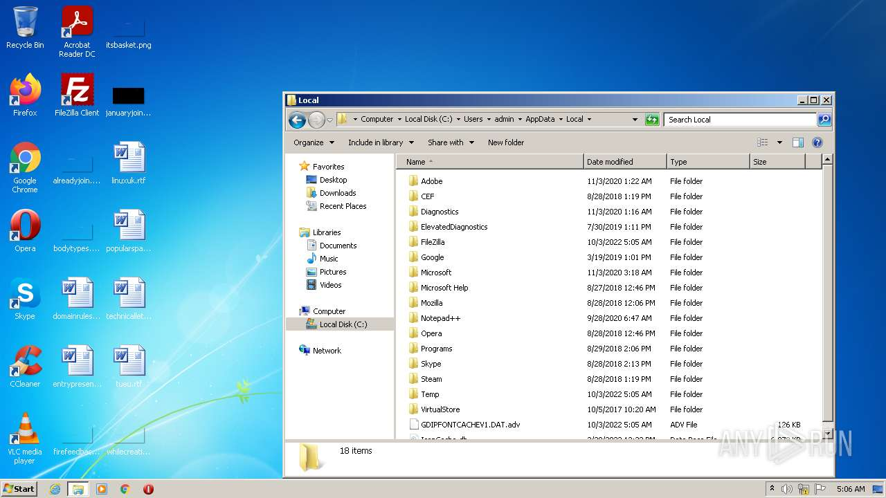
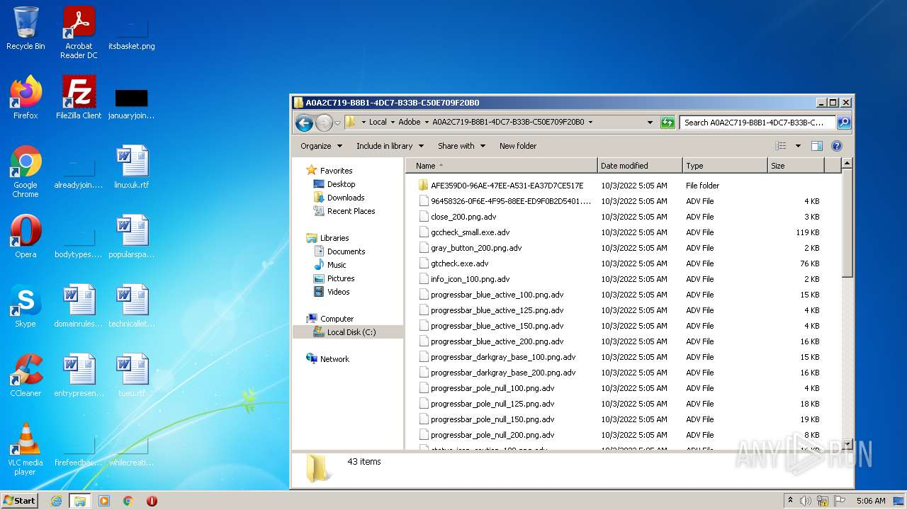
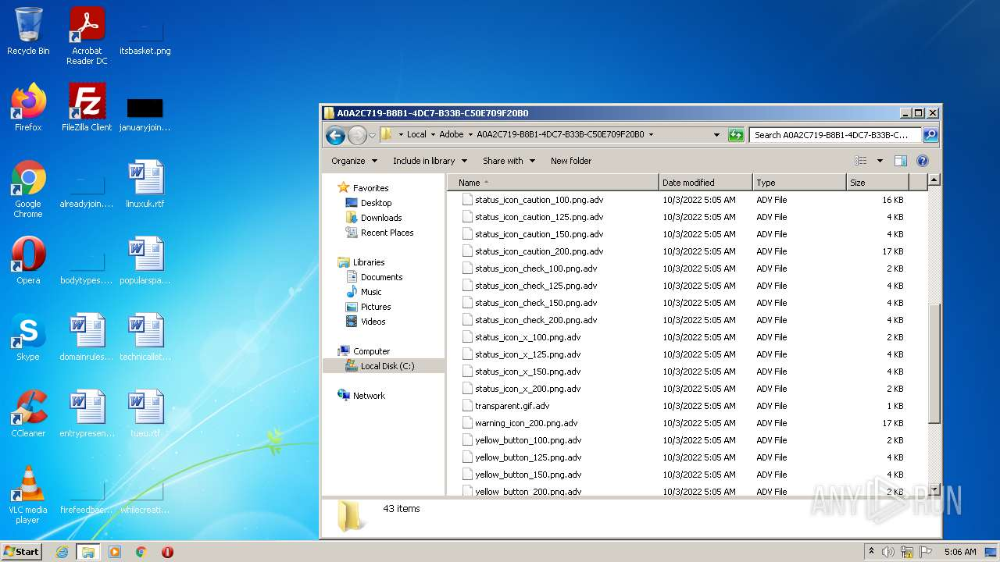
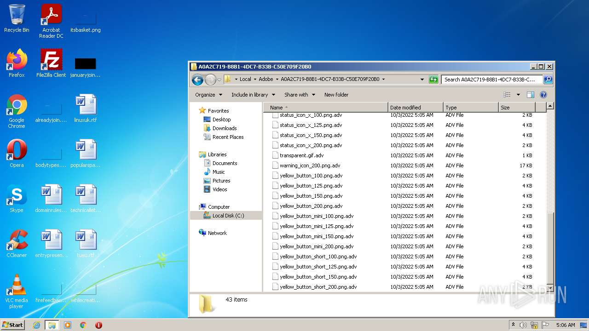
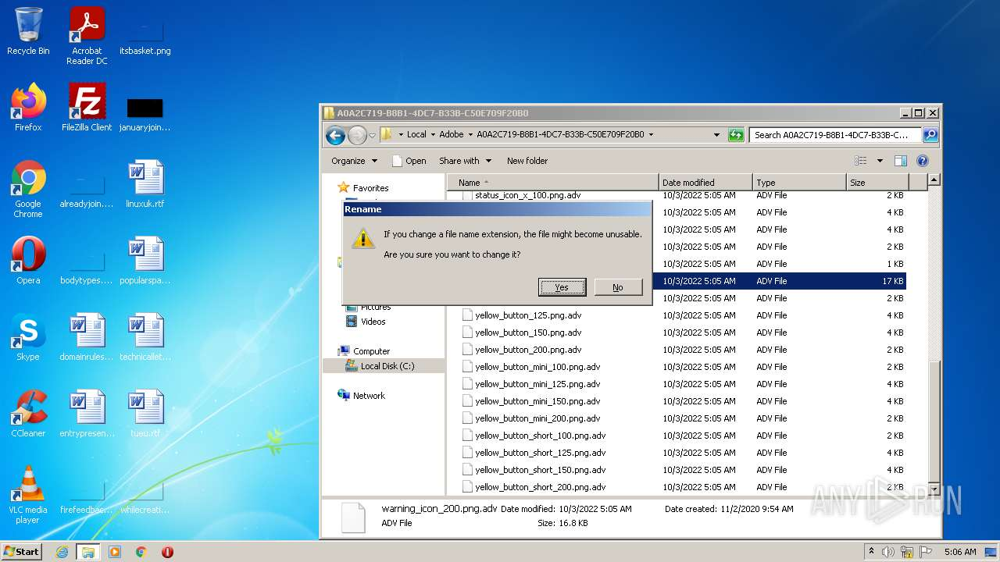
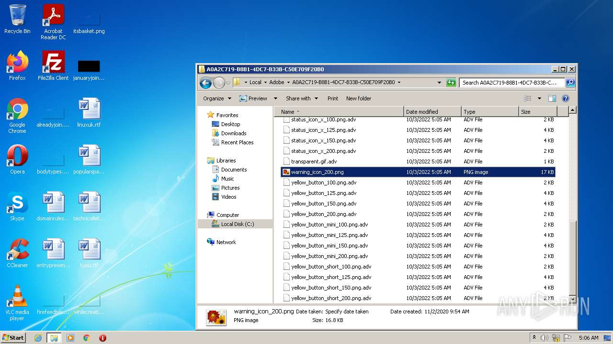
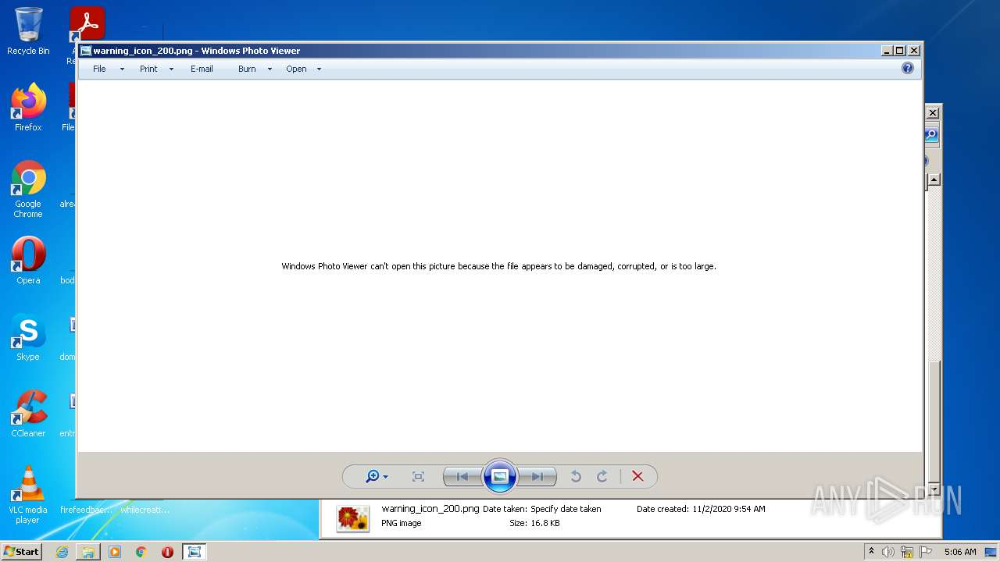
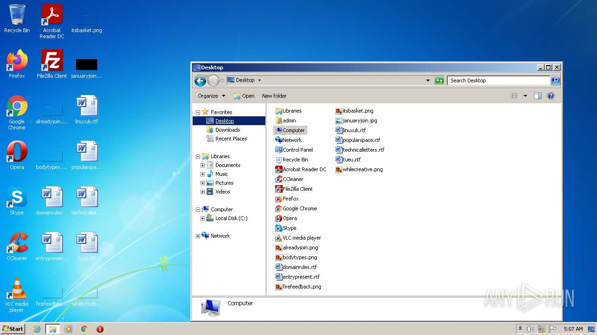

# HEUR-Trojan.Win32.Zudochka.vho-3d0b6d8806c174027cc50dd4cd415268fd180f8964ae2bfce1cacf44ca82f660

- https://any.run/report/3d0b6d8806c174027cc50dd4cd415268fd180f8964ae2bfce1cacf44ca82f660/249d93d9-0982-4de0-8c02-98febe62975e

```
- _id: "3d0b6d8806c174027cc50dd4cd415268fd180f8964ae2bfce1cacf44ca82f660"
  creation_date: 1580484614  # 2020-01-31 16:30:14 +0100 CET
  crowdsourced_yara_results: 
  - author: "Felix Bilstein - yara-signator at cocacoding dot com"
    description: "Detects win.fct."
    rule_name: "win_fct_auto"
    ruleset_id: "0085df1d11"
    ruleset_name: "win.fct_auto"
    source: "https://malpedia.caad.fkie.fraunhofer.de/"
  - author: "ReversingLabs"
    description: "Yara rule that detects FCT ransomware."
    rule_name: "Win32_Ransomware_FCT"
    ruleset_id: "0059bf1fd4"
    ruleset_name: "Win32.Ransomware.FCT"
    source: "https://github.com/reversinglabs/reversinglabs-yara-rules"
  first_submission_date: 1580496426  # 2020-01-31 19:47:06 +0100 CET
  last_analysis_date: 1663864930  # 2022-09-22 18:42:10 +0200 CEST
  last_analysis_results: 
    Kaspersky: 
      result: "HEUR:Trojan.Win32.Zudochka.vho"
  magic: "PE32 executable for MS Windows (GUI) Intel 80386 32-bit"
  size: 87040
  trid: 
  - file_type: "Win64 Executable (generic)"
    probability: 32.2
  - file_type: "Win32 Dynamic Link Library (generic)"
    probability: 20.1
  - file_type: "Win16 NE executable (generic)"
    probability: 15.4
  - file_type: "Win32 Executable (generic)"
    probability: 13.7
  - file_type: "OS/2 Executable (generic)"
    probability: 6.2
```










