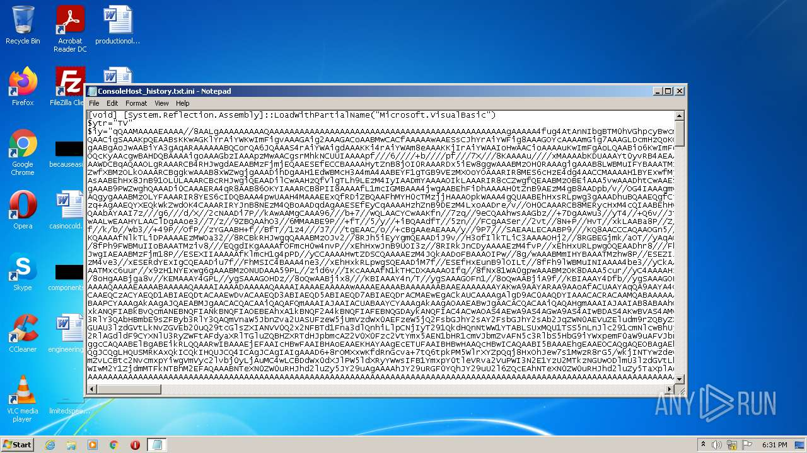
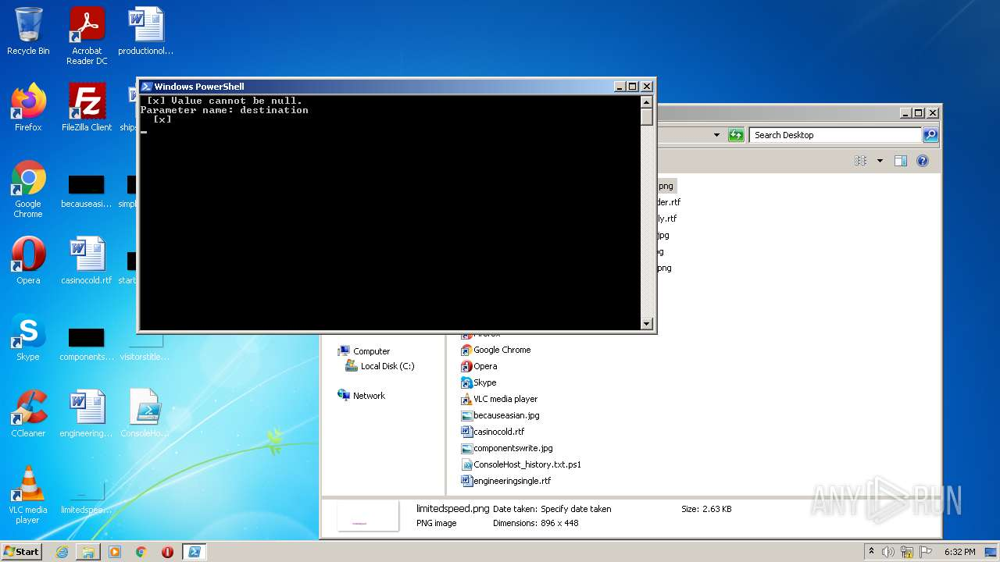
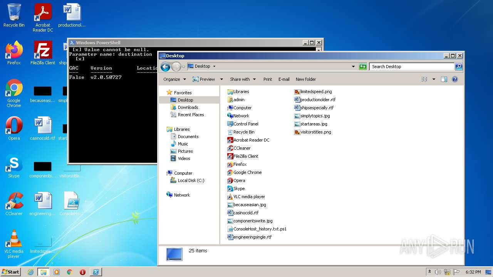
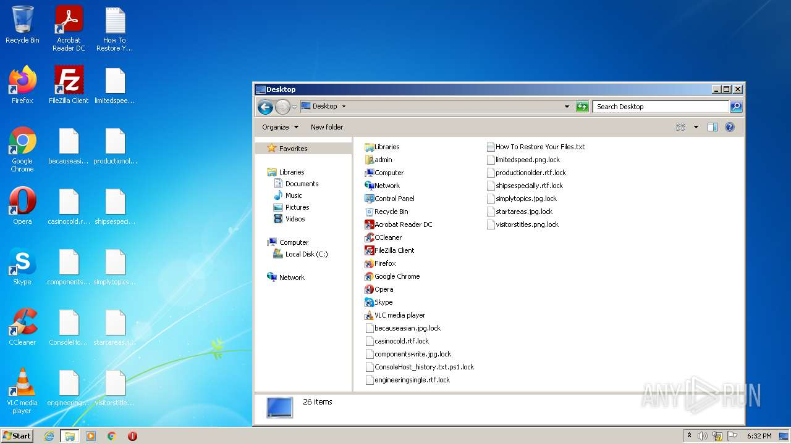
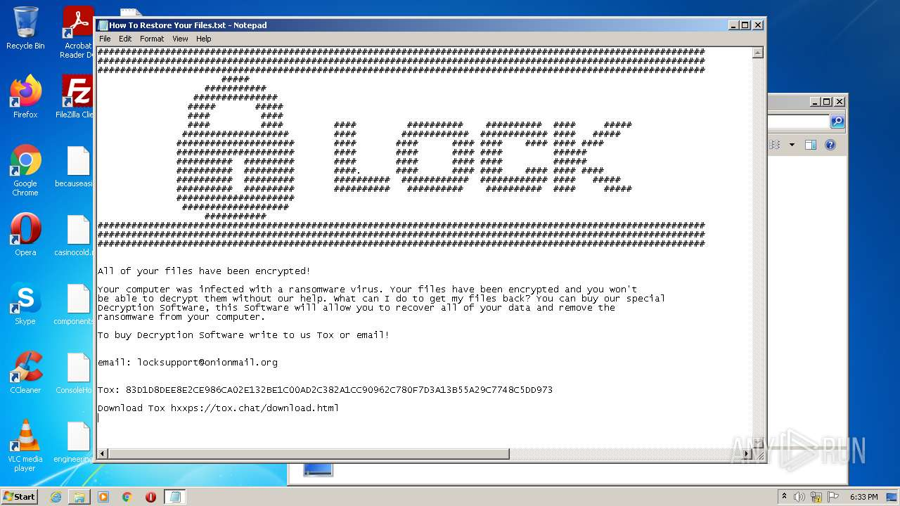
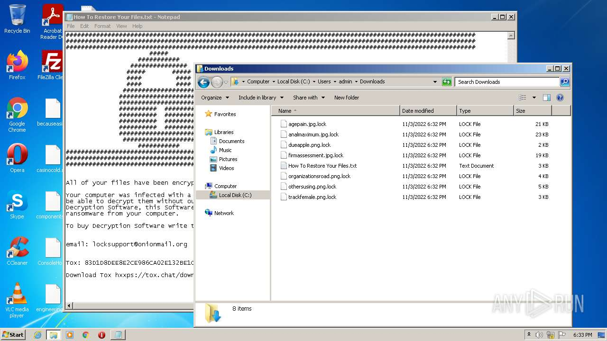
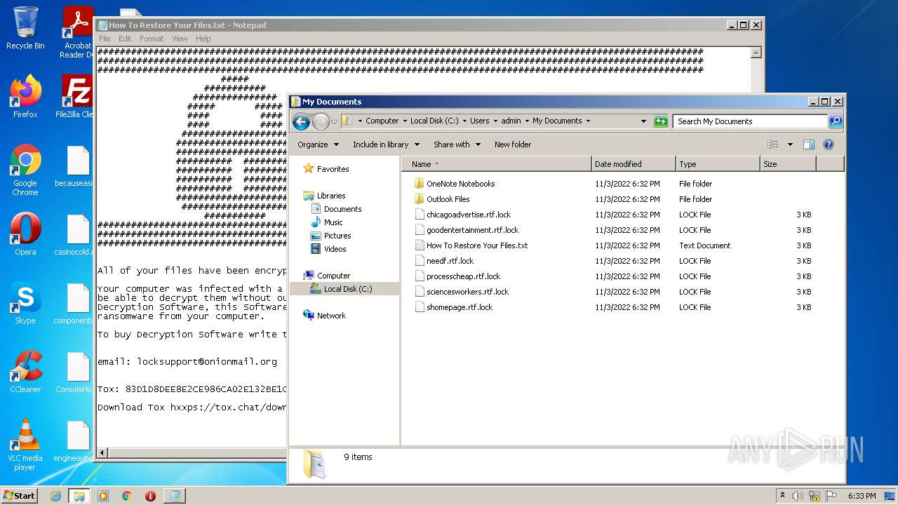

# Trojan-Dropper.PowerShell.Agent.cw-4c2799a221d00977e51237ee12927e19e8c89d1371f0045bc32cc4d71da9f685

- https://any.run/report/4c2799a221d00977e51237ee12927e19e8c89d1371f0045bc32cc4d71da9f685/11458e25-a985-4864-9426-5aa64077cd9e

```
- _id: "4c2799a221d00977e51237ee12927e19e8c89d1371f0045bc32cc4d71da9f685"
  first_submission_date: 1667474429  # 2022-11-03 12:20:29 +0100 CET
  last_analysis_date: 1667474429  # 2022-11-03 12:20:29 +0100 CET
  last_analysis_results: 
    Kaspersky: 
      result: "Trojan-Dropper.PowerShell.Agent.cw"
  magic: "ASCII text, with very long lines, with CRLF, LF line terminators"
  size: 311634
  trid: 
  - file_type: "file seems to be plain text/ASCII"
    probability: 0.0
```








