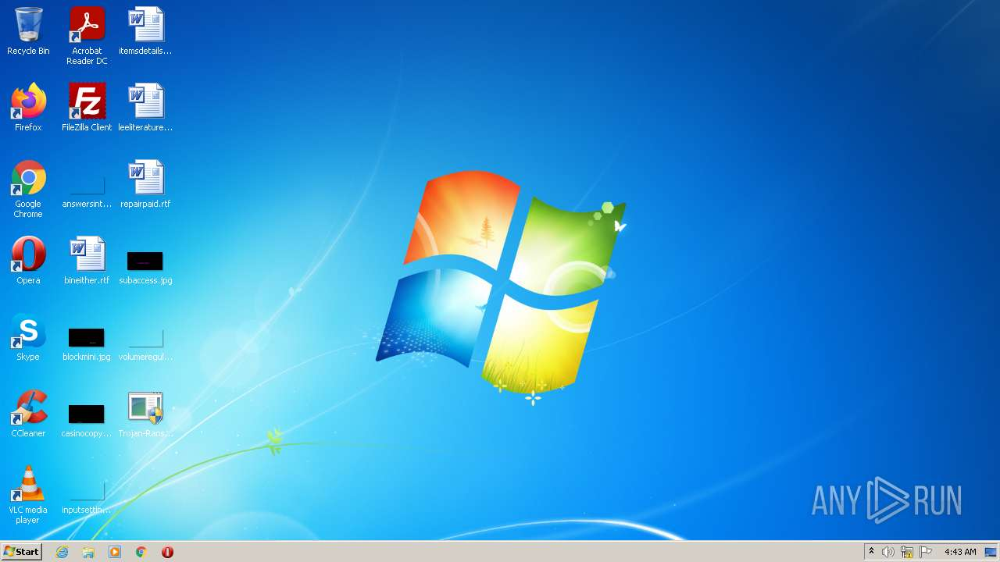
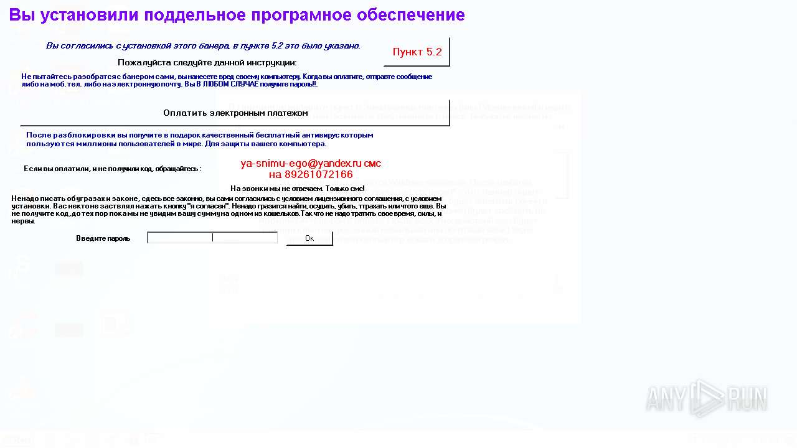
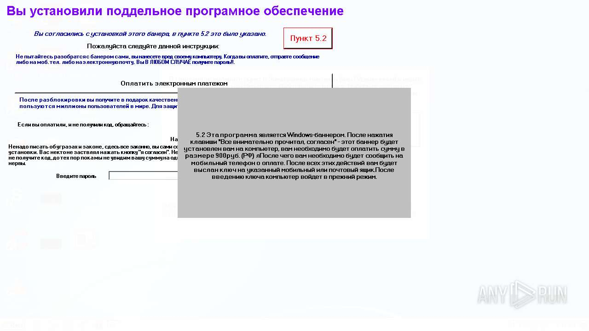
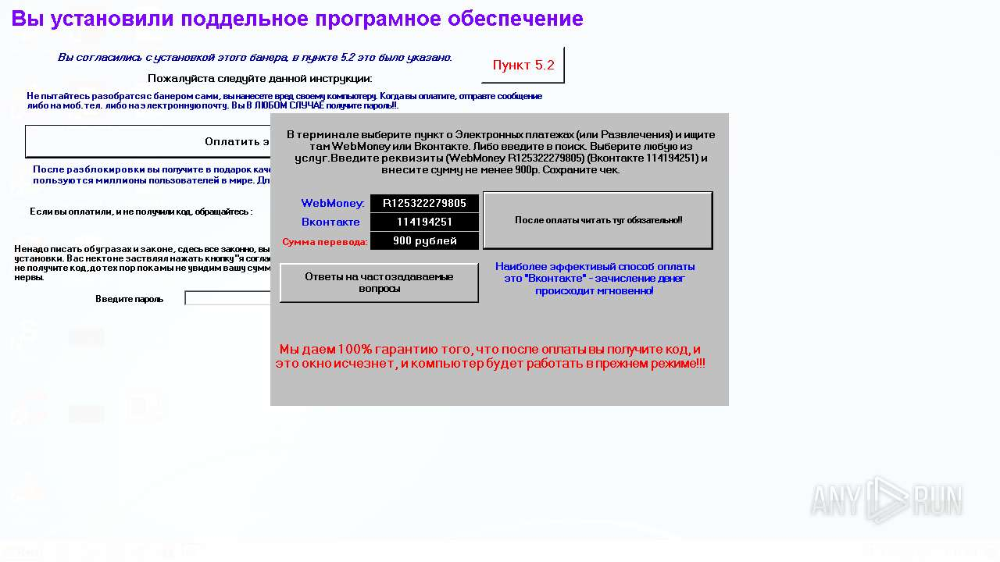

# Trojan-Ransom.MSIL.FakeInstaller.e-b409589defada451b7bb5599ca99faf8795479e487229f7fa1764556eed3a3aa

- https://any.run/report/b409589defada451b7bb5599ca99faf8795479e487229f7fa1764556eed3a3aa/f4fd6b9c-f2be-4acb-9f79-0913baaddba8

```
- _id: "b409589defada451b7bb5599ca99faf8795479e487229f7fa1764556eed3a3aa"
  creation_date: 1294780331  # 2011-01-11 22:12:11 +0100 CET
  first_submission_date: 1294931876  # 2011-01-13 16:17:56 +0100 CET
  last_analysis_date: 1571543303  # 2019-10-20 05:48:23 +0200 CEST
  last_analysis_results: 
    Kaspersky: 
      result: "Trojan-Ransom.MSIL.FakeInstaller.e"
  magic: "PE32 executable for MS Windows (GUI) Intel 80386 32-bit Mono/.Net assembly"
  packers: 
    PEiD: ".NET executable"
  size: 1153767
  trid: 
  - file_type: "Generic CIL Executable (.NET, Mono, etc.)"
    probability: 44.5
  - file_type: "Win32 Executable MS Visual C++ (generic)"
    probability: 18.9
  - file_type: "Win64 Executable (generic)"
    probability: 16.8
  - file_type: "Windows screen saver"
    probability: 7.9
  - file_type: "Win32 Dynamic Link Library (generic)"
    probability: 4.0
```






