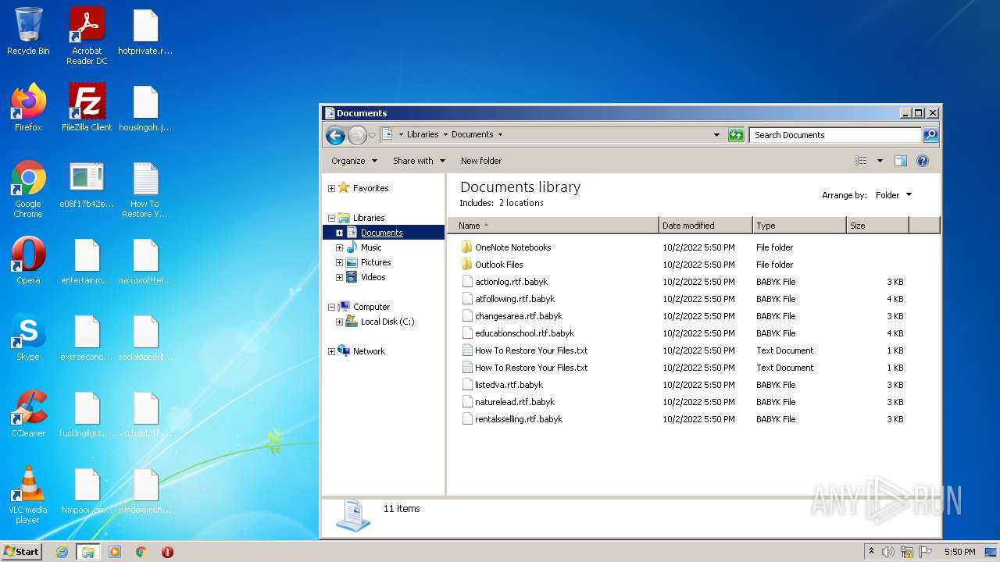
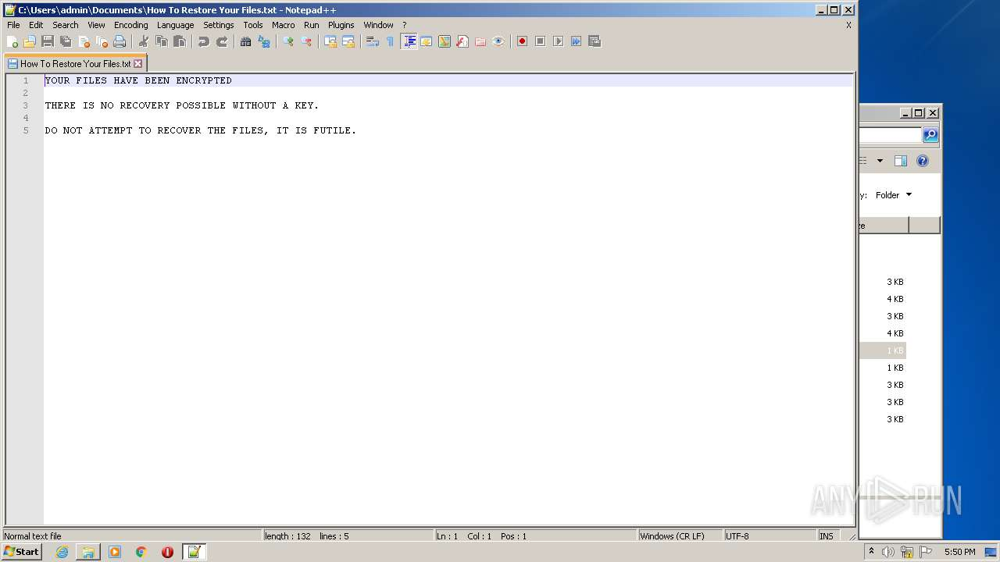
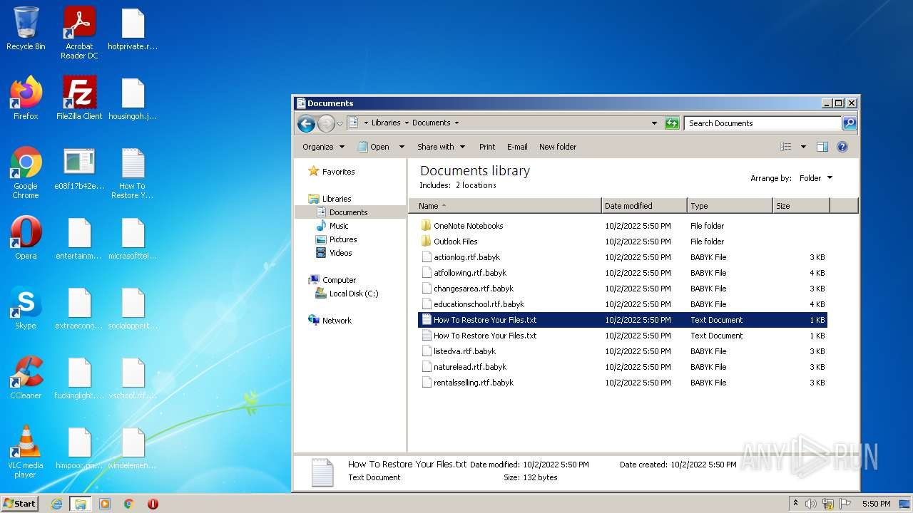
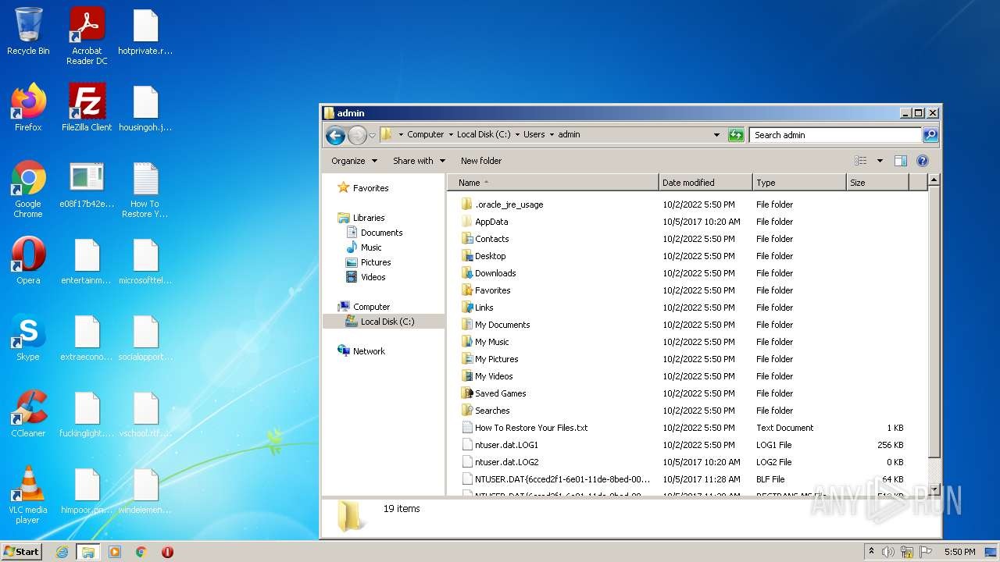
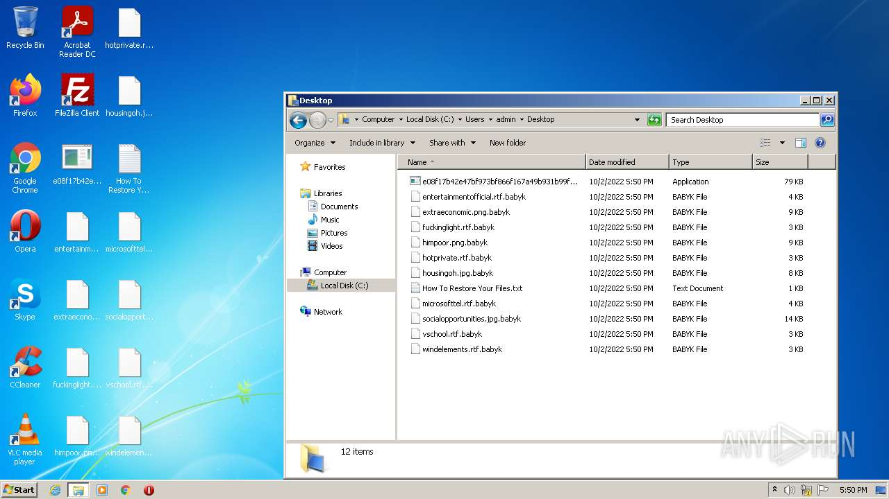

# Trojan-Ransom.Win32.Babuk.a-e08f17b42e47bf973bf866f167a49b931b99fe1b50bc820078ac2644bd8c209c

- https://any.run/report/e08f17b42e47bf973bf866f167a49b931b99fe1b50bc820078ac2644bd8c209c/652d0092-5ca1-4d94-8919-e574b23dfa61

```
- _id: "e08f17b42e47bf973bf866f167a49b931b99fe1b50bc820078ac2644bd8c209c"
  creation_date: 1616527360  # 2021-03-23 20:22:40 +0100 CET
  crowdsourced_yara_results: 
  - author: "Florian Roth"
    description: "Detects destructive malware"
    rule_name: "Destructive_Ransomware_Gen1"
    ruleset_id: "0002573660"
    ruleset_name: "apt_olympic_destroyer"
    source: "https://github.com/Neo23x0/signature-base"
  - author: "TS @ McAfee ATR"
    description: "Rule to detect Babuk Locker"
    rule_name: "Ransom_Babuk"
    ruleset_id: "001b0fd2c6"
    ruleset_name: "RANSOM_BabukLocker_Jan2021"
    source: "https://github.com/advanced-threat-research/Yara-Rules"
  - author: "ditekSHen"
    description: "detects command variations typically used by ransomware"
    rule_name: "INDICATOR_SUSPICIOUS_GENRansomware"
    ruleset_id: "00c3b8eb5d"
    ruleset_name: "indicator_suspicious"
    source: "https://github.com/ditekshen/detection"
  - author: "ditekSHen"
    description: "Detects executables containing many references to VEEAM. Observed in ransomware"
    rule_name: "INDICATOR_SUSPICOUS_EXE_References_VEEAM"
    ruleset_id: "00c3b8eb5d"
    ruleset_name: "indicator_suspicious"
    source: "https://github.com/ditekshen/detection"
  - author: "ditekSHen"
    description: "Detects Babuk ransomware"
    rule_name: "MALWARE_Win_Babuk"
    ruleset_id: "00cc803bdc"
    ruleset_name: "malware"
    source: "https://github.com/ditekshen/detection"
  - author: "Felix Bilstein - yara-signator at cocacoding dot com"
    description: "Detects win.babuk."
    rule_name: "win_babuk_auto"
    ruleset_id: "008bb34bcb"
    ruleset_name: "win.babuk_auto"
    source: "https://malpedia.caad.fkie.fraunhofer.de/"
  first_submission_date: 1664710202  # 2022-10-02 13:30:02 +0200 CEST
  last_analysis_date: 1664710202  # 2022-10-02 13:30:02 +0200 CEST
  last_analysis_results: 
    Kaspersky: 
      result: "Trojan-Ransom.Win32.Babuk.a"
  magic: "PE32 executable for MS Windows (GUI) Intel 80386 32-bit"
  size: 80896
  trid: 
  - file_type: "Win32 Executable MS Visual C++ (generic)"
    probability: 58.4
  - file_type: "Win32 Dynamic Link Library (generic)"
    probability: 12.3
  - file_type: "Win16 NE executable (generic)"
    probability: 9.4
  - file_type: "Win32 Executable (generic)"
    probability: 8.4
  - file_type: "OS/2 Executable (generic)"
    probability: 3.8
```







