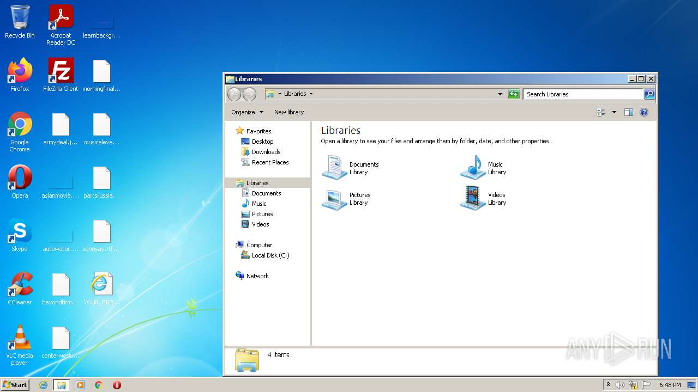

# Trojan-Ransom.Win32.Chimera.a-1dacdc296fd6ef6ba817b184cce9901901c47c01d849adfa4222bfabfed61838

- https://any.run/report/1dacdc296fd6ef6ba817b184cce9901901c47c01d849adfa4222bfabfed61838/56134f7d-da18-4440-8050-f8b51b060f25

```
- _id: "1dacdc296fd6ef6ba817b184cce9901901c47c01d849adfa4222bfabfed61838"
  creation_date: 1442478265  # 2015-09-17 10:24:25 +0200 CEST
  first_submission_date: 1442484404  # 2015-09-17 12:06:44 +0200 CEST
  last_analysis_date: 1667438946  # 2022-11-03 02:29:06 +0100 CET
  last_analysis_results: 
    Kaspersky: 
      result: "Trojan-Ransom.Win32.Chimera.a"
  magic: "PE32 executable for MS Windows (GUI) Intel 80386 32-bit Mono/.Net assembly"
  packers: 
    PEiD: ".NET executable"
  size: 237568
  trid: 
  - file_type: "Generic CIL Executable (.NET, Mono, etc.)"
    probability: 67.7
  - file_type: "Win64 Executable (generic)"
    probability: 9.7
  - file_type: "Win32 Dynamic Link Library (generic)"
    probability: 6.0
  - file_type: "Win16 NE executable (generic)"
    probability: 4.6
  - file_type: "Win32 Executable (generic)"
    probability: 4.1
```





