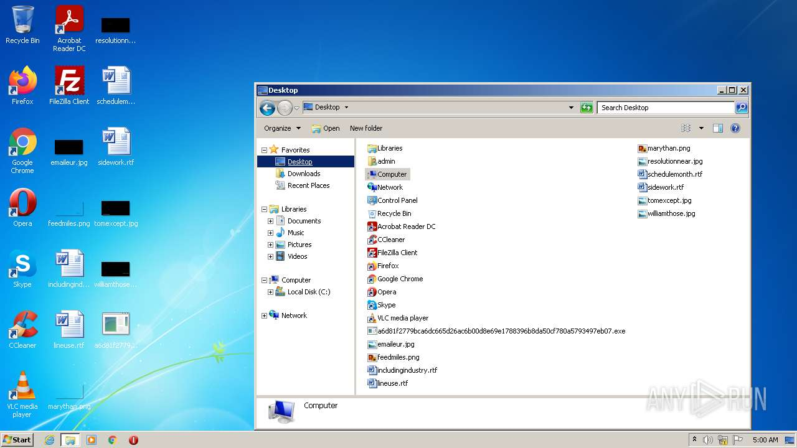
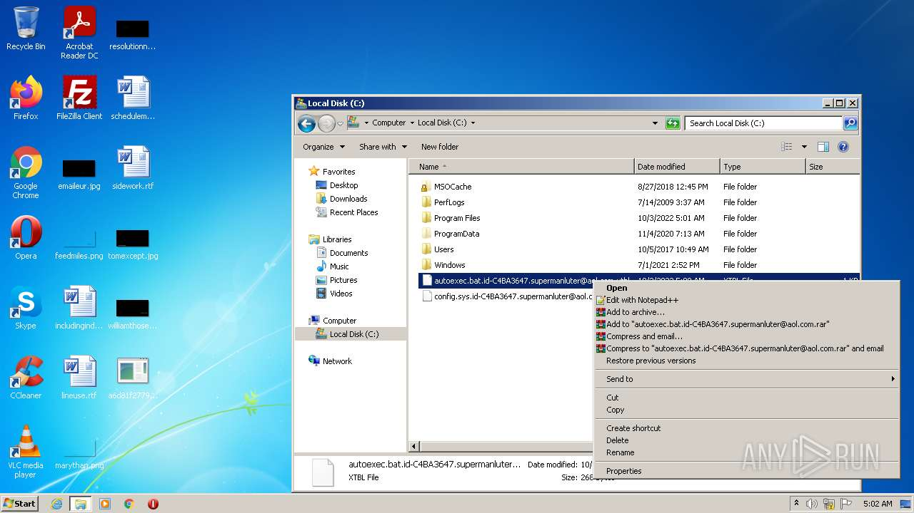

# Trojan-Ransom.Win32.Crusis.f-a6d81f2779bca6dc665d26ac6b00d8e69e1788396b8da50cf780a5793497eb07

- https://any.run/report/a6d81f2779bca6dc665d26ac6b00d8e69e1788396b8da50cf780a5793497eb07/15d408b8-dcaf-401f-a7b5-24095caa09a9

```
- _id: "a6d81f2779bca6dc665d26ac6b00d8e69e1788396b8da50cf780a5793497eb07"
  creation_date: 1463209605  # 2016-05-14 09:06:45 +0200 CEST
  first_submission_date: 1579300373  # 2020-01-17 23:32:53 +0100 CET
  last_analysis_date: 1580362514  # 2020-01-30 06:35:14 +0100 CET
  last_analysis_results: 
    Kaspersky: 
      result: "Trojan-Ransom.Win32.Crusis.f"
  magic: "PE32 executable for MS Windows (GUI) Intel 80386 32-bit"
  size: 145230
  trid: 
  - file_type: "Win32 Executable MS Visual C++ (generic)"
    probability: 64.5
  - file_type: "Win32 Dynamic Link Library (generic)"
    probability: 13.6
  - file_type: "Win32 Executable (generic)"
    probability: 9.3
  - file_type: "OS/2 Executable (generic)"
    probability: 4.1
  - file_type: "Generic Win/DOS Executable"
    probability: 4.1
```







