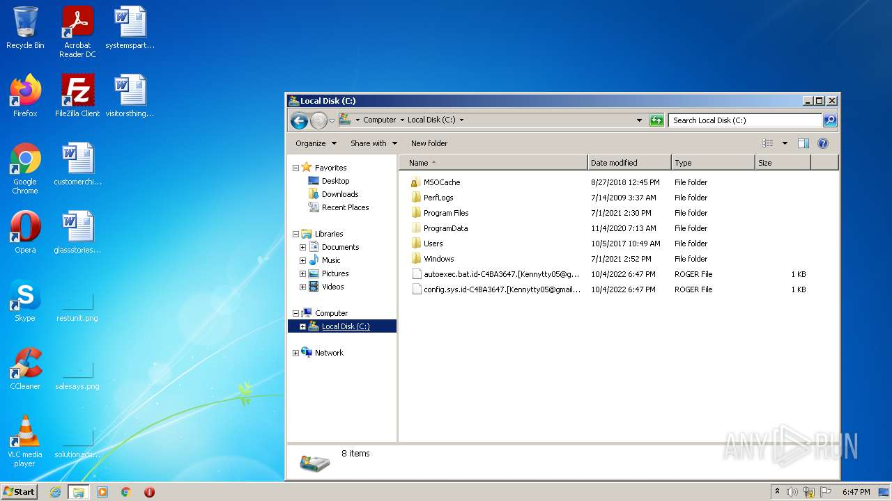
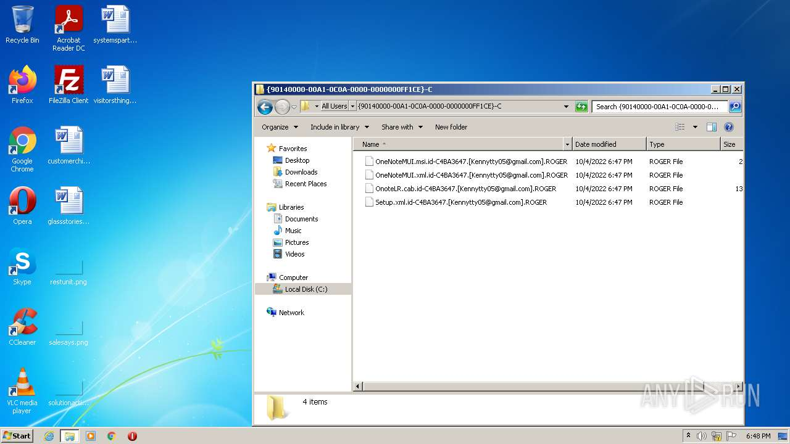

# Trojan-Ransom.Win32.Crusis.to-01cfe07a140803b0b8f52fce01ab7a38d829c809fafde1eec61d2909657928e4

- https://any.run/report/01cfe07a140803b0b8f52fce01ab7a38d829c809fafde1eec61d2909657928e4/72dda298-bf51-4ceb-90a1-19174ba02352

```
- _id: "01cfe07a140803b0b8f52fce01ab7a38d829c809fafde1eec61d2909657928e4"
  first_submission_date: 1580651271  # 2020-02-02 14:47:51 +0100 CET
  last_analysis_date: 1580724335  # 2020-02-03 11:05:35 +0100 CET
  last_analysis_results: 
    Kaspersky: 
      result: "Trojan-Ransom.Win32.Crusis.to"
  magic: "PE32 executable for MS Windows (GUI) Intel 80386 32-bit"
  size: 94720
  trid: 
  - file_type: "Win32 Dynamic Link Library (generic)"
    probability: 38.4
  - file_type: "Win32 Executable (generic)"
    probability: 26.3
  - file_type: "OS/2 Executable (generic)"
    probability: 11.8
  - file_type: "Generic Win/DOS Executable"
    probability: 11.6
  - file_type: "DOS Executable Generic"
    probability: 11.6
```



