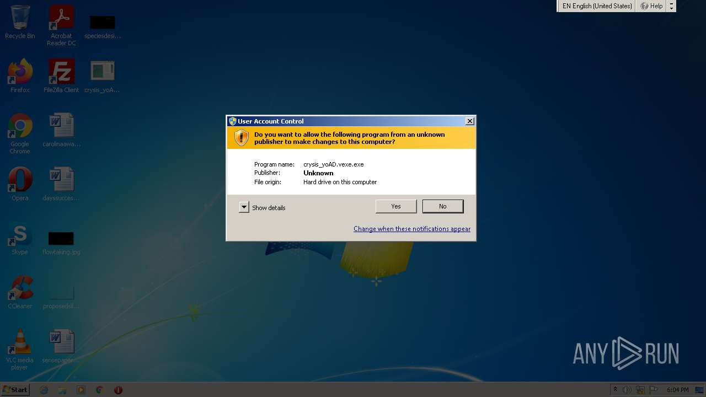
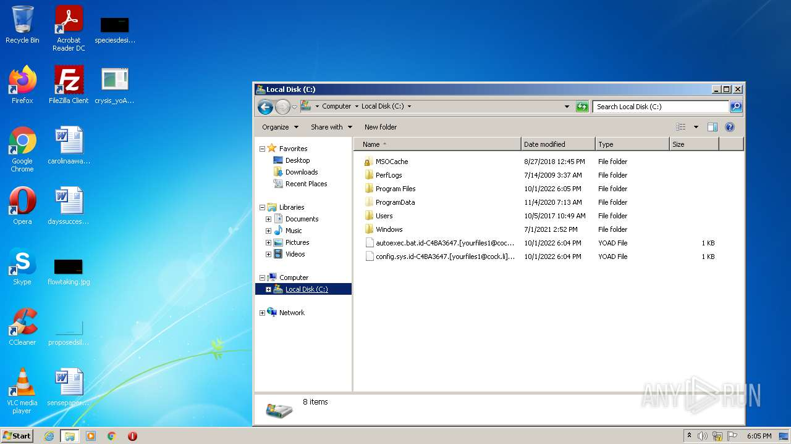
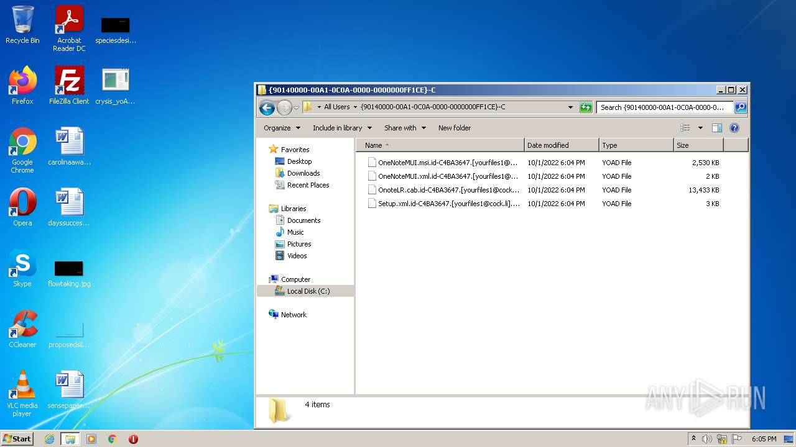

# Trojan-Ransom.Win32.Crusis.to-af6fbd5a5ae9d9ce415d39a62535eb4bd042598bfdc788da6263cbdd251ac679

```
- _id: "af6fbd5a5ae9d9ce415d39a62535eb4bd042598bfdc788da6263cbdd251ac679"
  creation_date: 1488498546  # 2017-03-03 00:49:06 +0100 CET
  crowdsourced_yara_results: 
  - author: "Felix Bilstein - yara-signator at cocacoding dot com"
    description: "autogenerated rule brought to you by yara-signator"
    rule_name: "win_dharma_auto"
    ruleset_id: "0085dc20fa"
    ruleset_name: "win.dharma_auto"
    source: "https://malpedia.caad.fkie.fraunhofer.de/"
  - author: "Florian Roth"
    description: "Detects Wadhrama Ransomware via Imphash"
    rule_name: "MAL_Ransomware_Wadhrama"
    ruleset_id: "000fec53f7"
    ruleset_name: "crime_mal_ransom_wadharma"
    source: "https://github.com/Neo23x0/signature-base"
  first_submission_date: 1609882958  # 2021-01-05 22:42:38 +0100 CET
  last_analysis_date: 1616579475  # 2021-03-24 10:51:15 +0100 CET
  last_analysis_results: 
    Kaspersky: 
      result: "Trojan-Ransom.Win32.Crusis.to"
  magic: "PE32 executable for MS Windows (GUI) Intel 80386 32-bit"
  size: 94720
  trid: 
  - file_type: "Win32 Dynamic Link Library (generic)"
    probability: 29.6
  - file_type: "Win16 NE executable (generic)"
    probability: 22.7
  - file_type: "Win32 Executable (generic)"
    probability: 20.3
  - file_type: "OS/2 Executable (generic)"
    probability: 9.1
  - file_type: "Generic Win/DOS Executable"
    probability: 9.0
```





