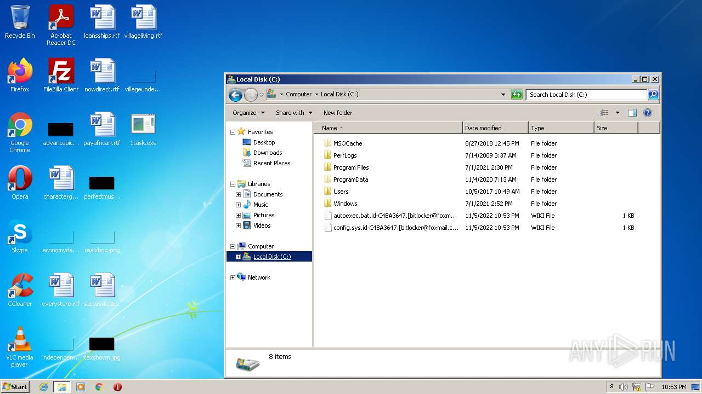
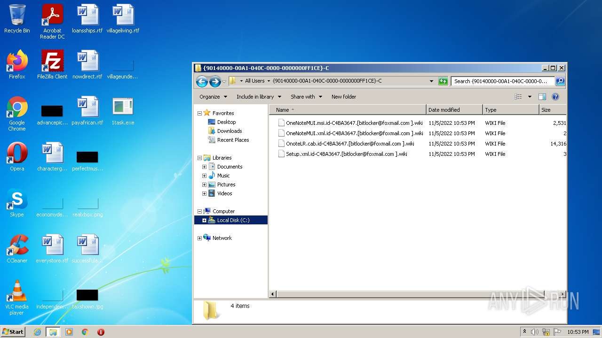
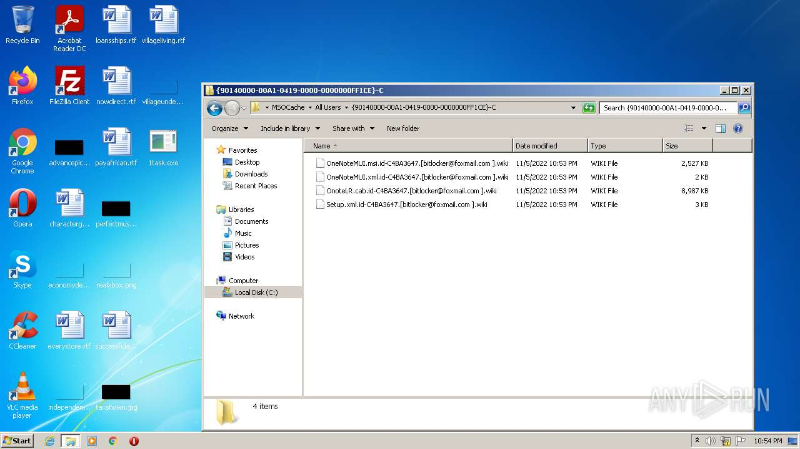

# Trojan-Ransom.Win32.Crusis.to-e0d1bc534899364c71d48fe6b3983da34223688831ad8336369f81e3536d4ab2

- https://any.run/report/e0d1bc534899364c71d48fe6b3983da34223688831ad8336369f81e3536d4ab2/1fc988b3-6d50-46fd-b1d2-ba227be8298b

```
- _id: "e0d1bc534899364c71d48fe6b3983da34223688831ad8336369f81e3536d4ab2"
  creation_date: 1488498546  # 2017-03-03 00:49:06 +0100 CET
  crowdsourced_yara_results: 
  - author: "Florian Roth"
    description: "Detects Wadhrama Ransomware via Imphash"
    rule_name: "MAL_Ransomware_Wadhrama"
    ruleset_id: "000fec53f7"
    ruleset_name: "crime_mal_ransom_wadharma"
    source: "https://github.com/Neo23x0/signature-base"
  - author: "ditekSHen"
    description: "Detects Dharma ransomware"
    rule_name: "MALWARE_Win_Dharma"
    ruleset_id: "00cc803bdc"
    ruleset_name: "malware"
    source: "https://github.com/ditekshen/detection"
  - author: "Felix Bilstein - yara-signator at cocacoding dot com"
    description: "Describes win.dharma."
    rule_name: "win_dharma_auto"
    ruleset_id: "0085dc20fa"
    ruleset_name: "win.dharma_auto"
    source: "https://malpedia.caad.fkie.fraunhofer.de/"
  first_submission_date: 1571691336  # 2019-10-21 22:55:36 +0200 CEST
  last_analysis_date: 1652758090  # 2022-05-17 05:28:10 +0200 CEST
  last_analysis_results: 
    Kaspersky: 
      result: "Trojan-Ransom.Win32.Crusis.to"
  magic: "PE32 executable for MS Windows (GUI) Intel 80386 32-bit"
  size: 94720
  trid: 
  - file_type: "Win32 Dynamic Link Library (generic)"
    probability: 29.6
  - file_type: "Win16 NE executable (generic)"
    probability: 22.7
  - file_type: "Win32 Executable (generic)"
    probability: 20.3
  - file_type: "OS/2 Executable (generic)"
    probability: 9.1
  - file_type: "Generic Win/DOS Executable"
    probability: 9.0
```





