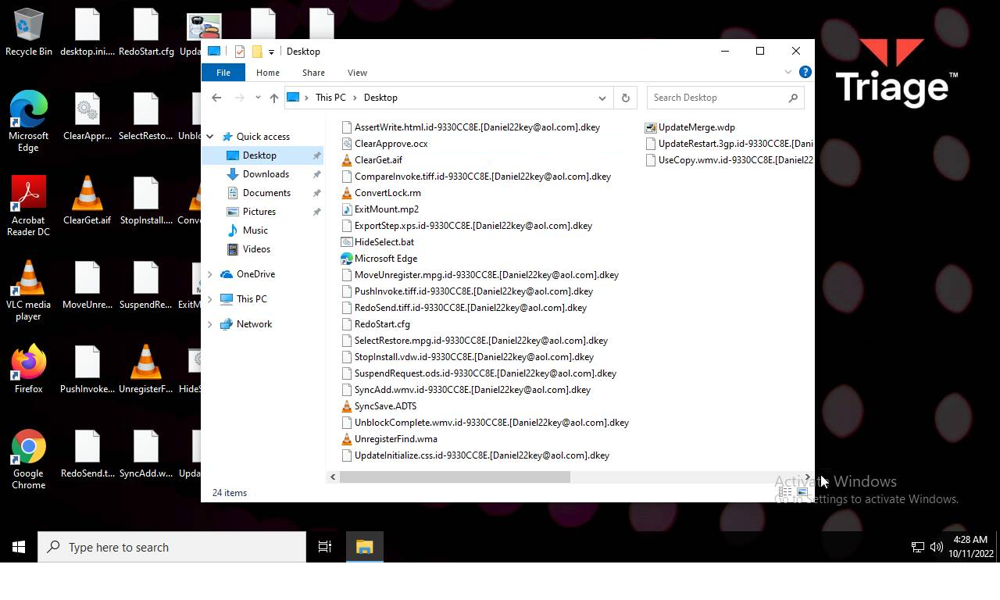
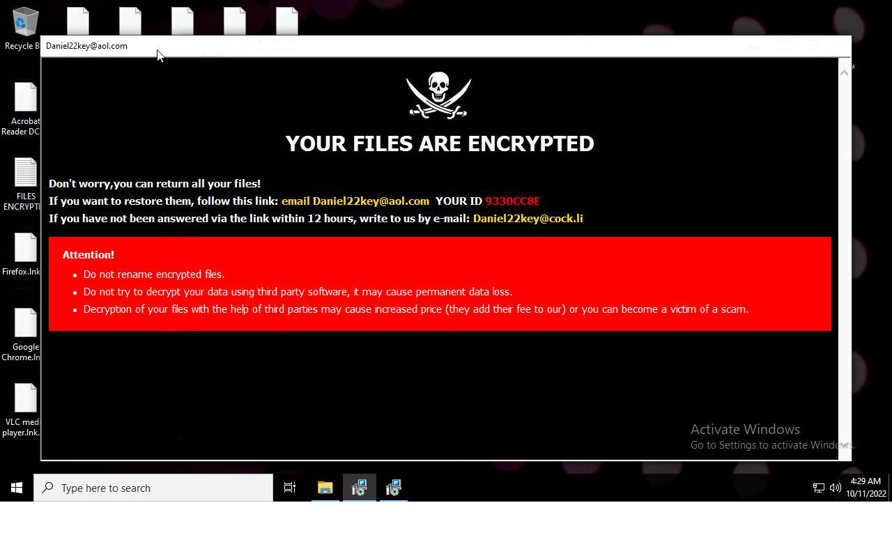
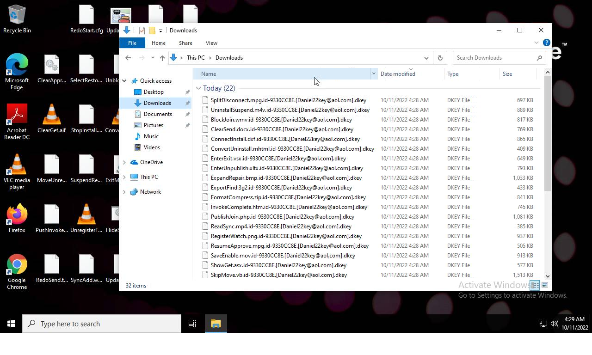
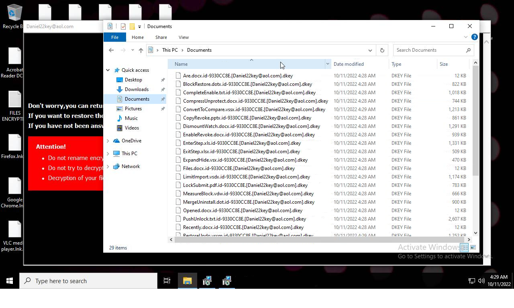

# Trojan-Ransom.Win32.Crusis.to-f608858af270c6b6956146e6c3ce0bc737916646e442784d5fb9c543c7ed09bc

- https://tria.ge/221011-e22aasefgj/behavioral2

```
- _id: "f608858af270c6b6956146e6c3ce0bc737916646e442784d5fb9c543c7ed09bc"
  creation_date: 1488498546  # 2017-03-03 00:49:06 +0100 CET
  crowdsourced_yara_results: 
  - author: "Florian Roth"
    description: "Detects Wadhrama Ransomware via Imphash"
    rule_name: "MAL_Ransomware_Wadhrama"
    ruleset_id: "000fec53f7"
    ruleset_name: "crime_mal_ransom_wadharma"
    source: "https://github.com/Neo23x0/signature-base"
  - author: "ditekSHen"
    description: "Detects Dharma ransomware"
    rule_name: "MALWARE_Win_Dharma"
    ruleset_id: "00cc803bdc"
    ruleset_name: "malware"
    source: "https://github.com/ditekshen/detection"
  - author: "Elastic Security"
    description: "Identifies DHARMA ransomware"
    rule_name: "Windows_Ransomware_Dharma_aa5eefed"
    ruleset_id: "0154975e96"
    ruleset_name: "Windows_Ransomware_Dharma"
    source: "https://github.com/elastic/protections-artifacts"
  - author: "Elastic Security"
    description: "Identifies DHARMA ransomware"
    rule_name: "Windows_Ransomware_Dharma_b31cac3f"
    ruleset_id: "0154975e96"
    ruleset_name: "Windows_Ransomware_Dharma"
    source: "https://github.com/elastic/protections-artifacts"
  - author: "Elastic Security"
    description: "Identifies DHARMA ransomware"
    rule_name: "Windows_Ransomware_Dharma_e9319e4a"
    ruleset_id: "0154975e96"
    ruleset_name: "Windows_Ransomware_Dharma"
    source: "https://github.com/elastic/protections-artifacts"
  - author: "Elastic Security"
    description: "Identifies DHARMA ransomware"
    rule_name: "Windows_Ransomware_Dharma_942142e3"
    ruleset_id: "0154975e96"
    ruleset_name: "Windows_Ransomware_Dharma"
    source: "https://github.com/elastic/protections-artifacts"
  - author: "Felix Bilstein - yara-signator at cocacoding dot com"
    description: "Detects win.dharma."
    rule_name: "win_dharma_auto"
    ruleset_id: "0085dc20fa"
    ruleset_name: "win.dharma_auto"
    source: "https://malpedia.caad.fkie.fraunhofer.de/"
  first_submission_date: 1665392831  # 2022-10-10 11:07:11 +0200 CEST
  last_analysis_date: 1665393017  # 2022-10-10 11:10:17 +0200 CEST
  last_analysis_results: 
    Kaspersky: 
      result: "Trojan-Ransom.Win32.Crusis.to"
  magic: "PE32 executable for MS Windows (GUI) Intel 80386 32-bit"
  size: 94720
  trid: 
  - file_type: "Win32 Dynamic Link Library (generic)"
    probability: 29.6
  - file_type: "Win16 NE executable (generic)"
    probability: 22.7
  - file_type: "Win32 Executable (generic)"
    probability: 20.3
  - file_type: "OS/2 Executable (generic)"
    probability: 9.1
  - file_type: "Generic Win/DOS Executable"
    probability: 9.0
```





